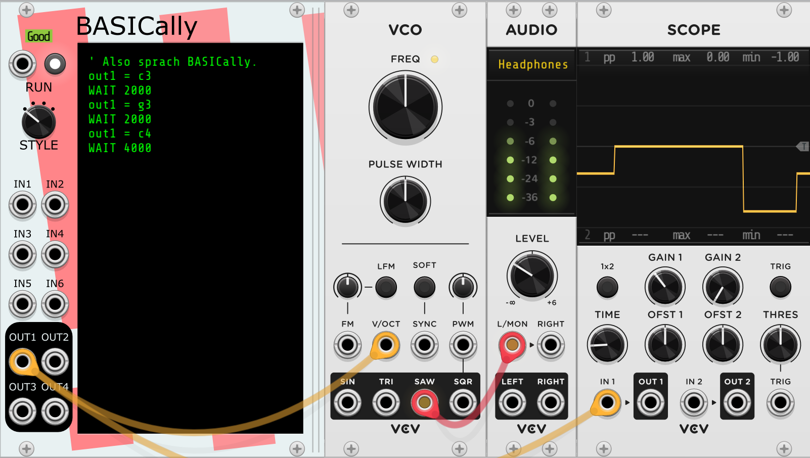
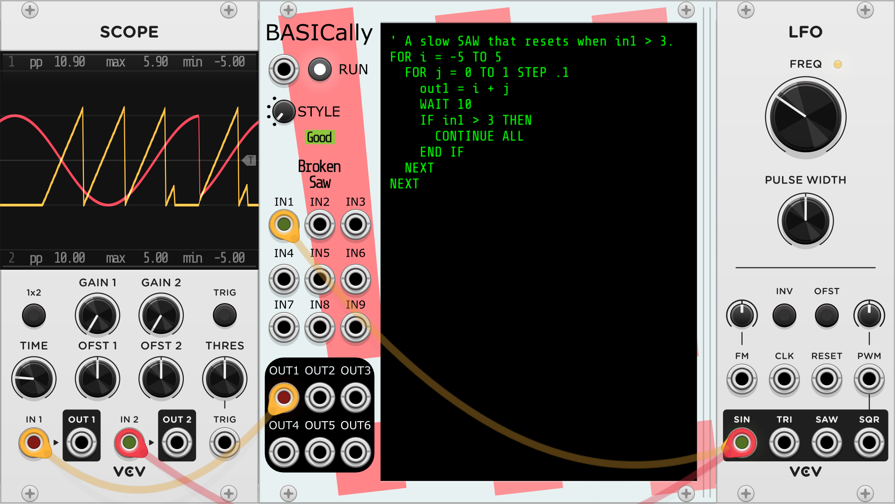
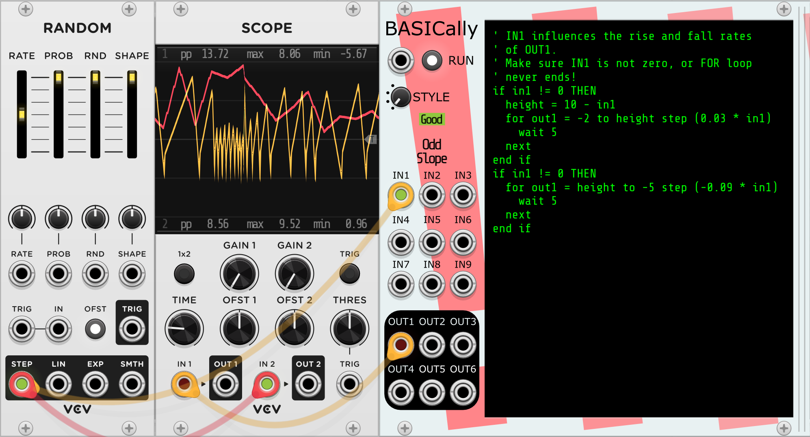
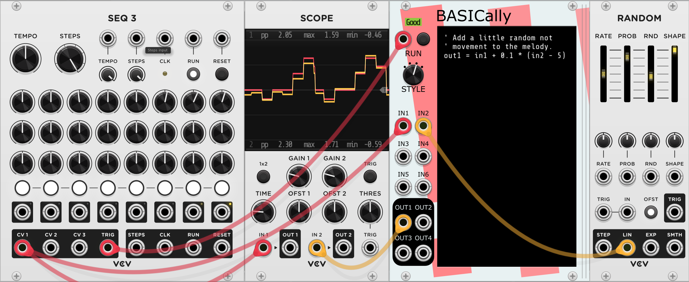
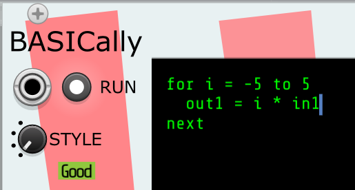
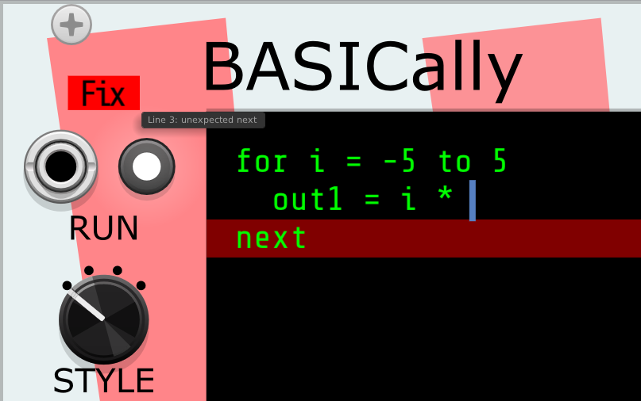

# BASICally

A simple, possibly familiar procedural programming language within the
context of VCV Rack. Can act like:
* a very flexible sequencer
* VCO or LFO
* a wavefolder
* a control voltage utility
* sample and hold
* a tape delay or tape loop
* all of the above and more, simultaneously

Useful for:
* quickly trying out an idea
* simple transformations that would otherwise involve many small utility modules
* non-standard approaches to otherwise straightforward ideas

### Examples

* [A video explaining](https://www.youtube.com/watch?v=YsEG85MK8Oc) how to use BASICally to modify incoming MIDI, in this case to map
keys to parts of an extended chord.

#### Sequencer playing the first three notes of Also sprach Zarathustra


#### LFO altered by inputs


#### An almost triangle wave with randomly selected slopes and peak


#### Sample and hold

Note that STYLE is set to "Start on trigger, don't loop".

The examples above are all in [this patch](examples/BASICallyExamples1.vcv).
A patch with some simple/strange/silly ideas for other things BASICally can do
are in [this patch](examples/BASICallyExperiments.vcv).

#### Presets
There are over a dozen presets demonstrating how BASICally can be used,
including unusual sequencers, oscillators, tape and delay effects,
a sample and hold, a signal router, and four different quantizers. Since the
workings of these are controlled solely by the BASICally code, it's easy to
change how they behave.

<!-- TODO: video of different Presets and their output -->

## Unique Features
While there are
[other modules](https://github.com/mahlenmorris/VCVRack#related-modules)
with a similar emphasis on "writing code within VCV", BASICally has some
interesting differences:
* It intentionally bears a visual resemblance to the
[BASIC language](https://en.wikipedia.org/wiki/BASIC) (albeit a **quite
limited** version of BASIC). BASIC is a language that many people
know, once knew, or can pick up by looking at examples.
* The right side of the module is a resize bar; pull it to the right or left,
and the code window changes size. Handy for reading those long comments without
line breaks and for shrinking the module down to a small size when you don't
wish to edit the code. Also, the text window scrolls vertically as you move
through it.
* Input ports (IN1-IN9) and output ports (OUT1-OUT6) are polyphonic,
with a maximum of 16 channels each. 
* Four different run "STYLES" (see Controls below), giving it the ability to
 act on a RUN trigger, or to run the most recent working version continuously
 as you type, or only run while a button or trigger is pressed.
* Edits in the text window become part of the VCV Rack Undo/Redo system.
* You can pick from a (small) number of screen color schemes in the menu.
* [Scientific pitch notation](https://en.m.wikipedia.org/wiki/Scientific_pitch_notation) is supported (e.g., c4, Db2, d#8). They are turned into V/OCT values.
* Using the [Tipsy text protocol](https://github.com/baconpaul/tipsy-encoder),
BASICally can [send messages](#text-functions) to modules that accept Tipsy text messages, such as
[TTY](#tty). This can be useful for debugging and other situations where mere graphs
are not as informative as text, and one may expect future modules that accept
Tipsy text messages.
* Easily allows for [multitasking](#multitasking-also-and-when-blocks) within
the same BASICally module.

## The Language
### Setting and Using Variables (Assignment and Math)
Always in the form:

**variable name** = **mathematical expression**

Set values of the OUT1, OUT2, OUT3, OUT4, OUT5, and OUT6 ports for other modules to
read via connected cables. Assignment is also used for setting variables for
use elsewhere by your program.

Examples:

    ' Creates a variable called 'foo' and sets it to 3.0. All values
    ' in BASICally are floating point numbers.
    foo = 3
    ' Uses the value of the 'foo' variable.
    bar = 5 * IN1 + foo
    ' Sets the value of the OUT1 port.
    OUT1 = bar * -0.01
    ' Sets out2 equal to -1.9. Operator precedence is the same as most other languages.
    OUT2 = 0.1 + 2 * -1
    ' Set out2 to emit the V/OCT value for middle C.
    OUT2 = C4
    ' Get and set polyphonic channels of the INx and OUTx ports.
    OUT2 = 0.1  ' Sets the first channel of OUT2 to 0.1.
    OUT2[1] = 0.1  ' Also sets the first channel of OUT2 to 0.1.
    OUT2[16] = IN1[1]  ' Sets the last OUT2 channel equal to the value of IN1's first channel.

* All variables start with the value 0.0 when first read.
* Variables stay available in the environment of a module until the patch
is restarted. This is true even if the code that created the variable has been removed from the program.
* OUT1-6 (and all of their channels) are, by default, limited (aka, clamped) to the range -10v <--> 10v. You can make
individual OUT ports unclamped in [the module menu](#clampunclamp-outn-values). Input values and internal values are not clamped.
* [Scientific pitch notation](https://en.m.wikipedia.org/wiki/Scientific_pitch_notation) is supported (e.g., c4, Db2, d#8), turning them into
V/OCT values. So you can use **OUT1 = c4**, send OUT1 to a VCO in the default position, and the VCO will output a tone at middle C.

The following are operators and functions you can use in mathematical
expressions:
* **"+", "-", "*", "/"** -- add, subtract, multiply, divide. Note that dividing
any number by zero, while undefined in *mathematics*, is defined by *BASICally*
to be 0.0.
* **"<", "<=", ">" , ">=", "==", "!="** -- comparison operators. Most commonly used
in IF-THEN[-ELSE] statements.
* "condition **?** true_value **:** false_value" -- often known as the ternary operator, allows choices to be made based on comparisons of values.
For example, "distance >= 2 ? 1.4 : 3.14" means if DISTANCE is two or more, return 1.4; otherwise, return 3.14.
* **"and", "or", "not"** -- Boolean logic operators. For purposes of these, a zero
value is treated as **FALSE**, and *any non-zero value* is treated as **TRUE**.
* Technical note: correct testing of equality or inequality in floating point numbers is [notoriously non-obvious to beginners](https://embeddeduse.com/2019/08/26/qt-compare-two-floats/) (and even experts). For example, in previous versions of BASICally, "3.1" does NOT equal "31 * .1"! As of version 2.0.14, BASICally uses an ever-so-slightly looser definition of equality, as described at the end of the essay linked above. For most uses this will work exactly as before and be less prone to surprises like this example. But if you find yourself comparing two numbers and you want differences of 0.00001V to matter, I'll suggest that instead of writing "a == b", you use "a <= b AND a >= b", which does not invoke the looser definition. 

### Math Functions

| Function  | Meaning        | Examples |
| --------- | -------------- | -------- |
|**abs(x)**| absolute value | abs(2.1) == 2.1, abs(-2.1) == 2.1 |
|**ceiling(x)**|integer value at or above x | ceiling(2.1) == 3, ceiling(-2.1) == -2 |
|**channels(p)**|number of channels in polyphonic INx port p | FOR chan = 1 TO channels(IN1)|
|**connected(x)**|1 if named port x has a cable attached, 0 if not | connected(IN1) |
|**floor(x)**|integer value at or below x|floor(2.1) == 2, floor(-2.1) == -3|
|**log2(x)**|Base 2 logarithm of x; returns zero for x <= 0|log2(8) == 3|
|**loge(x)**|Natural logarithm of x; returns zero for x <= 0|loge(8) == 2.07944|
|**log10(x)**|Base 10 logarithm of x; returns zero for x <= 0|log10(100) == 2|
|**max(x, y)**|the larger of x or y|max(2.1, 2.3) == 2.3, max(2.1, -2.3) == 2.1
|**min(x, y)**|the smaller of x or y|min(2.1, 2.3) == 2.1, min(2.1, -2.3) == -2.3
|**mod(x, y)**|the remainder after dividing x by y. Will be negative only if x is negative|mod(10, 2.1) == 1.6
|**normal(mean, std_dev)**| bell curve distribution of random number | normal(0, 1) |
|**pow(x, y)**|x to the power of y|pow(3, 2) == 9, pow(9, 0.5) == 3 |
|**random(min, max)**|uniformly random number: min <= random(x, y) < max | random(-1, 1)|
|**sample_rate()**|number of times BASICally is called per second (e.g., 44100)|sample_rate() == 48000|
|**sign(x)**|-1, 0, or 1, depending on the sign of x|sign(2.1) == 1, sign(-2.1) == -1, sign(0) = 0|
|**sin(x)**|arithmetic sine of x, which is in radians| sin(30 * 0.0174533) == 0.5, sin(3.14159 / 2) == 1|
|**start()**|True *only* for the moment when a program has just been recompiled. Useful for blocks that initialize variables at startup| WHEN start() ...|
|**time()**|The number of seconds (see note below) since this BASICally module started running|IF time() > 60 THEN ' It's been a minute.|
|**time_millis()**|The approximate (see note below) number of milliseconds since this BASICally module started running|IF time_millis() > 60000 THEN ' It's been a minute.|
|**trigger(INn)**|True *only* for the moment when the INn port has received a trigger. Useful for WHEN blocks that wish to change the behavior of the program whenever this trigger is seen.| WHEN trigger(in9) ...|

### Text functions

BASICally can create text messages and send them in the Tipsy encoding to
modules that can use them or display them (for example, [TTY](#tty) or [Memory](https://github.com/mahlenmorris/VCVRack/blob/main/Memory.md#memory)).

As of version 2.0.16, BASICally has variables and arrays that can store text. These are distinguished
from other variables by the name ending in a "\$". For example:

    hey$ = "hello, "
    you$[0] = {"world", "planet", "Earth", "universe"}
    pick = random(0, 4)   ' A number from 0 -> 3.99999..., 
    print(OUT6, hey$, you$[pick], "!")


| Function | Meaning       | Examples |
| -------- | ------------- | -------- |
| **debug(foo)** | returns text of the form 'foo = (current value of var_name)' | debug(foo) -> "foo = 3.14159" |
| **debug(bar[], start, end)** | returns text of the form 'bar[start] = { (values in bar[]) }' | debug(bar[], 0, 3) -> "bar[0] = {2, 3.11, 0, -4}" |
| **debug(you$[], start, end)** | returns text of the form 'you[start] = { (string values in you$[]) }' | debug(you$[], 0, 3) -> "you$[0] = {"world", "planet", "Earth", "universe"}" |
| **print(OUTn, text, text, ...)** | Joins the computed text and sends it out the port. | print(OUT6, "note = ", sin(IN1)) -> Sends "note = 0.5" via OUT6 port. |

### WAIT Statements
Always in the form:

WAIT **mathematical expression**

Specifies a number of milliseconds for the program to make no changes. The
OUTn ports maintain their voltages at the values they were at when the WAIT started.

Examples:

    ' Waits a full second.'
    wait 1000
    ' Wait half of one thousandth of a second.
    WAIT 0.5
    ' wait [in2] tenths of a second.
    wait in2 * 100
    ' The shortest possible WAIT. Exactly one sample.
    WAIT 0
    ' Negative values are treated as if the value was zero.
    WAIT -3

WAIT's are a powerful way to reduce the amount of CPU that BASICally is consuming in your patch.
If you find that your BASICally module is using a lot of CPU, even a short WAIT (e.g., WAIT 1, or WAIT 0.2)
can help make the module use less CPU. When BASICally is processing non-audio signals, the ear is quite unlikely to perceive
the 1ms delay.

### Comments
A single quote (') followed by a space indicates that the rest of the line will
be treated as a comment only to be read by the user. Comments have no effect on
the execution of other statements.

Examples:

    out2 = c3 ' A C3 note.
    out2 = -1 ' Also a C3 note.
    WAIT 200 ' Pause for 1/5 of a second.
    ' The next line can be turned on just by removing the initial tick (').
    ' out1 = 2.3 * in1  ' Look, I'm live-coding!

### Arrays
Simple one-dimensional, 0-indexed arrays are available. The index will have
floor() act on it internally. Using an index less than zero will be ignored.

    a[3.3] = 2.2  ' Same as a[3] = 2.2
    a[-1] = 6     ' Ignored, will have no effect.

You can set a series of values in a array quickly by specifying just the
initial index, and enclosing the series of values with curly braces '{}'
For example, this will assign value to b[1], b[2], and b[3]. Note that these
values do not need to be constants, as some other languages require.

    b[1] = { -5, sin(in3), 2.2 }

Reading from an array works the same; The index will have floor() act on
it internally. Using an index less than zero will return a value of 0.0.
Accessing any index within the array that hasn't been set will also return
a value of 0.0.

    out1 = b[1]

Unlike BASIC and many other languages, there is no need to set the size of
the array before using it (i.e, there is no DIM() statement.)

There are also arrays of strings, see [Text Functions](#text-functions) for details.

### Polyphonic Inputs and Outputs
Polyphonic or multi-channel signals are referenced as if they were arrays in BASICally. VCV Rack cables can carry at most 16 channels.
IN1[1] is the first channel, as is IN1 (without the array notation), and IN1[16] is the last usable channel.

The functions channels() and set_channels() also help you use polyphonic signals.
* channels(INx) - returns the number of channels in that input signal. That value is set by the module that is sending that signal.
Often used when processing multiple channels like so, which halves the input signals:
```
FOR chan = 1 to channels(IN1)
  OUT2[chan] = IN1[chan] / 2
NEXT   ' Or "NEXTHIGHCPU", see the section on FOR-NEXT loops.
```
* set_channels(OUTx) - Tells the specified output port how many channels to have. Without using
set_channels(), the output port will continue to output the highest channel number that has been set
since the module started. For example:
```
OUT1[2] = 0            ' Starting from scratch, OUT1 now has 2 channels.
OUT1[8] = 1            ' Now OUT1 now has 8 channels.
OUT1[4] = -2           ' OUT1 still has 8 channels.
set_channels(OUT1, 5)  ' OUT1 now only has 5 channels.
```

### IF Statements (Conditional Behavior)
There are four kinds of IF statements:

IF **conditional expression** THEN

**...Statements for True...**

END IF

or

IF **conditional expression** THEN

**...statements for True...**

ELSE

**...Statements for False...**

END IF

or

IF **conditional expression 1** THEN

**...Statements for when expression 1 is True...**

ELSEIF **conditional expression 2** THEN

**...Statements for when expression 2 is True...**

ELSEIF **conditional expression 3** THEN

**...Statements for when expression 3 is True...**  *(You can have multiple ELSEIF clauses.)*

END IF

or

IF **conditional expression 1** THEN

**...Statements for when expression 1 is True...**

ELSEIF **conditional expression 2** THEN

**...Statements for when expression 2 is True...**

ELSEIF **conditional expression 3** THEN

**...Statements for when expression 3 is True...**  *(You can have multiple ELSEIF clauses.)*

ELSE

**...Statements for when expression 3 is False...**

END IF


The conditional expression evaluates to **False** if it equals **zero**; it evaluates to
**True** otherwise.

Examples:
```
if in1 > 3.7 then
  out1 = in2 * 0.01
  out2 = sin(in2)
end if

if in1 > 3.7 or foo == -1 then
  out1 = in2 * 0.01
  out2 = sin(in2)
else
  out1 = 0
  out2 = 0.5
end if

if a == 5 then
  out1 = in2 + 1
elseif a == 4 then
  out1 = in2
elseif a == 3 then
  out1 = in2 - 1
else
  out1 = in3
end if
```
### WHILE Loops
Used to repeat statements while some condition is true:

```
WHILE **expression**
  **...Statements...**
END WHILE
```

Example:
```
OUT1 = 0.1
WHILE OUT1 < 10
  OUT1 = OUT1 * 2
  WAIT 10
END WHILE
' out1 will be: 0.2, 0.4, 0.8, 1.6, 3.2, 6.4, 12.8 and then leave the loop
```
Note that the last value (12.8) will be 10.0 unless OUT1 is [unclamped](#clampunclamp-outn-values).

### CONTINUE WHILE and EXIT WHILE
While in a WHILE loop, there may be circumstances when you want to change
what statements to run. There are two special ways to do this.

**CONTINUE WHILE** moves execution back to the beginning of the loop.

**EXIT WHILE**, in contrast, moves to the statement after the END WHILE, leaving the
loop entirely.

Examples:
```
WHILE note == c4 
  IF foo > 2 AND foo < 2.5 THEN
    ' Skips rest of loop when foo in this range.
    CONTINUE WHILE
  END IF  
  foo = foo + random(-1, 1)
  WAIT 1
END WHILE

WHILE note == c4 
  IF foo > 2 AND foo < 2.5 THEN
    ' Leave loop when foo in this range.
    EXIT WHILE
  END IF  
  foo = foo + random(-1, 1)
  WAIT 1
END WHILE
```

### FOR Loops
Useful for repeating statements for some limited number of times.
There are two kinds of FOR loops:

FOR **variable** = **expression** TO **expression** **...Statements...** NEXT

(**variable** goes up by one every loop)

or

FOR **variable** = **expression** TO **expression** STEP **expression** **...Statements...** NEXT

(**variable** goes up by the STEP **expression** every loop, or down if it's negative)

Examples:
```
for i = -5 to 5
  out1 = i
  wait 100
next
' out1 will be: -5, -4, -3, -2, -1, 0, 1, 2, 3, 4, 5 and then leave the loop

for i = 0 to 5
  for j = 0.4 to 0 step -0.1
    out1 = i + j
    wait 10
  next
  wait 100
next
' out1 will be: 0.4, 0.3, 0.2, 0.1, 0, 1.4, 1.3, 1.2, ...
```
Note that the TO and STEP expressions are only computed when entering the loop.
```
dest = 10
leap = 2
FOR j = 0 TO dest STEP leap
  dest = .1  ' Has no effect on loop.
  leap = .1  ' Also no effect.
  out1 = j
  wait 10
next
' out1 will be: 0, 2, 4, 6, 8, 10 and then leave the loop.
```

NB: Remember that all variables, **including the loop variables in FOR-NEXT
loops**, are in the same variable space. If you are using [blocks](#blocks)
which might be running at the same time, make sure you use **different loop
variables in different blocks**. Not doing so leads to VERY confusing behavior
when running.

### Faster FOR loops with NEXTHIGHCPU

This next point about FOR loops is subtle.
As of version 2.0.21, you have the choice of ending a FOR loop with either of
**NEXT** or **NEXTHIGHCPU**. I'll attempt to explain the difference.

VCV Rack is running BASICally code (and all of the other modules) once for every sample; that is, if you are running at 48KHz, it's running each module 48,000 per second. Each module tries to run as quickly as possible, but if a module takes too long to run many times in a row, you will hear nasty pops and dropouts in the audio.

One design principle I've had is that it should be a bit difficult for a BASICally user to stall out the VCV Rack system this way. As a result of this principle, every time a FOR-NEXT loop repeats, there is [actually a hidden "WAIT 0"](#hidden-wait-0-statements) that occurs. A "WAIT 0" really means, "BASICally will finish processing this sample, and then when the next sample is processed, I'll continue where I left off."

Consider this simple loop:
```
FOR chan = 1 to channels(IN1)
  OUT1[chan] = IN1[chan] / 2
NEXT
```
Unrolling this loop, it becomes:
```
OUT1[1] = IN1[1] / 2
WAIT 0
OUT1[2] = IN1[2] / 2
WAIT 0
OUT1[3] = IN1[3] / 2
WAIT 0
OUT1[4] = IN1[4] / 2
WAIT 0
...
```

Now, if a 16-channel IN1 is changing quite slowly (like most CV signals), you might not notice that the 16th channel gets updated 15 samples (i.e., 0.3 milliseconds) after the first one. But you might, depending on what the signals are altering.

And if these are audio signals, this means that each audio signal is only getting sampled every 16 samples; this is **very** noticeable.

So, if your code is in that situation, or the loop is small enough and not called for every sample, then by replacing NEXT with NEXTHIGHCPU ,the FOR loop to run without the "WAIT 0"s, i.e., 
```
OUT1[1] = IN1[1] / 2
OUT1[2] = IN1[2] / 2
OUT1[3] = IN1[3] / 2
OUT1[4] = IN1[4] / 2
...
```

As the name suggests, this *can* drive up the CPU usage of BASICally. So if you try it, I'll suggest you check how well it's running by activating VCV's "View/Performance Meters" and see if the numbers and the audio are acceptable to you are not.

Here's some rough guidelines (definitely not rules) that help guide my thinking about when to use which NEXT:

| Situation | Suggestion |
| --------- | ---------- |
| Initialization on startup | NEXT |
|Running a calculation over a long array (more than 20 items) | NEXT |
|Processing multiple channels of audio every sample | NEXTHIGHCPU |
|Processing polyphonic CV, per sample accuracy is not required | NEXT |
|Processing polyphonic CV, per sample accuracy would be better | NEXTHIGHCPU|

### CONTINUE FOR and EXIT FOR
While in a FOR loop, there may be circumstances when you want to change
what statements to run. There are two special ways to do this.

**CONTINUE FOR** moves execution back to the beginning of the loop, changing
the variable value as it normally would.

**EXIT FOR**, in contrast, moves to the statement after the NEXT, quitting the
loop entirely.

Examples:
```
for i = 0 to 5
  if i == 2 then CONTINUE FOR end if  ' Skips rest of loop when i == 2.
  out1 = i
  wait 100
next
' out1 will be 0, 1, 3, 4, 5, and then leave this loop.

for i = 0 to 5
  if i == 2 then EXIT FOR end if   ' Leaves loop when i == 2.
  out1 = i
  wait 100
next
' out1 will be 0, 1, and then leave this loop.
```
### CONTINUE ALL and EXIT ALL
Similarly, you can use **CONTINUE ALL** to move execution to the top of the
program (or ALSO block).

For the two STYLES that support halting the program, which are:

* Start on trigger, loop
* Start on trigger, don't loop

encountering an **EXIT ALL** will actually halt the program/block. A trigger
to the RUN input or pushing the RUN button will start it again.

### CLEAR ALL
"CLEAR ALL" resets all variables to 0, and resets all arrays to empty.

### RESET
Whenever a "RESET" is executed, it immediately stops processing this sample, and on the
next sample each block (see Multitasking, below) will start from scratch. It does NOT
change any variable values. This is very similar to the state when you've just typed a
character into the editing window and the code compiles correctly, with one
exception; recompiling the code makes start() become true, but RESET does NOT make start() become true.

Note that RESET's effect is **immediate**. For example:

```
...
IF trigger(in7) OR foo > 20 THEN
  RESET
  out2 = 0
END IF
...
```

the "out2 = 0" will NEVER be executed.

## Multitasking: ALSO and WHEN blocks

**Note: This section has kind of advanced topics, or at least they have the
potential to make BASICally more confusing, especially if you are new to
programming in general. You don't need to know this part to make BASICally do
useful things for you, so feel free to skip this section the first
time you learn about BASICally. But come back and read this later; multitasking
may be useful to you soon!**

The code style described above (one big loop of code that gets repeated) doesn't allow
for certain kinds of programs to be easily written, and can be less efficient
than required. For example, when running in just one loop:
* Any initialization code will get executed every time. One can minimize this
to an extent by setting and checking an "init" variable being non-zero, but
this concept should be better integrated into the language.
* Running two loops with WAITs in them would be diabolically difficult to write.
* Checking for a trigger at an IN port is difficult, and impossible during a
WAIT.

To allow BASICally to do these things, version 2.0.7 introduced "multitasking"
and "blocks".

### Blocks
There are two kinds of Blocks of code.

#### ALSO Blocks
ALSO blocks each run continuously, exactly the way the (non-blocked) code examples
elsewhere in this manual do. For example:

```
FOR OUT1 = -5 TO 5 STEP 0.1
  WAIT 100
NEXT
```

Causes OUT1 to emit a stepped saw wave with a period of 10 seconds.

However, if you wanted the same program to also run this downward saw on OUT2:

```
FOR OUT2 = 5 TO -1 STEP -0.2
  WAIT 75
NEXT
```

that would be very difficult. But with ALSO blocks, it's easy.

```
FOR OUT1 = -5 TO 5 STEP 0.1
  WAIT 100
NEXT

ALSO
FOR OUT2 = 5 TO -1 STEP -0.2
  WAIT 75
NEXT
END ALSO
```

Now both loops will run at the same time!

The ALSO ... END ALSO is the new part here. Each ALSO block runs simultaneously
with all of the other blocks. The ALSO blocks are run in the order that they
appear in the program. So in this example:

```
' Block1
IF IN1 == 0 THEN
  foo = random(0, 1)
END IF

' Block2
ALSO
out1 = foo * 10
END ALSO
```

Then the **foo** variable that Block2 uses will be changed when Block1
changes it. They share the same "variable space".

As we see in these examples, if there is code at the top of
the program that isn't otherwise in a block, BASICally treats it like an ALSO
block. Note that these all work the same:
```
(some code)

ALSO
(more code)
END ALSO
```

```
ALSO
(some code)
END ALSO

ALSO
(more code)
END ALSO
```

But the following won't compile:

```
ALSO
(some code)
END ALSO

(more code)
```

#### WHEN blocks
WHEN blocks only start running when some condition is met.

WHEN Blocks are of the form:
```
WHEN (condition)
(some code)
END WHEN
```
For example:
```
WHEN foo > 3
FOR OUT1 = -5 TO 5 STEP 0.1
  WAIT 100
NEXT
END WHEN
```

BASICally will wait for the condition (in this case,
"foo > 3") to be true, and then will start running the FOR-NEXT loop.
Once the FOR-NEXT loop has completed, the block will stop running until
the condition is true again. All of this is independent of the ALSO blocks;
they will continue running simultaneously.

WHEN Blocks are useful when used with the start() or trigger()
methods, *especially* for running the "initialization" code mentioned above:

```
' A trigger to IN9 resets the speed the notes are played.
FOR n = 0 TO 3
  out1 = note[n]
  WAIT pause_length
NEXT

WHEN start() OR trigger(in9)
IF start() THEN
  note[0] = { c3, g3, c4, c4 }  ' The notes in my score.
END IF
pause_length = random(100, 2000)  '  How fast we play the notes.
END WHEN
```

### Details of Multitasking

Some notes about how this all works under the hood.

Every sample, BASICally does the following:
* Walk through the list of WHEN Blocks, in the order they appear in the code.
* * If a WHEN block is not already running, then the (condition) is evaluated, and
if it is true, then the Block is started.
* * If a WHEN block was already running (or was just started in the step above),
then it is run for one sample's worth of time.
* Walk through the ALSO Blocks, in the order they appear in the code.
* * Each ALSO Block is run for one sample's worth of time.

NB: Remember that all variables, **including the loop variables in FOR-NEXT
loops**, are in the same variable space. If you are using blocks
which might be running at the same time, make sure you use **different loop
variables in different blocks**. Not doing so leads to VERY confusing behavior
when running.

For example:

```
WHEN trigger(IN1)
  FOR i = 1 to 10  ' Uses "i"
    foo[i] = random(0, 10)
  NEXT
END WHE

WHEN bar > 3
  FOR i = -5 to 5 STEP 0.1  ' ALSO uses "i"!
    OUT1 = sin(i)
  NEXT
END WHEN
```
is going to have **wildly unpredictable results** whenever both WHEN blocks are
running at the same time. Better for the second block to use "j", or "i2", or
something meaningful in context that is not used elsewhere in the program.

### Other Things to Note
BASICally is intended for the very casual user, with the hope that examples
alone will suffice to suggest how programs can be written. Because of the UI
limitations, detailed error reporting is difficult to provide. But if you
hover your mouse over the little red area to the left that says "Fix", it
will attempt to point out the first place that BASICally couldn't understand
the code.  

Programs are typically short. For that reason, this language doesn't need
the features that are useful for writing long programs but increase the
amount of boilerplate code. Here are a few surprising differences
from more robust languages:
* BASICally is **case-insensitive**. "OUT1", "oUt1", and "out1" all refer to
the same variable. "WAIT" and "wait" are identical in meaning. DB3, Db3, and
db3 are the same note. I would certainly suggest you capitalize consistently
within in your programs to make them easier to read, but BASICally won't
insist on it.
* **Newlines do not matter**, *except* that comments always end at the newline.
The following are identical in meaning:
```
out1 = sin(in2) * 0.3 + mod(in1, 4)
```
```
 out1 =
 sin(in2)
   * 0.3
      + mod(
  in1, 4)
```

If lines are wrapping around in a way that makes it hard to read,
remember that you can **resize the code window** by dragging the right-side
edge of the module.
* **Indentation does not matter**. That said, even short programs can become more readable to you by using the indentation demonstrated in the examples.

## Slightly Surprising Details

### WAIT Statements Changing Lengths

In the case of

    wait in2 * 100

the length of time might get shorter or longer if in2 changes while
the WAIT has started. For example, if in2 is 10.0 when the WAIT starts, then
it will *start* to wait for 1000 millis. However, if, say, 100 milliseconds later
the value of in2 changes to 0.5, then the WAIT is now for 50 milliseconds.
What should happen?

What BASICally does is frequently recompute the wait time and then see if the
WAIT has already exceeded the new value; if it does, the WAIT ends and the next
statement runs. Doing this makes BASICally more responsive to changes from the
user.

If this is not what you want, just assign the value to a variable:

    pause_ms = in2 * 100
    wait pause_ms

Then (in the scenario above) the length of the WAIT will be 1000 millis,
and no change to in2 during the WAIT can change that.

*Note that this differs from the way FOR-NEXT loops work, where the TO and STEP
values are computed **only** upon entering the loop.*

### Hidden WAIT 0 Statements

Under the hood, WAIT statements are how BASICally knows to stop running its
code and pass control back to the other modules in VCV Rack. If it never WAITed,
VCV Rack would hang and eventually the program would crash. Therefore, there are a number of hardwired WAIT 0 lines inserted. For example, consider this program:
```
OUT3 = 0
FOR level = 0 To 5 STEP 0.01
  OUT3 = level
NEXT
OUT1 = sin(in2 * in2)
WHILE level > 1
  level = level / 2
  OUT3 = level
END WHILE
```    
Under the hood, it is turned into:
```
OUT3 = 0
FOR level = 0 To 5 STEP 0.01
  OUT3 = level
  WAIT 0   ' There is a hidden WAIT 0 inserted just before every NEXT in a FOR-NEXT loop.
NEXT
OUT1 = sin(in2 * in2)
WHILE level > 1
  level = level / 2
  OUT3 = level
  WAIT 0   ' There is a hidden WAIT 0 inserted just before every END WHILE in a WHILE loop.
END WHILE
WAIT 0  ' There is a hidden WAIT 0 inserted at the bottom of the program.
```

### Controls
#### The Good/Fix Light
The lit word in the upper left corner indicates whether or not BASICally has figured out how to turn your code into instructions. If it looks like:



then BASICally can run your code. However if it looks like:



Then it cannot run the code as it stands. You can see that the line where it
gets confused is highlighted in red.

If you roll the mouse pointer over the "Fix", then BASICally will attempt to
describe the first error it found. As you can see here, it can only vaguely
tell you where it got confused and why. Note that if the editing window is
scrolled away from the line where the error occurs, you won't be able to see
the highlight line until you scroll up (or down) to it.

If the red and green colors are hard to tell apart, there is a menu option to change it
to blue and orange.

#### STYLE Knob + RUN Button and Input
There are four options to determine when the code will run. Three of them rely on the RUN Button and trigger/gate, which are described below.

* **Always run** -- Will always try to run the latest code in the window that
compiled. This is the best state for making changes on the fly and seeing them
applied immediately. Also nice for when you are first determining what your
code for this module should be. Note that when the code changes, BASICally restart the code from the start of the code.

* **Start on trigger, loop** -- If not already running, then it waits for the RUN
button to be pressed or a trigger to be seen by the RUN input. When the signal
to run happens, it will run and "loop", meaning it will when it gets to the last line, it will do a "WAIT 0", and then start again from the top.

* **Start on trigger, don't loop** -- If not already running, then it waits for
the RUN button to be pressed or a trigger to be seen by the RUN input.
When the signal to run happens, it will run and then stop when the last line is reached. This is useful for making Sample & Hold behavior; the RUN input
becomes the trigger for the Hold.

* **Run when gate is open** -- While the RUN button is pressed or the RUN input
is high, then BASICALLY will run. If the button is released or the input
falls low, then the program will stop. As long as the program isn't changed, when the next button press/input high occurs, execution will pick up from where it left off. For example, suppose a five second WAIT starts, and then after 3.5
seconds the button is released. When the button is later pressed, the WAIT will continue for another 1.5 seconds before moving on to the next statement.

### Menu Options

#### Title
You can specify a short title that will appear above the INn ports. This may make
it easier to identify what each BASICally module is doing, especially when
you've minimized the size.

#### Screen Colors
A small number of choices about text colors.

#### Error Line Highlighting
By default, if BASICally can't understand your code in its entirety, then it
will attempt to highlight the line where it stopped understanding your code.
It's not terribly accurate, but gives you a sense of where to change your code.
If the red highlight is distracting, you can turn it off here.

#### Colorblind-friendly status light
By default, BASICally uses green and red for the Good/Fix light. In hopes of
making the distinction clearer to more people, this option turns those colors to
blue and orange, and makes the error line highlighting orange as well.

#### Clamp/unclamp OUTn values
Normally OUTn values are not allowed to go below -10V or go above 10V; the bulk
of VCV Rack modules do not have meaningful uses for values outside of that
range. However, values within BASICally can be any floating point number, and
it can be useful (especially for debugging a script) to see the true value of
a variable in an OUTn. You can clamp/unclamp each of the OUTn ports individually
in this menu.

Modules that can usefully display the unclamped values include:
* [ML Modules' Volt Meter](https://library.vcvrack.com/ML_modules/VoltMeter),
* [my own TTY](#tty), and
* [NYSTHI's MultiVoltimetro](https://library.vcvrack.com/NYSTHI/MultiVoltimetro).

#### Syntax/Math Hints
Just in case you're in the middle of coding and you don't want to look up
this documentation, there's some hints about the syntax of BASICally. You can
click on a particular statement and it will be inserted into your code.

### Known Limitations
* If the text is taking over 1000 physical lines (like if the window is
really narrow, and there is a LOT of text), then you can only show the first
1000 lines. I'll gently suggest you make the module wider, and then more of
the text will be reachable.

### Bypass Behavior
When the module is bypassed, all OUTn ports are set to zero volts.

### Related Modules
* Frank Buss's
[Formula](https://library.vcvrack.com/FrankBuss/Formula).
* docB's
[Formula One](https://library.vcvrack.com/dbRackFormulaOne), which, compared
to BASICally, seems to be slightly more CPU efficient for doing raw math.
* [Monome Teletype](https://library.vcvrack.com/monome/teletype),
If I understand it correctly, it mostly responds to triggers with scripts in
a very terse language, likely an artifact of
[the hardware it is based on](https://market.monome.org/products/teletype).
Looks pretty deep and interesting.
* docB's [dbRackCsound](https://github.com/docb/dbRackCsound)
([download](https://github.com/docb/dbRackCsound/releases/tag/v2.0.1)),
which uses the very powerful [CSound](https://csound.com/) engine.
 Not in the Library as I write this (January 2023).
* [VCV Prototype](https://vcvrack.com/Prototype#manual), which I _think_ is only available for
VCV Rack version 1. But you can write code in Lua or Javascript (in an external editor).
