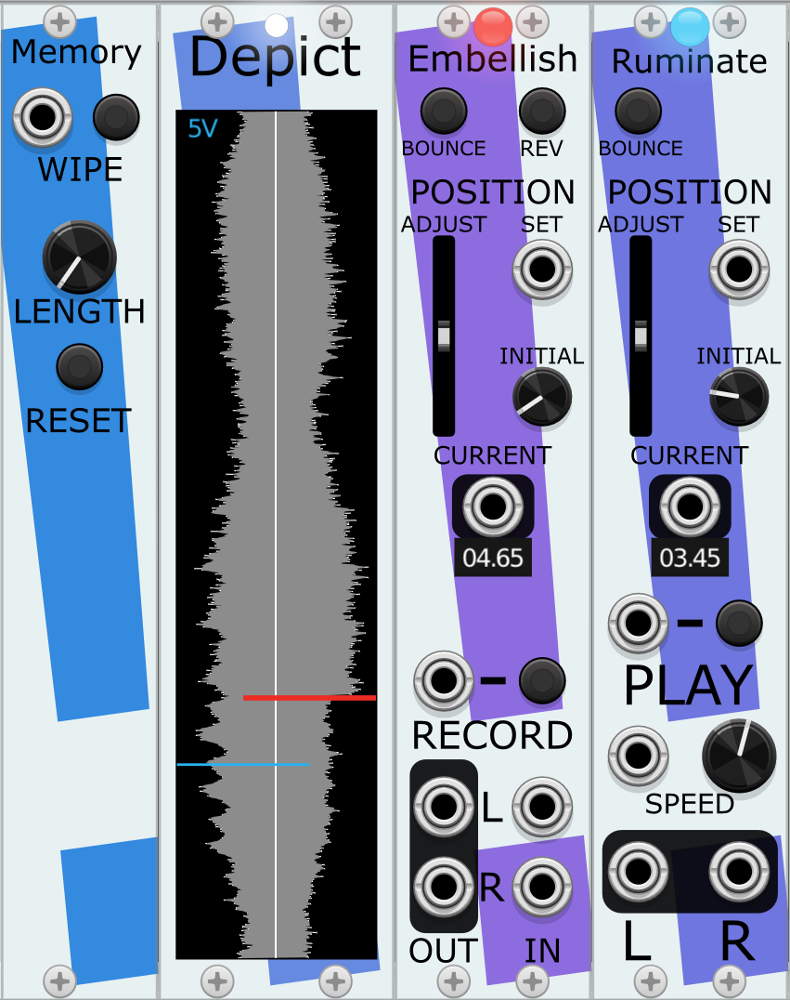
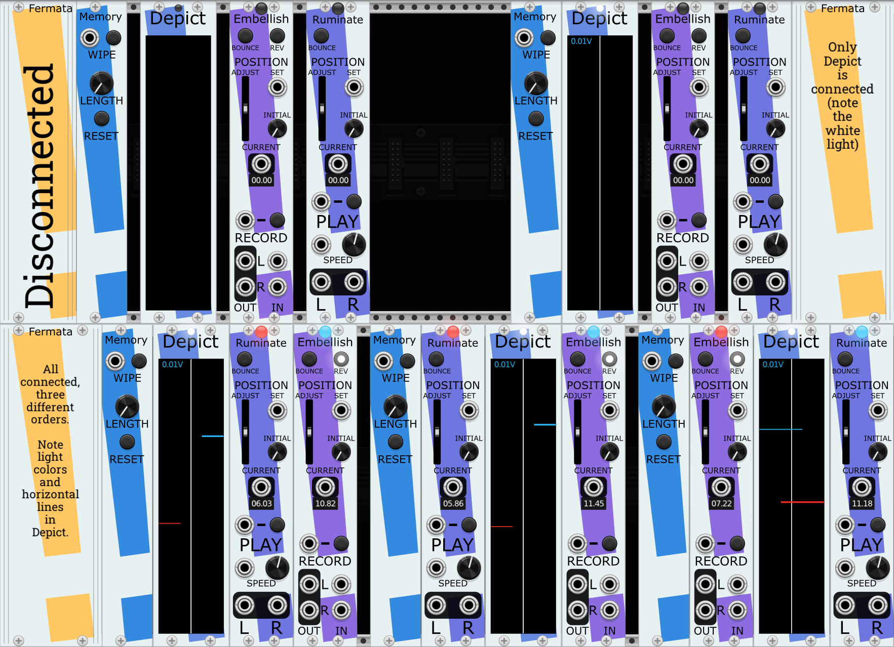

# The Memory modules for VCV Rack
A set of related modules for use with VCV Rack 2.0. They combine to form ensembles of
recording and playback of audio. Forms an inverted tape machine, with a motionless
recording medium (a Memory) and playback and recording heads that move independently within it.

* [Memory](#memory): The module containing the audio. Can be wiped clean
and resized. *Always* the left-most module in any Memory ensemble.
* [Depict](#depict): Visualizes the contents of the Memory and the movement of the heads within it.
* [Embellish](#embellish): Records stereo signals sent to it, but simultaneously plays back the 
audio signal under the head. This makes sound-on-sound, effects passes, and the building up of 
sound over time straighforward.
* [Ruminate](#ruminate): Plays back audio at a large variety of speeds.

# The Memory Ensemble
A Memory ensemble is a set of at least some of these modules next to each other (like extensions). The modules in a single ensemble can be in any order from left-to-right, with the exception that the required Memory module is always the left-most module.

Each non-Memory module has a small light near the top edge of the module; when a module is connected to a Memory (by being in a group of these modules), then it's light will be lit. For some modules, that light will be a color; that color is the same as the color that will be shown for the module in the Depict visualizer.

A typical starting place for a Memory Ensemble is one each of:
* [Memory](#memory) - the storage for the audio data.
* [Embellish](#embellish) - writes audio to Memory.
* [Ruminate](#ruminate) - Plays audio from the content of Memory.
* [Depict](#depict) - Visualizer for the state of Memory and the movement of the Embellish and Ruminate heads. Not required, but helpful. 

# Memory
The basis of any Memory ensemble is exactly one Memory module. Whichever Memory module is closest to the left side of the other modules in the ensemble is the one used by the ensemble.

A Memory by itself cannot play or record audio. It is solely where the stereo audio data is stored and can be retrieved.

Most modules treat the Memory audio data as a circular loop; typically, moving past the arrives at the beginning of the audio.

### Notes on Sample Rate
* The Memory is storing its data at whatever the VCV sample rate was when the module is first created or whatever the VCV sample rate was when the Memory module was last RESET. Changing the VCV Sample Rate will not update the sample rate of the Memory, which will result in playback of audio to be distorted (sped up or slowed down) by the difference in Memory's rate and the current VCV rate.
* Memory modules can consume *a lot* of your computer's RAM when running. The higher the LENGTH, the more data Memory will be storing. The larger the VCV Sample Rate, the more data Memory will be storing. A single Memory set to 1000 seconds (i.e., 16m 40s) at a Sample Rate of 48 kHz is using 366 Mb of RAM.

### Controls
#### WIPE Input and Button
Pressing the button or sending a trigger to the WIPE input will keep the length of the Memory the same, but reset all of the values within it to 0.0V.
#### LENGTH Knob
The length of the Memory audio buffer, in seconds, ranging from 1 - 1000. Changes do not take effect until the RESET button is pressed.
#### RESET Button
Gets rid of the previous audio buffer, creates a new one of LENGTH seconds, then sets it to 0.0V.

# Depict
A module for displaying both a representation of the audio data in Memory and showing the positions of the Embellish and Ruminate heads.

You can have multiple Depict modules in the same ensemble; they will show identical information.

### Example

Depict's display has a few parts to it, shown here:
* The grey center spine shows the peak amplitudes for both the left and right channel of audio data
within the Memory, with the left channel extending from the white centerline to the left, and the white channel extending from the white centerline to the right. 
* The number at the top left displays the current scaling level; in this case, indicating that a line reaching all the way to the edge would be at 5V. This display autoscales up and down to ensure that the highest value in the data is visible (up to 50V).
* The waveform is drawn from beginning (the 0.0V position voltage at the bottom) to end (the 10.0V position voltage at the top). These position voltages are meaningful to the SET, INITIAL, and CURRENT values in Embellish and Ruminate.
* Playback heads (Ruminate) start from the left-hand edge and are drawn to the right, in the color of the light on its corresponding module. The left-to-right position of the line suggests the position within the ensemble that Ruminate can be found. Note how the end point of the red Ruminate line is to the left part, much as the red Ruminate is on the left edge of the ensemble. The end point of the purple Ruminate line is a bit past the centerline, much as the purple Ruminate is just to left of the middle of the ensemble.
* Recording heads (Embellish) start from the right-hand edge and are drawn to the left, in the color of the light on its corresponding module. Again, the left-to-right position of the line suggests the position within the ensemble that Embellish can be found. The end point of the green Embellish line is to the left of the yellow Embellish line, and note that the green Embellish is to the left of the yellow Embellish.

# Embellish

# Ruminate