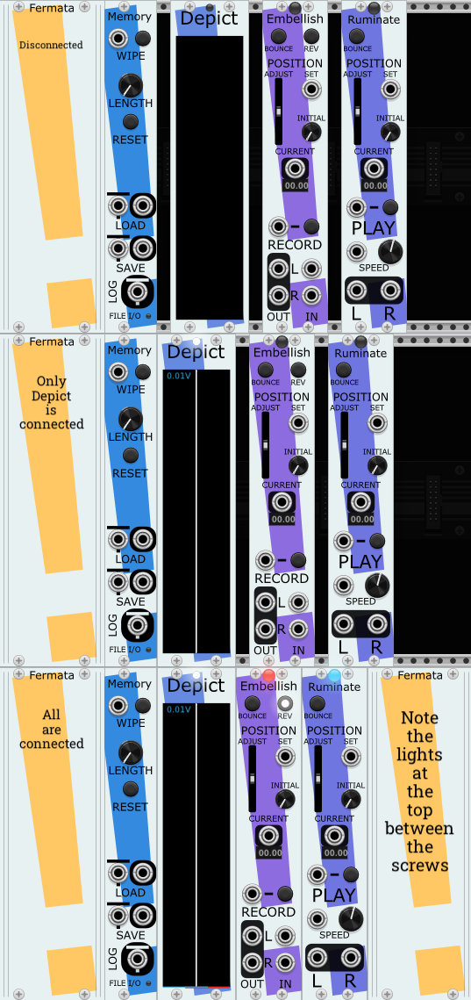

# The Memory modules for VCV Rack
A set of related modules for use with VCV Rack 2.0. They combine to form ensembles of
recording and playback of audio. Forms an inverted tape machine, with a motionless
recording medium (a Memory) and playback and recording heads that move independently within it.

* [Memory](#memory): The module containing the audio. Can be wiped clean
and resized. *Always* the left-most module in any Memory ensemble.
* [Depict](#depict): Visualizes the contents of the Memory and the movement of the heads within it.
* [Embellish](#embellish): Records stereo signals sent to it, but simultaneously plays back the 
audio signal under the head. This makes sound-on-sound, effects passes, and the building up of 
sound over time straighforward.
* [Ruminate](#ruminate): Plays back audio buffer at a large variety of speeds, most easily over the whole Memory.
* [Fixation](#fixation): Also plays back audio from the Memory, but with an emphasis on playing smaller sections and with repetition.

A 15 minute video demonstrating some uses cases [is here](https://youtu.be/EKoMFsSqUo4). It demonstrates these simple patches:
* [Introduction](examples/Memory%20-%20ensemble%20basics.vcv)
* [First Guitar Example](examples/Memory%20-%20guitar%20samples.vcv)
* [Square Wave and Delay](examples/Memory%20-%20Delay%20Pass%20over%20Square%20Wave.vcv)
* [Guitar Beat](examples/Memory%20-%20guitar%20sample%20beat.vcv)
* [Live Recording](examples/Memory%20-%20record%20live.vcv)

These videos demonstrate some other features of these modules:
* [Fade on Move menu option](https://www.youtube.com/watch?v=dOsupn0-Mxw)
* [V/Oct SPEED menu option](https://www.youtube.com/watch?v=kGKmS2WjqIs)
* [Loading Files into Memory](https://www.youtube.com/watch?v=MvuQLtUkY4w)
* [Loading and Saving in Memory](https://www.youtube.com/watch?v=fw6dk4pGn1s)

And these videos discuss Fixation in particular:
* [Playing sections of Memory](https://www.youtube.com/watch?v=nDcjS6hz9qE)
* [Fixation as Highly Controllable Granular Synth](https://www.youtube.com/watch?v=jzkOs-odrig)
* [Playing Melodies with Short Samples](https://www.youtube.com/watch?v=rDCgencIVIY)

The documentation for the *other* Stochastic Telegraph modules can [be found here](README.md).

# The Memory Ensemble
A Memory ensemble is a set of at least some of these modules next to each other (like extensions). The modules in a single ensemble can be in any order from left-to-right, with the exception that the required Memory module is always the left-most module.

Each non-Memory module has a small light near the top edge of the module; when a module is connected to a Memory (by being in a group of these modules), then it's light will be lit. For some modules, that light will be a color; that color is the same as the color that will be shown for the module in the Depict visualizer.

A typical starting place for a Memory Ensemble is one each of:
* [Memory](#memory) - the storage for the audio data.
* [Embellish](#embellish) - writes audio to Memory. But a Memory can load audio from a .WAV file, so not strictly required.
* [Ruminate](#ruminate) or [Fixation](#fixation) - Plays audio from the content of Memory.
* [Depict](#depict) - Visualizer for the state of Memory and the movement of the Embellish, Ruminate, and Fixation heads. Not required, but really helpful to understand what's happening. 

# Memory
The basis of any Memory ensemble is exactly one Memory module. Whichever Memory module is closest to the left side of the other modules in the ensemble is the one used by the ensemble.

A Memory by itself cannot play or record audio. It is solely where the stereo audio data is stored and can be retrieved.

Most modules treat the Memory audio data as a circular loop; typically, moving past the arrives at the beginning of the audio.

### Position and signal voltage
There are knobs, inputs, and outputs that all correspond to positions within the Memory. Since there is no standard way to send a "time" within VCV, and especially since
Memory buffers can be quite a bit larger than 10 seconds, I decided to just map 0-10 to whatever the length of the buffere is. All of them work the same way:
* They range in values from 0.0V to just under 10.0V. Values outside that range will wrap around, hence 10.0V is the same as 0.0V.
* 0.0V is the beginning of the Memory buffer. It appears at the bottom of the Depict display.
* Values close to 10.0V will be at the end.
* Modules have the option of treating the buffer as a loop seamlessly joined at begining and end, or as a bounded region. See the BOUNCE control on those modules.

### Notes on Sample Rate
* The Memory is storing its data at whatever the VCV sample rate was when the module is first created or whatever the VCV sample rate was when the Memory module was last RESET. Changing the VCV Sample Rate will not update the sample rate of the Memory, which will result in playback of audio to be distorted (sped up or slowed down) by the difference in Memory's rate and the current VCV rate.
* Memory modules can consume *a lot* of your computer's RAM when running. The higher the LENGTH, the more data Memory will be storing. The larger the VCV Sample Rate, the more data Memory will be storing. A single Memory set to 1000 seconds (i.e., 16m 40s) at a Sample Rate of 48 kHz is using 366 Mb of RAM.

### Controls
**There are videos about file loading and saving [here](https://www.youtube.com/watch?v=MvuQLtUkY4w) and [here](https://www.youtube.com/watch?v=fw6dk4pGn1s).**
#### WIPE Input and Button
Pressing the button or sending a trigger to the WIPE input will keep the length of the Memory the same, but reset all of the values within it to 0.0V.
#### LENGTH Knob
The length of the Memory audio buffer, in seconds, ranging from 1 - 1000. Changes do not take effect until the RESET button is pressed.
#### RESET Button
Gets rid of the previous audio buffer, creates a new one of LENGTH seconds, then sets it to 0.0V.
#### LOAD Tipsy Input
**The LOAD input takes *only* [Tipsy](https://github.com/baconpaul/tipsy-encoder) inputs. Tipsy is a way to send text over a VCV Rack cable; currently, the only module that can send controllable Tipsy text is
[BASICally](README.md#basically) (see the "print()" command).**

The LOAD input can accept two different types of textual messages:
* A file name, or path and a filename
* * For example, ``foo.wav``, or ``sub/directory/bar.wav``
* * This is assumed to be relative to the Load Folder you set in the menu.
For example, if the Load Folder is set to ``/my sounds``, then sending ``drums/snare.wav`` to the LOAD input will cause Memory to immediately
replace the Memory's contents with the audio from ``/my sounds/drums/snare.wav``, if that file exists.
* ``#N``, where N is some integer number
* * For example, ``#0``, ``#12``, ``#776``
* * In this case, the Nth file (zero-indexed) in the Load Folder will be loaded, wrapping around to the beginning if N is larger than the number of files.
So if your Load Folder conatined the three files, ``apple.wav``, ``banana.wav``, and ``chocolate.wav``, then ``#0``, ``#3``, and ``#6`` would all refer to ``apple.wav``.
* * This means that a BASICally program like the following will load a random file in the Load Folder every time IN1 sees a trigger.

#### LOAD Completion Output
Loading a file takes an amount of time that is hard to predict, since the file can be on an SSD, a spinning hard drive, or a network or cloud drive. And larger
files take longer to read than shorter ones. To help synchronize events that need to happen *after* the file has loaded, this output is provided.

Any time that a file load is completed, no matter how it was started (via the menu or the Tipsy input) and no matter if it succeeds or fails (like if the named
file doesn't exist or isn't a readable .wav file), when it has completed, a trigger will come out of this output. 
#### SAVE Tipsy Input
**The SAVE input takes *only* Tipsy inputs. Tipsy is a way to send text over a VCV Rack cable; currently, the only module that can send useful Tipsy data is
[BASICally](README.md#basically) (see the "print()" command).**

The SAVE input can accept:
* A file name, or path and a filename
* * For example, ``foo.wav``, or ``sub/directory/bar.wav``
* * This is assumed to be relative to the Save Folder you set in the menu.
For example, if the Save Folder is set to ``/my sounds``, then sending ``drums/snare.wav`` to the SAVE input will cause Memory to immediately
save the Memory's contents to the file ``/my sounds/drums/snare.wav``. Note that this will fail if the folder ``/my sounds/drums`` doesn't already exist; Memory
will not create new sub-folders. Also note, **Memory will happily overwrite an already existing file, and cannot ask you to confirm that's what you want.** 
#### SAVE Completion Output
Saving a file takes an amount of time that is hard to predict, since the file can be on an SSD, a spinning hard drive, or a network or cloud drive. And larger
files take longer to save than shorter ones. To help synchronize events that need to happen *after* the file has loaded, this output is provided.

Any time that a file save is completed, no matter how it was started (via the menu or the Tipsy input) and no matter if it succeeds or fails (like if the named
folder doesn't exist or can't be written to), when it has completed, a trigger will come out of this output. 
#### LOG Tipsy Output
If you want to see a human-readable log of load and save events, a cable from this output to one of the TEXTn inputs of the TTY module will show you
any messages it has, including the length of files it reads in. This is especially useful if files aren't loading or saving as you expect.

### Menu Options
#### Pick Folder for Loading
Select a folder to load audio files from. Once this is done, the "Load File" submenu will be populated with all of the WAV files it can load. Any inputs to the
LOAD Tipsy input will be relative to this folder.  
#### Load File
Once the Load Folder has been selected, any files Memory thinks it can read (currently only .WAV files) will be listed here, and selecting one will
immediately load it into the Memory.
#### Load most recent file on module start
If set, when the patch is loaded (or even when the module is duplicated), it will attempt to load
in the last file that was loaded.
#### Pick Folder for Saving
Select a folder to Save .wav files to. Once this is done, any inputs to the SAVE Tipsy input will be relative to this folder.  
#### Save to File...
A standard dialog box to save files with will appear. The entire current contents of the Memory buffer will be saved as a WAV file.

### Known Limitations
* Putting noise into the LOAD and SAVE Tipsy inputs can crash VCV Rack.

# Depict
A module for displaying both a representation of the audio data in Memory and showing the positions of the Embellish, Fixation, and Ruminate heads.

You can have multiple Depict modules in the same ensemble; they will show identical information.
### Example

Depict's display has a few parts to it, shown here:
* The grey center spine shows the peak amplitudes for both the left and right channels of audio data
within the Memory, with the left channel extending from the white centerline to the left, and the white channel extending from the white centerline to the right. 
* The number at the top left displays the current scaling level; in this case, indicating that a line reaching all the way to the edge would be at 5V. This display autoscales up and down to ensure that the highest value in the data is visible (up to 50V).
* The waveform is drawn from beginning (the 0.0V position voltage at the bottom) to end (the 10.0V position voltage at the top). These position voltages are meaningful to the SET, INITIAL, and CURRENT values in Embellish and Ruminate, and the POSITION in Fixation.
* **Ruminate** playback heads start from the left-hand edge and are drawn to the right, in the color of the light on its corresponding module. The left-to-right position of the line suggests the position within the ensemble where Ruminate is located. Note how the end point of the blue Ruminate line is in the middle, much as the blue Ruminate is in the middle of the ensemble.
* **Fixation** playback heads are short lines not connected to either edge, in the color of the light on its corresponding module. The left-to-right position of the line suggests the position within the ensemble where Fixation is located. Note how the position of the yellow Fixation line is to the right, much as the yellow Fixation is the right-most module in the ensemble.
* **Embellish** recording heads start from the right-hand edge and are drawn to the left, in the color of the light on its corresponding module. Again, the left-to-right position of the line suggests the position within the ensemble where Embellish is located. The end point of the red Embellish line is to the left of the other endpoints, as it is the left-most module.

# Embellish
Embellish is used to record audio onto a Memory. Embellish represents a playback and record head that can be moved freely over the length of the audio buffer.

More than one Embellish can be used in the same ensemble. 
### Uses
* To record audio onto the Memory, use the IN (Left and Right) inputs.
* To facilitate sound-on-sound techniques and other novel techniques of manipulation, there are OUT (Left and Right) outputs, which can be routed to any processing you desire and then routed back to the IN inputs.
* * For additively add layers of audio onto a Memory in tape-looping style, route the OUTs to a mixer, add the new audio to the mixer, and send the results to the INs. To avoid uncontrolled signal gain over time, you may wish to slightly lower the levels on the audio from the OUTs or add compression/limiting before sending to the INs.
* * * You can even use panning within the mixer to, say, put the new audio in one position and the previous audio in another.
* * Alternatively (or additionally!), you can use an Embellish to add effects to the audio already present or being actively added by another Embellish. Send the INs to a chorus or distortion or ??? module, and then send the result to the OUTs.
* An Embellish that is running but has no signal entering the INs will erase the Memory it is running over.
* You can use the Position SET or ADJUST to move the recording head to elsewhere on the Memory. This allows for techniques of "painting" the Memory over time, building up an audio loop.
### Controls

#### BOUNCE Button
When unlit, when the head hits the edge of Memory, it will loop around to the other edge and continue.
WHen lit, the head will "bounce" off the edges of Memory, which will result in it recording in reverse even though REV is off.
#### REV Button
Unlike Ruminate, Embellish runs only at one speed, but can operate in forward and reverse.
#### Position ADJUST Slider
ADJUST is a self-centering slider that allows you to manually move the recording head within the memory. Note that recording will stop until the ADJUST slider is released.
#### Position SET Input
SET is an input that resets the position of the head. It takes values from 0.0V to just under 10.0V. When the input value changes, recording (if happening) will stop, the head will move to the new position, and then recording will continue. 
#### Position INITIAL Knob
A value from 0.0v to 10.0 that sets the position of the head ONLY the first time it is turned on.

If there are multiple Embellishes in an ensemble, it is useful to set this value to something different for each Embellish, so that when the patch is restarted, both heads aren't writing to the same exact position, with results that are unlikely to be intended. Similarly, if a Ruminate is running right alongside an Embellish at the same speed (i.e., "1"), the Ruminate can be ducked to zero volume (see Click Avoidance below for why); setting their Initial positions differently avoids that problem. 
#### Position CURRENT Output
An output that emits the position from 0.0V to 10.0V.

Below this is a display showing this position in either:
* seconds.hundredths - if the Memory size is less than 60 seconds OR
* minutes:seconds - if the Memory size is at least 60 seconds
#### RECORD Gate Input and Button
Embellish will record audio if either the button has been pressed into the Recording position or a while a gate is being received by the RECORD input.
#### OUT (Left and Right)
To facilitate sound-on-sound techniques and other techniques of manipulation, there are OUT (Left and Right) outputs, which can be routed to any processing you desire and then routed back to the IN inputs. 
#### IN (Left and Right)
While running, the Embellish module writes whatever signal is arriving in the IN (Left and Right) inputs to the Memory. If no signal is present or the cables are disconnected, it will zero out where it is writing to.
### Bypass Behavior
If Bypass is enabled, Embellish will stop writing. However, turning Embellish on and off using Bypass while recording will also bypass the module's Click Avoidance behavior, so it's not generally advised; it will almost surely add clicks to the recording.

# Ruminate
Ruminate, like Fixation, is used to playback audio from a Memory. Ruminate represents a playback head that can be moved freely over the length of the audio buffer.

More than one Ruminate can be used in the same ensemble. On a Depict, each Ruminate will appear as a
line connected to the left edge of the Depict screen.
### Uses
* To listen to audio recorded into the Memory, attach the OUT (Left and Right) outputs to a mixer. Or better yet, put a few Ruminates in different locations and/or different speeds and mix them together.
* Try playing the same audio at different speeds an octave apart. I find that making one Ruminate run at SPEED 1 and others run at, say, 2.0 or 0.5 or .25 works as a nice starting place. 
### Controls

#### BOUNCE Button
When unlit, when the head hits the edge of Memory, it will loop around to the other edge and continue.
WHen lit, the head will "bounce" off the edges of Memory, which will result in it playing in reverse even though the speed is positive.
#### Position ADJUST Slider
ADJUST is a self-centering slider that allows you to manually move the playback head within the memory. Note that audio output and head movement will stop until the ADJUST slider is released.
#### Position SET Input
SET is an input that resets the position of the head. It takes values from 0.0V to just under 10.0V. When the input value changes, playback (if happening) will stop, the head will move to the new position, and then playback will continue. 
#### Position INITIAL Knob
A value from 0.0v to 10.0 that sets the position of the head ONLY the first time it is turned on.

If there are multiple Ruminates in an ensemble and they are moving at the same speed, it is useful to set this value to something different for each Ruminate, so that when the patch is restarted, both heads aren't playing from the same exact position. Similarly, if a Ruminate is running right alongside an Embellish at the same speed (i.e., "1"), the Ruminate can be ducked to zero volume (see Click Avoidance below for why); setting their Initial positions differently avoids that problem. 
#### Position CURRENT Output
An output that emits the position from 0.0V to 10.0V.

Below this is a display showing this position in either:
* seconds.hundredths - if the Memory size is less than 60 seconds OR
* minutes:seconds - if the Memory size is at least 60 seconds
#### PLAY Input and Button
Ruminate will playback audio if either the button has been pressed into the Playing position or a while a positive gate is being received by the PLAY input.
#### SPEED Input and Knob
The speed that the playback head is traveling is the *sum* of the SPEED Input and Knob value. If you want the SPEED Input to completely control the speed, set the Knob value to zero.

As you might expect, playback speed will affect the pitch and tempo of the sounds played (the following assumes that the "Use Speed as V/Oct" menu option is unchecked):
* "1" is playback at the speed it was recorded at.
* "-1" is playback in reverse, although note that if BOUNCE is set, then when a Ruminate hits the beginning of the audio, it will start playing forwards.
* "0.5" is half speed, pitching the audio down an octave and taking twice as long to play. This is quite possibly the best speed :)
* "2" is double speed, pitched an octave up.

If the "Use Speed as V/Oct" menu option is checked, then the sum of the SPEED input and knob are treated like a V/Oct signal, as seen in
many other modules. More precisely, when SPEED input + knob == 1, then Ruminate will playback at the speed it was recorded at.

The knob goes from -10V to 10V.
#### OUT (Left and Right)
If Ruminate is playing, the audio output is emitted here.

### Menu Options
#### Fade on Move
Affects the behavior when the slider or SET moves the position of the head.
If checked (the default), the L&R outputs will be silent until the position stops changing. If not checked, then the playback will continue as it's being moved.
See [example video](https://www.youtube.com/watch?v=dOsupn0-Mxw).
#### Use Speed as V/Oct
Affects how the SPEED is interpreted. When unchecked (the default),
the sum of the SPEED input and control is how many samples the playhead moves forward per sample emitted, so 1 is normal speed, .5 is half-speed. When checked, this sum will be interpreted the way that V/Oct is interpreted in most modules. See [example video](https://www.youtube.com/watch?v=kGKmS2WjqIs).
### Randomize Behavior
To make the likelihood of pleasing combinations higher, when the Randomize function on the module menu is chosen, the Speed Knob will be
set to values of a just intonation [diatonic scale](https://en.m.wikipedia.org/wiki/Just_intonation#Diatonic_scale), where "1V" is the root. Best when
the audio content is a fairly consistant single tone.

### Bypass Behavior
If Bypass is enabled, Ruminate will stop playing. However, turning Ruminate on and off by using Bypass while playing will also bypass the module's Click Avoidance behavior, so it's not generally advised; it will almost surely have clicks in the audio it sends out.

# Fixation
Fixation, like Ruminate, is used to playback audio from a Memory. Fixation has abilities that let it excell at playing short bits of a Memory repeatedly. It's ideal for looping for set lengths of time or for restarting based on a clock signal.

More than one Fixation can be used in the same ensemble. On a Depict, each Fixation will appear as a
short line, not connected to either edge.
### Controls

The STYLE control is key to understanding how Fixation will behave. Note that some controls will have no effect if particular STYLE's are selected.

#### CLOCK Input

Two of the STYLE's initiate and restart playback by triggers received by this input.

#### POSITION Knob, Attenuverter, and Input

When a position to play from is needed (see the STYLE section below), the value of the POSITION Input (if present) is multiplied by the Attenuverter value, and this product is added to the value of the POSITION knob. That value is wrapped around into a value from 0V-10V, and that position within the buffer be used.

#### LENGTH Knob, Attenuverter, and Input

When a length of audio to play is needed (see the STYLE section below), the value of the LENGTH Input (if present) is multiplied by the Attenuverter value, and this product is added to the value of the LENGTH knob. That value is limited to a value from 1 ms to 10 seconds, and that length of audio within the buffer will be played.

#### COUNT Knob

The third STYLE uses this count from 1 - 128 to determine how many repetitions to play (at most) for each CLOCK input.

#### STYLE Knob
There are three possible settings for STYLE:
* **CLOCK only: LENGTH and COUNT ignored**
* Every time a trigger is received by the CLOCK input:
* * playback quickly fades out and stops (if already in progress)
* * the playhead moves to POSITION
* * a trigger is output at TRIG
* * the playback quickly fades up and plays until the next CLOCK.
* **Always plays LENGTH: CLOCK and COUNT ignored**:
* Playback starts at POSITION for LENGTH milliseconds; LENGTH is read every time the loop restarts. Once that playback is complete:
* * playback quickly fades out and stops (if already in progress)
* * the playhead moves to POSITION
* * a trigger is output at TRIG
* * the playback quickly fades up and plays until length is reached.
* **CLOCK starts COUNT repeats of size LENGTH**:
* Every time a trigger is received by the CLOCK input:
* * the LENGTH is read, and a repeat counter is set to zero.
* * the playhead moves to POSITION
* * a trigger is output at TRIG
* * playback quickly fades up and plays for LENGTH milliseconds.
* * the counter is incremented by one. If that counter is now greater than or equal to COUNT, then
playback stops, otherwise we move to POSITION and play again for LENGTH (which is reread) milliseconds.

#### TRIG Output

This will output a short trigger whenever the play head starts playing from a POSITION. This can be useful for starting an envelope around the sound that Fixation outputs.

Note that this will likely NOT be precisely the same as when a CLOCK is received (in STYLE's that use CLOCK), because Fixation will quickly fade down the audio it's currently playing before starting the next playback. See the Click Avoidance section for more detail.

#### PLAY Input and Button
Fixation will playback audio if either the button has been pressed into the Playing position or a while a positive gate is being received by the PLAY input.

The button will be lit only if the playhead is actively playing back audio. For example, it will be unlit when 
#### SPEED Input and Knob
The speed that the playback head is traveling is the *sum* of the SPEED Input and Knob value. If you want the SPEED Input to completely control the speed, set the Knob value to zero.

As you might expect, playback speed will affect the pitch and tempo of the sounds played (the following assumes that the "Use Speed as V/Oct" menu option is unchecked):
* "1" is playback at the speed it was recorded at.
* "-1" is playback in reverse, although note that if BOUNCE is set, then when a Fixation hits the beginning of the audio, it will start playing forwards.
* "0.5" is half speed, pitching the audio down an octave and taking twice as long to play. This is quite possibly the best speed :)
* "2" is double speed, pitched an octave up.

If the "Use Speed as V/Oct" menu option is checked, then the sum of the SPEED input and knob are treated like a V/Oct signal, as seen in
many other modules. More precisely, when SPEED input + knob == 1, then Fixation will playback at the speed it was recorded at.

The knob goes from -10V to 10V.
#### OUT (Left and Right)
If Fixation is playing, the audio output is emitted here.

### Menu Options
#### Fade on Move
Affects the behavior when the slider or SET moves the position of the head.
If checked (the default), the L&R outputs will be silent until the position stops changing. If not checked, then the playback will continue as it's being moved.
See [example video](https://www.youtube.com/watch?v=dOsupn0-Mxw).
#### Use Speed as V/Oct
Affects how the SPEED is interpreted. When unchecked (the default),
the sum of the SPEED input and control is how many samples the playhead moves forward per sample emitted, so 1 is normal speed, .5 is half-speed. When checked, this sum will be interpreted the way that V/Oct is interpreted in most modules. See [example video](https://www.youtube.com/watch?v=kGKmS2WjqIs).
### Randomize Behavior
To make the likelihood of pleasing combinations higher, when the Randomize function on the module menu is chosen, the Speed Knob will be
set to values of a just intonation [diatonic scale](https://en.m.wikipedia.org/wiki/Just_intonation#Diatonic_scale), where "1V" is the root. Best when
the audio content is a fairly consistant single tone.

### Bypass Behavior
If Bypass is enabled, Fixation will stop playing. However, turning Fixation on and off by using Bypass while playing will also bypass the module's Click Avoidance behavior, so it's not generally advised; it will almost surely have clicks in the audio it sends out.

# Click Avoidance
Having recording heads starting and stopping and playback heads moving past recording heads is a recipe for usually annoying clicks and pops. A math-oriented person (like myself) might think of them as "discontinuities". For the sake of brevity, I'll forego describing all of the ways that the Memory system works to avoid these, and just mention a couple things:
* A playback head (i.e., Ruminate or Fixation) will fade its output volume to zero when it passes over a recording head, and then fade the volume back up. This usually happens in less than a millisecond of time, and is, in my experience, not noticable. However, a side effect of this is that if a playback head is moving at the same speed as a recording head and very closely near it (like within 50 samples), it's volume may be reduced or even zero. Setting the INITIAL position knobs to different values can help spread them apart when you start up the patch.
* Similarly, when two recording heads pass each other (e.g., in opposite directions), they will both fade out the signal they are writing to Memory.
* Another source of clicks is turing the playback head on and off, so this also fades in and out.
* Whenever a recording head starts or stops, it will "smooth out" where that happened.

Again, all of these interventions are quite brief in duration and you can safely forget they are happening; I'm just mentioning it here for completeness.

### Related Modules
Any Delay or Sampler module can do some of what the Memory system can do.

# Acknowledgements
Many thanks to [Marc Weidenbaum](https://disquiet.com/) for his offhand suggestion
that resulted in this idea coming to fruition. His encouragement and enthusiasm for
this idea were essential to it reaching this point.

Thanks to both [BaconPaul](https://baconpaul.org/) and
[pachde](https://library.vcvrack.com/?query=&brand=pachde&tag=&license=) of the VCV Rack 
community for greatly extending my silly idea to send text over a VCV cable and
seeing far more value in it then I did. And for then doing the actual work of
implementing it.

And my deepest gratitude to Diane LeVan, for letting me ignore her and useful household projects
for periods of time just to craft these things. I apologize for
waking up with new ideas at 5AM, and for having a retirement hobby that
is nearly impossible to even *start* describing to any of our friends.
