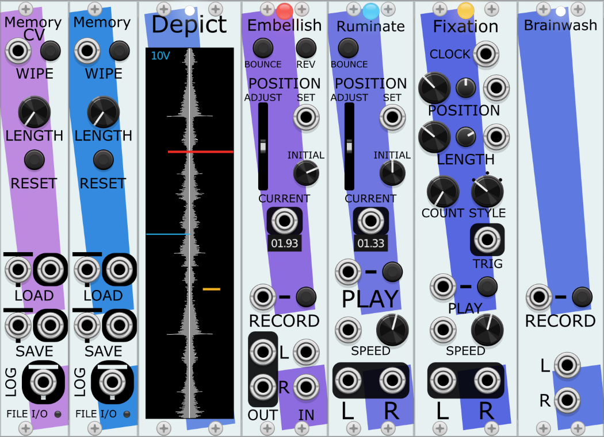

# The Memory modules for VCV Rack
A set of related modules for use with VCV Rack 2.0. They combine to form ensembles of
recording and playback of audio. Forms an inverted tape machine, with a motionless
recording medium (a Memory) and playback and recording heads that move independently within it.

* [Memory](#memory): The module containing the audio. Can be wiped clean
and resized. *Always* the left-most module in any Memory ensemble.
* [Depict](#depict): Visualizes the contents of the Memory and the movement of the heads within it.
* [Embellish](#embellish): Records stereo signals sent to it, but simultaneously plays back the 
audio signal under the head. This makes sound-on-sound, effects passes, and the building up of 
sound over time straighforward.
* [Ruminate](#ruminate): Plays back audio at a large variety of speeds.

# The Memory Ensemble
A Memory ensemble is a set of at least some of these modules next to each other (like extensions). The modules in a single ensemble can be in any order from left-to-right, with the exception that the required Memory module is always the left-most module.

Each non-Memory module has a small light near the top edge of the module; when a module is connected to a Memory (by being in a group of these modules), then it's light will be lit. For some modules, that light will be a color; that color is the same as the color that will be shown for the module in the Depict visualizer.

A typical starting place for a Memory Ensemble is one each of:
* [Memory](#memory) - the storage for the audio data.
* [Embellish](#embellish) - writes audio to Memory.
* [Ruminate](#ruminate) - Plays audio from the content of Memory.
* [Depict](#depict) - Visualizer for the state of Memory and the movement of the Embellish and Ruminate heads. Not required, but helpful. 

# Memory
The basis of any Memory ensemble is exactly one Memory module. Whichever Memory module is closest to the left side of the other modules in the ensemble is the one used by the ensemble.

A Memory by itself cannot play or record audio. It is solely where the stereo audio data is stored and can be retrieved.

Most modules treat the Memory audio data as a circular loop; typically, moving past the arrives at the beginning of the audio.

### Position and signal voltage
There are knobs, inputs, and outputs that all correspond to positions within the Memory. Since there is no standard way to send a "time" within VCV, and especially since
Memory buffers can be quite a bit larger than 10 seconds, I decided to just map 0-10 to whatever the length of the buffere is. All of them work the same way:
* They range in values from 0.0V to just under 10.0V. Values outside that range will wrap around, hence 10.0V is the same as 0.0V.
* 0.0V is the beginning of the Memory buffer. It appears at the bottom of the Depict display.
* Values close to 10.0V will be at the end.
* Modules have the option of treating the buffer as a loop seamlessly joined at begining and end, or as a bounded region. See the BOUNCE control on those modules.

### Notes on Sample Rate
* The Memory is storing its data at whatever the VCV sample rate was when the module is first created or whatever the VCV sample rate was when the Memory module was last RESET. Changing the VCV Sample Rate will not update the sample rate of the Memory, which will result in playback of audio to be distorted (sped up or slowed down) by the difference in Memory's rate and the current VCV rate.
* Memory modules can consume *a lot* of your computer's RAM when running. The higher the LENGTH, the more data Memory will be storing. The larger the VCV Sample Rate, the more data Memory will be storing. A single Memory set to 1000 seconds (i.e., 16m 40s) at a Sample Rate of 48 kHz is using 366 Mb of RAM.

### Controls
#### WIPE Input and Button
Pressing the button or sending a trigger to the WIPE input will keep the length of the Memory the same, but reset all of the values within it to 0.0V.
#### LENGTH Knob
The length of the Memory audio buffer, in seconds, ranging from 1 - 1000. Changes do not take effect until the RESET button is pressed.
#### RESET Button
Gets rid of the previous audio buffer, creates a new one of LENGTH seconds, then sets it to 0.0V.

# Depict
A module for displaying both a representation of the audio data in Memory and showing the positions of the Embellish and Ruminate heads.

You can have multiple Depict modules in the same ensemble; they will show identical information.
### Example

Depict's display has a few parts to it, shown here:
* The grey center spine shows the peak amplitudes for both the left and right channels of audio data
within the Memory, with the left channel extending from the white centerline to the left, and the white channel extending from the white centerline to the right. 
* The number at the top left displays the current scaling level; in this case, indicating that a line reaching all the way to the edge would be at 5V. This display autoscales up and down to ensure that the highest value in the data is visible (up to 50V).
* The waveform is drawn from beginning (the 0.0V position voltage at the bottom) to end (the 10.0V position voltage at the top). These position voltages are meaningful to the SET, INITIAL, and CURRENT values in Embellish and Ruminate.
* Playback heads (Ruminate) start from the left-hand edge and are drawn to the right, in the color of the light on its corresponding module. The left-to-right position of the line suggests the position within the ensemble that Ruminate can be found. Note how the end point of the red Ruminate line is to the left part, much as the red Ruminate is on the left edge of the ensemble. The end point of the purple Ruminate line is a bit past the centerline, much as the purple Ruminate is just to left of the middle of the ensemble.
* Recording heads (Embellish) start from the right-hand edge and are drawn to the left, in the color of the light on its corresponding module. Again, the left-to-right position of the line suggests the position within the ensemble that Embellish can be found. The end point of the green Embellish line is to the left of the yellow Embellish line, and note that the green Embellish is to the left of the yellow Embellish.

# Embellish
Embellish is used to record audio onto a Memory. Embellish represents a playback and record head that can be moved freely over the length of the audio buffer.

More than one Embellish can be used in the same ensemble. 
### Uses
* To record audio onto the Memory, use the IN (Left and Right) inputs.
* To facilitate sound-on-sound techniques and other novel techniques of manipulation, there are OUT (Left and Right) outputs, which can be routed to any processing you desire and then routed back to the IN inputs.
* * For additively add layers of audio onto a Memory in tape-looping style, route the OUTs to a mixer, add the new audio to the mixer, and send the results to the INs. To avoid uncontrolled signal gain over time, you may wish to slightly lower the levels on the audio from the OUTs or add compression/limiting before sending to the INs.
* * * You can even use panning within the mixer to, say, put the new audio in one position and the previous audio in another.
* * Alternatively (or additionally!), you can use an Embellish to add effects to the audio already present or being actively added by another Embellish. Send the INs to a chorus or distortion or ??? module, and then send the result to the OUTs.
* An Embellish that is running but has no signal entering the INs will erase the Memory it is running over.
* You can use the Position SET or ADJUST to move the recording head to elsewhere on the Memory. This allows for techniques of "painting" the Memory over time, building up an audio loop.
### Controls

#### BOUNCE Button
When unlit, when the head hits the edge of Memory, it will loop around to the other edge and continue.
WHen lit, the head will "bounce" off the edges of Memory, which will result in it recording in reverse even though REV is off.
#### REV Button
Unlike Ruminate, Embellish runs only at one speed, but can operate in forward and reverse.
#### Position ADJUST Slider
ADJUST is a self-centering slider that allows you to manually move the recording head within the memory. Note that recording will stop until the ADJUST slider is released.
#### Position SET Input
SET is an input that resets the position of the head. It takes values from 0.0V to just under 10.0V. When the input value changes, recording (if happening) will stop, the head will move to the new position, and then recording will continue. 
#### Position INITIAL Knob
A value from 0.0v to 10.0 that sets the position of the head ONLY the first time it is turned on.

If there are multiple Embellishes in an ensemble, it is useful to set this value to something different for each Embellish, so that when the patch is restarted, both heads aren't writing to the same exact position, with results that are unlikely to be intended. Similarly, if a Ruminate is running right alongside an Embellish at the same speed (i.e., "1"), the Ruminate can be ducked to zero volume (see Click Avoidance below for why); setting their Initial positions differently avoids that problem. 
#### Position CURRENT Output
An output that emits the position from 0.0V to 10.0V.

Below this is a display showing this position in either:
* seconds.hundredths - if the Memory size is less than 60 seconds OR
* minutes:seconds - if the Memory size is at least 60 seconds
#### RECORD Gate Input and Button
Embellish will record audio if either the button has been pressed into the Recording position or a while a gate is being received by the RECORD input.
#### OUT (Left and Right)
To facilitate sound-on-sound techniques and other techniques of manipulation, there are OUT (Left and Right) outputs, which can be routed to any processing you desire and then routed back to the IN inputs. 
#### IN (Left and Right)
While running, the Embellish module writes whatever signal is arriving in the IN (Left and Right) inputs to the Memory. If no signal is present or the cables are disconnected, it will zero out where it is writing to.
### Bypass Behavior
If Bypass is enabled, Embellish will stop writing. However, turning Embellish on and off using Bypass while recording will also bypass the module's Click Avoidance behavior, so it's not generally advised; it will almost surely add clicks to the recording.

# Ruminate
Ruminate is used to playback audio from a Memory. Ruminate represents a playback head that can be moved freely over the length of the audio buffer.

More than one Ruminate can be used in the same ensemble.
### Uses
* To listen to audio recorded into the Memory, attach the OUT (Left and Right) outputs to a mixer. Or better yet, put a few Ruminates in different locations and/or different speeds and mix them together.
* Try playing the same audio at different speeds an octave apart. I find that making one Ruminate run at SPEED 1 and others run at, say, 2.0 or 0.5 or .25 works as a nice starting place. 
### Controls

#### BOUNCE Button
When unlit, when the head hits the edge of Memory, it will loop around to the other edge and continue.
WHen lit, the head will "bounce" off the edges of Memory, which will result in it playing in reverse even though the speed is positive.
#### Position ADJUST Slider
ADJUST is a self-centering slider that allows you to manually move the playback head within the memory. Note that audio output and head movement will stop until the ADJUST slider is released.
#### Position SET Input
SET is an input that resets the position of the head. It takes values from 0.0V to just under 10.0V. When the input value changes, playback (if happening) will stop, the head will move to the new position, and then playback will continue. 
#### Position INITIAL Knob
A value from 0.0v to 10.0 that sets the position of the head ONLY the first time it is turned on.

If there are multiple Ruminates in an ensemble and they are moving at the same speed, it is useful to set this value to something different for each Ruminate, so that when the patch is restarted, both heads aren't playing from the same exact position. Similarly, if a Ruminate is running right alongside an Embellish at the same speed (i.e., "1"), the Ruminate can be ducked to zero volume (see Click Avoidance below for why); setting their Initial positions differently avoids that problem. 
#### Position CURRENT Output
An output that emits the position from 0.0V to 10.0V.

Below this is a display showing this position in either:
* seconds.hundredths - if the Memory size is less than 60 seconds OR
* minutes:seconds - if the Memory size is at least 60 seconds
#### PLAY Input and Button
Ruminate will playback audio if either the button has been pressed into the Playing position or a while a positive gate is being received by the PLAY input.
#### SPEED Input and Knob
The speed that the playback head is traveling is the *sum* of the SPEED Input and Knob value. If you want the SPEED Input to completely control the speed, set the Knob value to zero.

As you might expect, playback speed will affect the pitch and tempo of the sounds played:
* "1" is playback at the speed it was recorded at.
* "-1" is playback in reverse, although note that if BOUNCE is set, then when a Ruminate hits the beginning of the audio, it will start playing forwards.
* "0.5" is half speed, pitching the audio down an octave and taking twice as long to play. This is quite possibly the best speed :)
* "2" is double speed, pitched an octave up.

The knob goes from -10V to 10V.
#### OUT (Left and Right)
If Ruminate is playing, the audio output is emitted here.
### Randomize Behavior
To make the likelihood of pleasing combinations higher, when the Randomize function on the module menu is chosen, the Speed Knob will be
set to values of a just intonation [diatonic scale](https://en.m.wikipedia.org/wiki/Just_intonation#Diatonic_scale), where "1V" is the root. When the audio content is a fairly consistant single tone.
### Bypass Behavior
If Bypass is enabled, Ruminate will stop playing. However, turning Ruminate on and off by using Bypass while playing will also bypass the module's Click Avoidance behavior, so it's not generally advised; it will almost surely have clicks in the audio it sends out.
# Click Avoidance

### Related Modules
Any Delay or Sampler module can do some of what the Memory system can do.

# Acknowledgements
Many thanks to [Marc Weidenbaum](https://disquiet.com/) for his offhand suggestion
that resulted in this idea coming to fruition. His encouragement and enthusiasm for
this idea were essential to it reaching this point.

And my deepest gratitude to Diane LeVan, for letting me ignore her and useful household projects
for periods of time just to craft these things. I apologize for
waking up with new ideas at 5AM, and for having a retirement hobby that
is nearly impossible to even *start* describing to any of our friends.
