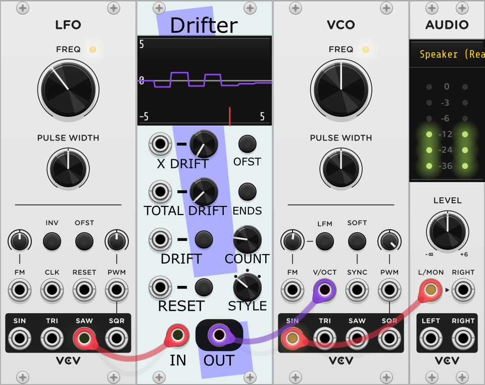

# VCV Rack plugin by Stochastic Telegraph
Modules for use with VCV Rack 2.0, with an emphasis on generative and self-regulating structure. Exploring the region between random and static.

## BASICally
A simple, somewhat familiar procedural programming language within the
context of Rack. Can act like:
* a sequencer
* VCO or LFO
* wavefolder
* control voltage utility
* sample and hold
* all of the above and more, simultaneously

Useful both for quickly trying out a transformation and efficient enough to use anywhere.

### Examples

TODO: Image of simple example.

TODO: Link to patch file with numerous examples.

TODO: video of different examples and their output

## Uses

### Sequencer

### Logic

### Sample and Hold

### Oscillator

### Utility

## The Language
### Setting Variables (i.e., Assignment)

### WAIT Statements

### Comments
A single quote followed by a space indicate that the rest of the line will
treated as a comment only to be read by the user.

Some examples:

    out2 = 3.250 ' A C4 note.
    WAIT 200 ' Pause for 1/5 of a second.
    ' Look, I'm live-coding!
    ' Next line can be turned on just by removing the initial quote.
    ' out1 = 2.3 * in1

### IF Statements

### FOR Loops

### CONTINUE FOR and ALL

### EXIT FOR and ALL

### Other
All of the OUTn outputs are limited to send values between -10V and 10V.
Anything higher or lower will be locked down to

BASICally is intended for the very casual user, with the hope that examples
alone will suffice to suggest how programs can be written. Because of the UI
limitations, detailed error reporting is difficult to provide.

Since programs are typically *very* short, the language leans towards ease for
the casual user. For that reason, the following lists a few surprising
differences from more robust languages:
* BASICally is case-insensitive. OUT1, oUt1, and out1 all refer to the same
variable. I would certainly suggest you be consistent within in your programs,
but the module won't insist on it.
* Newlines do not matter, *except* that comments always end with a newline.
* Indentation does not matter. That said, even short programs can benefit from
the indentation demonstrated in the examples.

## Slightly Surprising Details

### Implied WAIT 0 Statements

### Controls
#### GOOD Light

#### STYLE Knob

#### RUN Button and Input

### Menu Options

### Bypass Behavior

### Related Modules
For strictly mathematical transformations, Frank Buss's [Formula](https://library.vcvrack.com/FrankBuss/Formula) is more straightforward and (at least
in my brief testing) more CPU efficient module.

## Drifter
Creates sequences of values that can slowly (or quickly) vary, like a series of
points doing random walks connected into a series.

### Examples

* Set this up, and you'll just hear a single tone.
* Now try tapping the DRIFT button a few times, and you'll hear the frequency change.
 * The IN signal is the value coming out of the Saw wave, and is shown in the display as a short line moving from left to right along the bottom.  
 * The OUT signal is the height (Y position) of the line in the display that jumps whenever you press DRIFT at the X position of IN.
* Set the TOTAL DRIFT value to something larger, like 5.0.
* Now press DRIFT; the line moves a lot more now!
* Play with the STYLE knob, which changes the shape of the line in the display and hear how that changes the OUT values.
* There are many more knobs and controls, and they are described below. They long to be twiddled!

More examples can be found in [this patch](examples/AnnotatedSunlightOnSeaAnemones.vcv). You can [hear the results](https://www.youtube.com/watch?v=uagZ6GN_s1Y).

### Uses
Creating or modifying a series of values you wish was gradually (or drastically) changing - melodies, volume levels,
waveforms, CV levels. Note that the use of a Saw wave as the input in the
sample rack is just to better illustrate the idea of it being a
transformation function; you can put whatever you like into IN. Sine wave,
oscillator output, random,... Drifter alters signals, basically.

[Here's a video from Pazi K.](https://www.youtube.com/watch?v=L5No8J7SPK4) showing two Drifters being used to simultaneously
create the timbre of two sounds **and** create matching visuals in Etchasketchoscope.

(Someday I'll make a video or two that demonstrates these other notions better.)

### Controls
#### X DRIFT Input and Button
The maximum distance, in V, that each point can move
along the X-axis (i.e., left-to-right) in one DRIFT event. Setting it to
zero locks the points horizontally in place. Higher values allow
larger changes each DRIFT. Hint: start small.
#### OFST Button
Sets the range of the expected inputs and outputs from 0V - 10V or
-5V - +5V.
#### TOTAL DRIFT Input and Button
The maximum distance, in V, that each point can
move in the 2-dimensional space in one DRIFT event. Setting it to zero
locks the points in place. Higher values allow larger changes each
time. Hint: start small.
#### ENDS Button
Selects one of two options: Left and right end points stay locked
at value zero OR end points drift up and down when DRIFT events occur.
#### DRIFT Input and Button
A trigger to the Input or a Button press will
cause all of the points defining the output curve to move once, within the
limits set by X DRIFT, TOTAL DRIFT, and ENDS.
#### COUNT Knob
The number of segments in the steps/line/curve, from 1 (just
connecting the end points) to 32. **Takes effect at the next RESET.**
#### RESET Input and Button
A trigger to the Input or a Button press resets the line to its
starting position, which is all zeroes. This also applies any change to COUNT.
#### STYLE Knob
Selects one of three different line types, Steps/Lines/Curves.
Changes are applied instantly.
#### IN Input
Selects the horizontal position of the point on the line to be
selected. Shown on the display as a short line at the bottom of the display.
#### OUT Output
The vertical position of the line at the position determined by IN.

### Menu Options
#### "Save curve in rack"
* If checked - when the rack is saved, the current position of the line
will be saved with the rack, and that position will be loaded along with the rack.
* If **not** checked - when the rack is loaded, the line will always start at all zeros.

### Bypass Behavior
If this module is bypassed, then OUT will equal IN.

## Fuse
Block, allow, or attenuate a signal passing through, based on the number of triggers
observed in a different signal.
### Examples
#### Counting/Clock Divider

Here the LIMIT is set to 7, and Fuse basically acts like a clock divider,
sending out a trigger every seven input triggers and then resetting the count.

#### The Different Styles

Set this up and let it run, and you'll see that each setting of STYLE
has a different effect on the relationship between IN and OUT, especially as the
count of TRIGGER events gets closer to LIMIT. See the STYLE Knob description
for details.

More examples can be found in [this patch](examples/AnnotatedSunlightOnSeaAnemones.vcv). You can [hear the results](https://www.youtube.com/watch?v=uagZ6GN_s1Y).

### Uses
* Paired with other modules, can simulate modules that "wear out" or "break"
with repeated use.
* Allow generative patches to self-conduct behavioral changes over time.
* Periodically reset other accumulated state in a patch (e.g., in Drifter).
* Create fade-ins or fade-outs of signals that take hours to complete.

### Controls
Note that hovering the cursor over the colored fuse progress bar displays the
current count of TRIGGER events seen and the percentage of the LIMIT
has been reached

#### STYLE Knob
Selects from one of four styles of behavior:
* **BLOW CLOSED** (IN -> 0.0)
** While count is less than LIMIT, OUT equals IN.
Once count >= LIMIT, OUT is set to 0.0V.
* **BLOW OPEN** (0.0 -> IN)
** While count is less than LIMIT, OUT equals 0.0V. Once count >= LIMIT,
OUT equals IN.
* **NARROW** (IN * (1 - count/LIMIT) -> 0.0)
** Initially, OUT equals IN. As the count increases, OUT becomes an increasingly
attenuated version of IN, until it eventually becomes 0.0V.
* **WIDEN** (IN * (count/LIMIT) -> IN)
** Initially, OUT is 0.0V. As the count increases, OUT becomes an increasingly
larger version of IN, until it eventually equals IN.

#### LIMIT Knob
Specify the number of TRIGGER events (from 1 to 1000) that need to be received
for the Fuse to blow.

Hint: To count more than 1000 TRIGGER events, connect the BLOWN
signal of a first Fuse (with LIMIT X) to the TRIGGER of a second (with LIMIT Y)
and to the RESET of the first; then the second Fuse will blow after X*Y
TRIGGER events.

#### TRIGGER Input and Button
A trigger to the Input or a Button press adds one to the count of accumulated
TRIGGER events. If that count now equals LIMIT, then BLOWN will emit a
short trigger.
#### RESET Input and Button
A trigger to the Input or a Button press resets the count of accumulated
TRIGGER events to zero.
#### SLEW Knob
In math terms, OUT = **X** * IN. **X** is a value from 0.0 - 1.0 that is determined by
the STYLE, LIMIT and current count of TRIGGER events.

Note that this knob controls the slew on **X**, not the slew on OUT.
At the default SLEW value (0.0), changes to **X** happen instantaneously; this
*might* cause clicks in OUT, especially when OUT is an audio signal (e.g., a
Sine wave) using the NARROW or WIDEN style. Values of 0.1 will
generally prevent this click.

The value of SLEW is the minimum number of seconds it takes for **X** to change
from 0.0 -> 1.0 or from 1.0 -> 0.0. This means it will also affect how quickly
RESET takes effect. For example, a SLEW value of 2.3 means that a RESET to a
blown BLOW CLOSED Fuse will take 2.3 seconds to move from OUT = 0.0 -> OUT = IN.
The change will be linear (i.e., a straight line).
#### BLOWN Output
Outputs a single trigger once count == LIMIT.
#### IN Input
The signal being altered by Fuse.
#### OUT Output
The altered version of IN. See STYLE Knob for how it will be altered.

### Menu Options
#### "Unplugged value of IN"
A convenience only used when IN has no cable running into it.
The option (-10V, -5V, -1V, 1V, 5V, 10V) that is selected (if any) is then
assumed to be the constant value entering IN. This constant value is then
affected by the STYLE, LIMIT, and count of TRIGGERS when computing OUT, as
per the usual case.

### Bypass Behavior
If this module is bypassed, then OUT will equal IN. If IN has no cable running
into it, then OUT will be 0.0V, *even if* the "Unplugged value of IN" menu
option is set to something else.
