# Stochastic Telegraph modules for VCV Rack
Modules for use with VCV Rack 2.0, with an emphasis on generative and
self-regulating structure. Exploring the region between random and static.

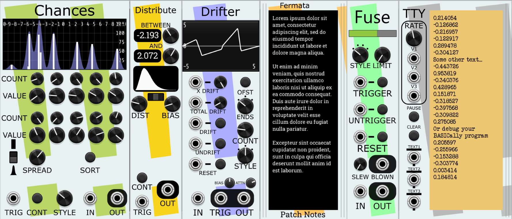
* [Chances](#chances): A random number generator where you select the desired values, their relative frequency, and how values are chosen (e.g., no repeats). Useful as both as a tightly constrained random number generator and as a quantizer for non-note values.
* [Distribute](#distribute): A random number generator with flexible output ranges and unusually tunable probability distributions.
* [Drifter](#drifter): Creates sequences of values that can slowly (or quickly) vary, like a series of points doing random walks connected into a series.
* [Fermata](#fermata): A text editor and labeling module. Write much longer text notes than the VCV Notes module. It's resizable, scrolls, has font choices, and more. Or just add some visual emphasis,
Stochastic Telegraph slant-bang style.
* [Fuse](#fuse): Block, allow, or attenuate a signal passing through, based on the number of triggers observed in a different signal.
* [TTY](#tty): A scrolling text window that displays distinct values it gets, and also displays [Tipsy](https://github.com/baconpaul/tipsy-encoder) text messages sent by other modules (like BASICally).

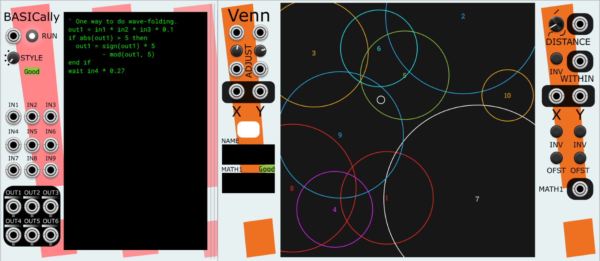
* [BASICally](BASICally.md): A simple, possibly familiar procedural programming language designed to work within the context of VCV Rack. It has [its own documentation](BASICally.md). 
* [Venn](#venn): A 2D graphical signal generator consisting of up to sixteen visible Circles and a visible Point chosen by mouse or CV. Where the Point is in relation to a Circle determines five CV values per Circle. 

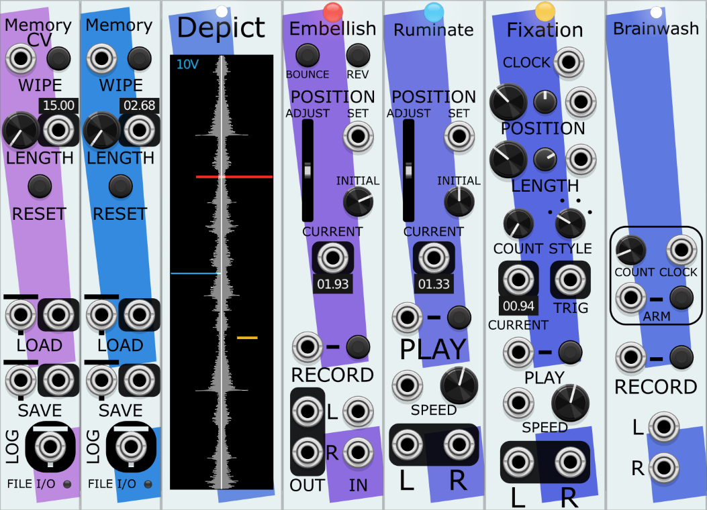
* [The Memory System](Memory.md): A set of seven interrelated recording/playback modules with [their own documentation](Memory.md).

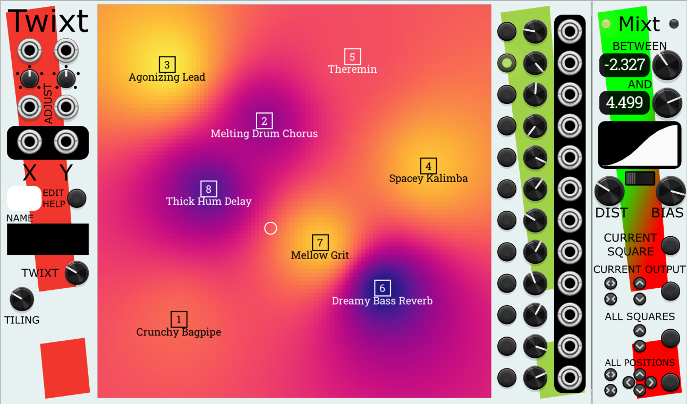
Twixt and Mixt, a pair of premium modules, with [their own documentation](https://github.com/mahlenmorris/STPremium/blob/main/Twixt.md). You can [purchase this plugin here](https://library.vcvrack.com/StochasticTelegraphTwixt).

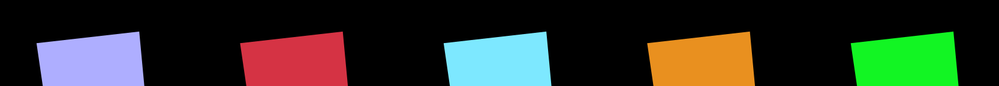

# Chances
A random number generator where you select the desired values and their relative frequency. You also select how values are chosen; e.g., sampling with repetition, shuffled into an order, or sampled but with no repeats. You can also specify the allowed SPREAD of output values from your desired values, allowing as much or as little variation from the desired values as you like.

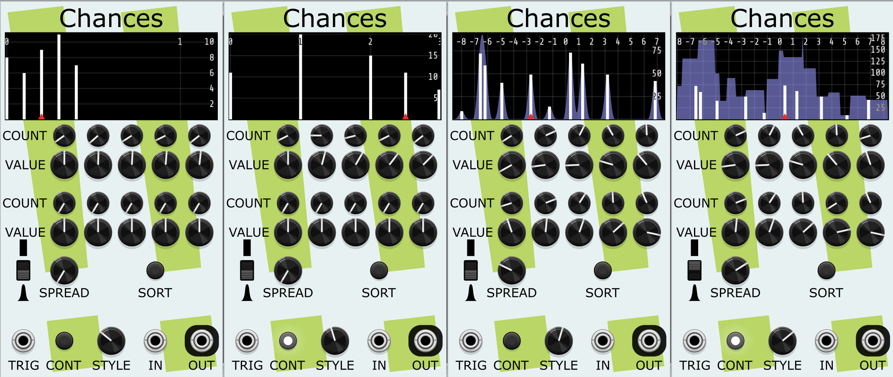

### Uses
* Create a random or *sort of* random stream of CV values with highly controlled constraints. These might be:
* * A particular set of V/Oct notes.
* * A set of note-like V/Oct values, but not in any known scale.
* * Values that change the V/Oct octave (e.g., -2, -1, 0, 1), with the COUNT specifying the likelyhood of each octave being chosen.
* * Use the values to specify particular amounts of an effect, like distortion or delay lengths. 
* Choosing the "Input Selection" STYLE effectively quantizes an incoming signal to one of ten values, and here the COUNT dictates how much of the input range quantizes to any specific value. 
### Controls
#### Pairs of COUNT and VALUE Knobs
There are ten pairs of COUNT and VALUE knobs. VALUE ranges from -10V to 10V, and COUNT ranges from 0 to 100. When the COUNT is zero (the default), then that pair will not contribute to the PDF (Probability Distribution Function) displayed at the top of Chances.

When the COUNT is more than zero, the larger the COUNT, the greater the chance that value will be output. See the STYLE knob below for details about how COUNT's affect the chances of the value being output.

Note that VCV Rack has [a number of ways to enter particular values](https://vcvrack.com/manual/KeyCommands#Parameter-commands) into a knob. For example, right-clicking a knob and typing "d#3v" will set the knob to the V/Oct value of the D#3 note.
#### SORT Button
It's often simpler to manipulate the PDF when the VALUEs are sorted from smallest to largest. Pressing this button will sort the knob pairs that way, with all of the COUNT==0 pairs at the end. This will not affect the PDF or output stream in any way.
#### SPREAD
Ranges from 0V to 2V, defaults to 0V. Turning this above zero allows Chances to output values that are SPREAD volts away from the value that was selected. As you turn the knob, you'll see on the display a blue outline of the PDF for a SPREAD of that value.

The ways this works is:
* A value is selected according to the COUNT+VALUE knobs and the setting of the STYLE knob.
* If SPREAD is non-zero, then Chances will a select a voltage between zero and SPREAD and either add or subtract that. The selection is done according to the Kind of SPREAD switch.

This allows you to allow and control small (or large) amounts of variance from the VALUEs, and greatly expands the variety of PDF's that Chances can follow.
#### Kind of SPREAD Switch
The default value for this (down) is a normal or Gaussian selection of SPREAD amounts (1).
So most of the time, the result will still be close to the initial value chosen.

The other value (up) is a uniform selection of SPREAD amounts. Thus any voltage N between (VALUE - SPREAD) and (VALUE + SPREAD) is equally likely.

(1) OK, it's not *exactly* Gaussian, it's Irwin-Hall with N=3. Please do not use Chances for cryptographic or scientific purposes :)

#### TRIG Input
If CONT is off, then new random values will only be generated when TRIG receives a trigger. The value(s) at OUT will be held until the next trigger occurs. This TRIG signal can be polyphonic; if it has more than one channel, then OUT will have the same number of channels. This allows you to, for example, use the same Chances for multiple values, but at different times.
See also the Menu Option that affects this. 

If CONT is on, then TRIG will be largely ignored, except for how it affects the OUT channel count.
#### CONT Button
If set (light is lit), then Chances will continuously generate new random values on every sample.
#### STYLE
There are four different kinds of STYLE, each with a different effect on how values are chosen.

To make this easier to visualize, imagine that you have three COUNT+VALUE pairs:

| VALUE | COUNT |
| ----- | ----- |
| -1 | 1 |
| 1.5 | 5 |
| 3.14 | 2 |

Now imagine laying these into a linear grid in order of VALUE, where each value is listed COUNT times:

| Value |
| ----- |
| -1 |
| 1.5 |
| 1.5 |
| 1.5 |
| 1.5 |
| 1.5 |
| 3.14 |
| 3.14 |

Let's call this the **List**. The **List** is reconstructed each time the VALUE or COUNT knobs are changed. 

Each STYLE selects values from the **List** in different ways. 

**Sampling** - every time we need a new value, it picks from the **List** at random, with each item in the **List** being equally likely each time. This is what you likely expect from a random generator. VALUEs with higher COUNTs are, unsurprisingly, more likely to be output.

**Shuffling** - When **Shuffling** is first selected, the **List** is shuffled into a random order, like a deck of cards. Whenever a value is needed, it deals from the top of this shuffled list; when it runs out, Chances then shuffles the current **List** again. This is less purely random than **Sampling** is, since the run of a shuffled list always contains all of the VALUES, and in exactly the COUNTs you specified.

Note that each OUT channel has its own, separate shuffled list that it draws from.

**No Repeats** - This is just like **Sampling**, except the value that was previously chosen is not allowed to be chosen. If there are only two distinct VALUE's, then Chances will just alternate values. If there is only one distinct value, it will keep picking that one value. This is even "less random".

Each OUT channel has its own, separate idea of what value it just output.

**Input Selection** - This STYLE is a bit different, and requires voltage(s) to be entering Chances via the IN port. It acts like a quantizer, mapping the IN values to positions in the **List**. This mapping depends on the range selected in the module's menu.

Supposing that you have **[0V, 10V]** selected in the menu. Since the **List** has eight items in it, then the mapping of IN to Value would be:

| IN | Value |
|----| ----- |
| 0, 1.25| -1 |
| 1.25 - 2.5| 1.5 |
| 2.5 - 3.75| 1.5 |
| 3.75 - 5| 1.5 |
| 5 - 6.25| 1.5 |
| 6.25 - 7.5| 1.5 |
| 7.5 - 8.75| 3.14 |
| 8.75 - 10| 3.14 |

Or more simply:

| IN | Value |
|----| ----- |
| 0, 1.25| -1 |
| 1.25 - 7.5| 1.5 |
| 7.5 - 10| 3.14 |

So a curious sort of quantizer, where you can give some values a wider part of the input domain than others. Unlike most quantizers, though, it has no notion of "octaves".

Interesting sources of IN signals include LFO's and other random sources.

**No Repeats 2** - Like **No Repeats**, as the value that was previously chosen is not allowed to be chosen. Unlike **No Repeats**, it also weights each value's likelihood of being chosen, meaning that, all else being equal, the number of TRIG's between repeated values tends to be longer. The COUNT's for each value are multiplied by it's respective weight.

After being chosen, the weights for a value being chosen again move from 0.0 -> 0.33 -> 0.67 -> 1.0.
Per our example above, let's move through a series of value choices and see how the weights are applied:

When just starting (or after a RESET trig has been observed), we are here.

| VALUE | COUNT | WEIGHT | SLOTS |
| ----- | ----- | -----  | ----- |
| -1 | 1 | 1.0 | 1 |
| 1.5 | 5 | 1.0 | 5 |
| 3.14 | 2 | 1.0 | 2 |

A TRIG is observed, and we chose a value, and it is, say, **1.5**. Now the state is:

| VALUE | COUNT | WEIGHT | SLOTS |
| ----- | ----- | -----  | ----- |
| -1 | 1 | 1.0 | 1 |
| 1.5 | 5 | 0.0 | 0 |
| 3.14 | 2 | 1.0 | 2 |

A 2nd TRIG is observed, and we chose a value. It cannot be 1.5, because the WEIGHT and thus SLOTS is 0.0. Chances then picks, say, **-1**. Now the state is:

| VALUE | COUNT | WEIGHT | SLOTS |
| ----- | ----- | -----  | ----- |
| -1 | 1 | 0.0 | 0 |
| 1.5 | 5 | 0.33 | 5 * 0.33 = 1.65 |
| 3.14 | 2 | 1.0 | 2 |

A 2nd TRIG is observed, and we chose a value. It cannot be -1, because now *its* weight is 0.0. Chances then picks, say, **3.14**. Now the state is:

| VALUE | COUNT | WEIGHT | SLOTS |
| ----- | ----- | -----  | ----- |
| -1 | 1 | 0.33 | 0.33 |
| 1.5 | 5 | 0.67 | 3.35 |
| 3.14 | 2 | 0.0 | 0 |

#### RESET Input
As the name implies, resets the state of the value selection algorithm, if it has any. A trigger received by RESET does the following:
* Sampling/Input Selection - no effect
* Shuffling - forces an immediate reshuffle
* No Repeats - forgets the most recently chosen value, allowing it to repeat on the next TRIG
* No Repeats 2 - clears all weights.

#### IN Input
Only used when STYLE is set to **Input Selection**. See the STYLE knob's **Input Selection** description for details about how IN uses Chances as a polyphonic quantizer.

#### OUT Output
Outputs a stream of random values based on the controls above. 
### Menu Options

#### Default number of OUT channels
Sometimes you want multiple OUT channels (e.g., three different notes being generated on the same scale) but you want them synced to the same trigger. Instead of you having to create a polyphonic TRIG input, this menu option allows you to set the number of OUT channels whenever there is only a single TRIG channel.

Note that OUT will not always have this many channels:
* If TRIG has more than one channel, then OUT will have the same number of channels.
* If STYLE is set to "Input Selection", then OUT will have the same number of channels as IN.

### Bypass Behavior
If this module is bypassed, then OUT will equal 0.0.

### Related Modules
Many modules tagged with "Random" will also produce random values. See also my [Distribute](#distribute) module for a different take on random numbers.
If you'd like to use Chances to create sequences (like a Turing machine), using Count Modula's [16](https://library.vcvrack.com/CountModula/ShiftRegister16) and [32](https://library.vcvrack.com/CountModula/ShiftRegister32) value Shift Registers could likely get you there.

# Distribute
Generates random values with flexible output ranges and unusually tunable probability distributions.

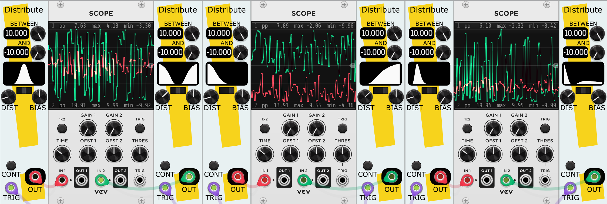

### Uses
* Create random CV values within a desired range.
* Bias the output of random values in a variety of ways. For example, if you wanted a V/Oct source that usually stayed 
in a small range of values, but occasionally produced a note outside that range.

### Techniques
Distribute creates single values, with no method of transitioning between values in any smooth way.
Connecting the output to a slew limiter allows you to control the maximum rate of change.
But if you want to have the change occur over a known period of time [this technique using the VCV Random module](https://community.vcvrack.com/t/constant-time-slew-limiter-with-shape-and-v-oct-control-over-time/26062/11)
is quite handy.

### Controls
#### Upper Limit Knob
The maximum value of the range of OUT values. Defaults to 10.0V.
Don't worry if this is below the lower limit, Distribute will automatically
swap the limits in a sensical way.
#### Lower Limit Knob
The minimum value of the range of OUT values. Defaults to -10.0V.
Don't worry if this is above the upper limit, Distribute will automatically
swap the limits in a sensical way.
#### Left/Both/Right Switch
* Left: Use only the left side of the distribution curve. Note that BIAS has no effect when Left is chosen.
* Both: Use the full width of the distribution curve. BIAS can further affect the shape of the value distribution.
* Right: Use only the right side of the distribution curve. Note that BIAS has no effect when Right is chosen.
#### DIST Knob
Shapes the probability density function (PDF) curve of the random values. The curve is visually represented on the little display, allowing you to change the range and distribution of the random values in a number of useful ways.

Example DIST settings when the switch is set to "Both":
* 0 -> A single value that is the average of the two limits.
* 1 -> A bell curve or Gaussian distribution, favoring values in the middle.
* 2 -> A uniform distribution, equally likely to pick any value between the limits.
* 3 -> An inverted Gaussian, picking nothing in the middle.
* 4 -> Only picks the two limit values.
#### BIAS Knob
Only applied when the switch is set to "Both". This allows the PDF curve to be "biased" to higher or lower values.

#### CONT Button
If set (light is lit), then Distribute will continuously generate new random values.
#### TRIG Input
If CONT is off, then new random values will only be generated when TRIG receives a trigger. The value at OUT value 
will be held until the next trigger occurs.
#### OUT Output
Outputs a stream of random values based on the controls above. 

### Menu Options

#### Default number of OUT channels
Sometimes you want multiple OUT channels (e.g., three different control voltages being generated with the same distribution) but you want them synced to one TRIG channel. Instead of you having to create a polyphonic TRIG input, this menu option allows you to set the number of OUT channels whenever there is only a single TRIG channel.

Note that OUT will not always have this many channels:
* If TRIG has more than one channel, then OUT will have the same number of channels.

### Bypass Behavior
If this module is bypassed, then OUT will equal 0.0.

### Related Modules
Many modules tagged with "Random" will also produce random values. See also my [Chances](#chances) module for a different take on random numbers.
If you'd like to use Chances to create sequences (like a Turing machine), using Count Modula's [16](https://library.vcvrack.com/CountModula/ShiftRegister16) and [32](https://library.vcvrack.com/CountModula/ShiftRegister32) value Shift Registers could likely get you there.

# Drifter
Creates sequences of values that can slowly (or quickly) vary, like a series of
points doing random walks connected into a series.

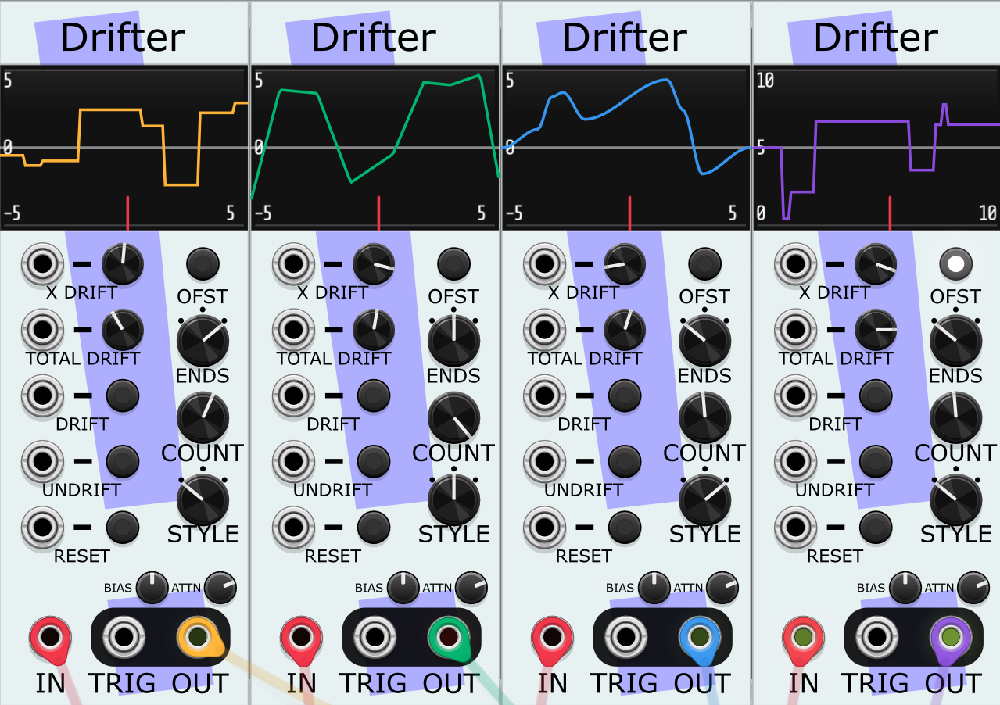

### Examples
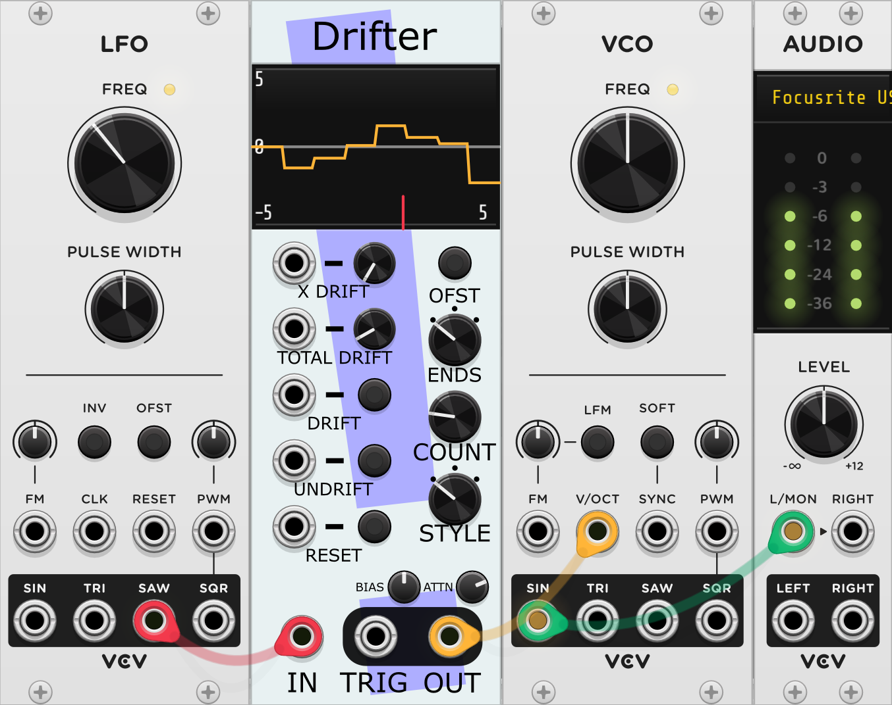

* Download [this small patch](examples/MinimalDrifter.vcv) here.
* Set this up, and you'll just hear a single tone.
* Now try tapping the DRIFT button a few times, and you'll hear the frequency change.
* The IN signal is the value coming out of the Saw wave, and is shown in the display as a short line moving from left to right along the bottom.  
* The OUT signal is the height (Y position) of the line in the display that jumps whenever you press DRIFT at the X position of IN.
* Set the TOTAL DRIFT value to something larger, like 5.0.
* Now press DRIFT; the line moves a lot more now!
* Play with the STYLE knob, which changes the shape of the line in the display and hear how that changes the OUT values.
* There are many more knobs and controls, and they are described below. They long to be twiddled!

More examples can be found in [this patch](examples/AnnotatedSunlightOnSeaAnemones.vcv). You can [hear the results](https://www.youtube.com/watch?v=uagZ6GN_s1Y).

### Uses
Creating or modifying a series of values you wish was gradually (or drastically) changing - melodies, volume levels,
waveforms, CV levels. Note that the use of a Saw wave as the input in the
sample rack is just to better illustrate the idea of it being a
transformation function; you can put whatever you like into IN. Sine wave,
oscillator output, random,... Drifter alters signals, basically.

And with the addition of the TRIG output, you do things like drive a sequencer with TRIG, but let the trigger points move. This changes the timing of the sequencer notes, yet
keeps the length of the whole phrase the same length.

You can also undrift points back to where they were.

[Here's a video from Pazi K.](https://www.youtube.com/watch?v=L5No8J7SPK4) showing two Drifters being used to simultaneously
create the timbre of two sounds **and** create matching visuals in Etchasketchoscope.

[Another patch](https://patchstorage.com/partch-2/), this one demonstrating using Drifter to hold melodies that play
several times and then allow it to vary at specific times.

(Someday I'll make a video or two that demonstrates these other notions better.)

### Controls
#### X DRIFT Input and Button
The maximum distance, in V, that each point can move
along the X-axis (i.e., left-to-right) in one DRIFT event. Setting it to
zero locks the points horizontally in place. Higher values allow
larger changes each DRIFT. Hint: start small.
#### OFST Button
Sets the range of the expected inputs and outputs from 0V - 10V or
-5V - +5V.
#### TOTAL DRIFT Input and Button
The maximum distance, in V, that each point can
move in the 2-dimensional space in one DRIFT event. Setting it to zero
locks the points in place. Higher values allow larger changes each
time. Hint: start small.
#### ENDS Button
Selects one of three options:
* Left and right end points stay locked
at their current value OR end points drift up and down when DRIFT events occur.
* Left and right endpoints drift independently.
* The right-side end point stays at the same value as the left one.

#### DRIFT Input and Button
A trigger to the Input or a Button press will
cause all of the points defining the output curve to move once, within the
limits set by X DRIFT, TOTAL DRIFT, and ENDS. Compare to UNDRIFT.
#### COUNT Knob
The number of segments in the steps/line/curve, from 1 (just
connecting the endpoints) to 32. **Takes effect at the next RESET.**
#### UNDRIFT Input and Button
A trigger to the Input or a Button press will
cause all of the points defining the output curve to move once, within the
limits set by X DRIFT, TOTAL DRIFT, and ENDS, but instead of DRIFT, which allows the
control points to move in any direction, UNDRIFT moves them eventually back towards the state they would be if you clicked RESET. DRIFT loosens the constraints on the curve, UNDRIFT tightens it back up. 
#### RESET Input and Button
A trigger to the Input or a Button press resets the line to its
starting position (see Menu Options below for choosing a starting position).
This also applies any change to COUNT.
#### STYLE Knob
Selects one of three different line types, Steps/Lines/Curves.
Changes are applied instantly.
#### BIAS and ATTN Knobs
ATTN  attenuates and optionally inverts the value of OUT before BIAS is added to it. The combination of BIAS and ATTN make it easier to directly
use the value of OUT.
#### IN Input
Selects the horizontal position of the point on the line to be
selected. Shown on the display as a short line at the bottom of the display.
#### TRIG Output
Outputs a short trigger each time the IN value moves to a new "section" of the graph (i.e., changes which two points it is between). This trigger could be used to start the envelope for a note set by OUT, making it simpler to use Drifter to play drifting melodies. The TRIG signal by itself can be used to make shifting tempos that drift around, yet always play the same number of times per sweep of IN.
#### OUT Output
The vertical position of the line at the position determined by IN.

### Menu Options
#### "Save curve in rack"
* If checked - when the rack is saved, the current position of the line
will be saved with the rack, and that position will be loaded along with the rack.
* If **not** checked - when the rack is loaded, the line will always start at all zeros.
#### RESET Shape
The default behavior for Drifter is to reset the line to evenly-spaced zero
values. However, this makes using Drifter for some uses tricky, so there are
many other shapes you can now RESET to. Each shape has variants called simply
A, B, C, and D.

##### Sine
Variants A, B, C, and D
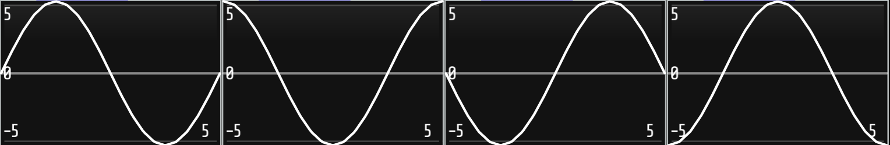
##### Triangle
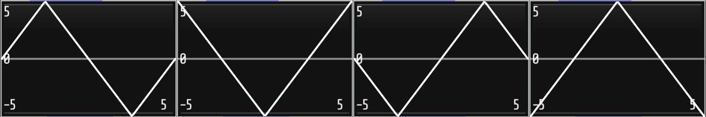
##### Rising Saw
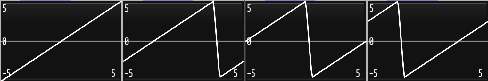
##### Falling Saw
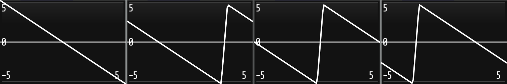
##### Square
Note that the transients in these "squares" aren't perfectly vertical,
because there is always initially some horizontal distance between the
points that define the shape.
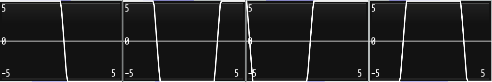

### Bypass Behavior
If this module is bypassed, then OUT will equal IN.

# Fermata
Write longer notes! And wider or narrower text notes.

Here is Fermata:
* as a label, in three of the six available sizes
* expanded a bit, turning it into a text editor
* further expanded, and with different font, font size, and screen color choices.
* a short video [showing the range of sizes](https://www.youtube.com/watch?v=VQs2c6qWk8E).

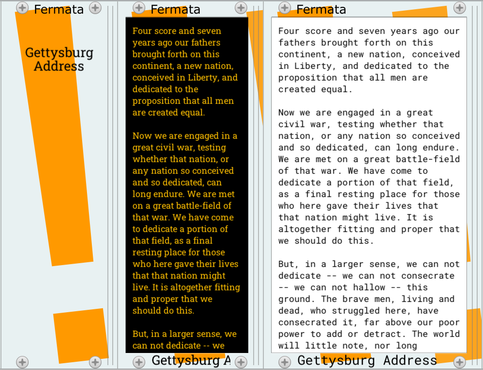
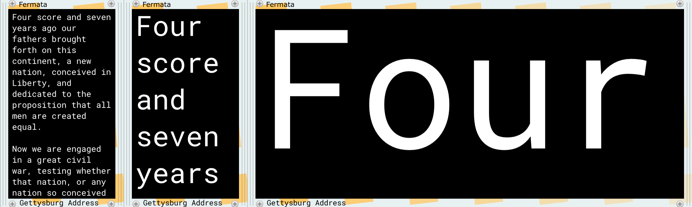

### Uses
* Instructions for playing the patch, for yourself or others.
* Notes/reminders on how this part of the patch works. Take a look at [this patch](examples/AnnotatedSunlightOnSeaAnemones.vcv) for one example of what this might look like.
* TODO's or ideas about the patch.
* As a label, the title names a chunk of the patch, allowing the person seeing
it to pull it open and, say, read more detail on how it works. An example of this can be found in [this patch](examples/AnnotatedSunlightOnSeaAnemones.vcv).
* A very wide banner of horizontal text. You can add easily readable text in a video or still image of your patch.
* A short story or poem you're writing while listening to your patch.

### Features
* Up and down arrow keys work mostly like you expect. Home and End go to the
top and bottom of the text, PgUp and PgDown go up and down a screen length.
* Text scrolls as you move up and down.
* Resize the module by dragging the left or right edges. Size can range
from 3-300 HP.
* Pick from a (small) variety of fonts.
* Pick the number of lines available at a time via the "Visible Lines" menu selection, with ranges from the 28-line default to a single line of **very** large text (like the "Four" in the image above).
* Pick from a (small) variety of foreground/background colors.
* Set the title in the module menu.

Also useful for making a vertical text label:
* Set the title in the menu.
* Resize the module (by dragging the left or right edges) and when it's narrow enough (3-8 HP), the title becomes the label text.

### Menu Options
#### Set Title
Type in the title you'd like to use here.
#### Screen Colors
Pick from a small number of color choices for the editor window.
#### Visible Lines
Pick the font size by selecting the number of visible lines of text, from 28 to 1.
#### Font
Pick from a small number of fonts. The "Mono" fonts are monospaced fonts.

### Known Limitations
* If the text is taking over 1000 physical lines (like if the window is
really narrow, and there is a LOT of text), then you can only show the first
1000 lines. I'll gently suggest you make the module wider, and then more of
the text will be reachable.

### Bypass Behavior
If this module is bypassed, then it will be darker. But otherwise, no different.

### Related Modules
#### Writing Text
* VCV's [Notes](https://library.vcvrack.com/Core/Notes).
#### Labels
* cf's [LABEL](https://library.vcvrack.com/cf/LABEL).
* NYSTHI's [Label](https://library.vcvrack.com/NYSTHI/Label) and
[LabelSlim](https://library.vcvrack.com/NYSTHI/LabelSlim).
* stoermelder's [GLUE](https://library.vcvrack.com/Stoermelder-P1/Glue).
* Submarine's [TD-510](https://library.vcvrack.com/SubmarineFree/TD-510),
[TD-410](https://library.vcvrack.com/SubmarineFree/TD-410), and
[TD-316](https://library.vcvrack.com/SubmarineFree/TD-316).

# Fuse
Block, allow, or attenuate a signal passing through, based on the number of triggers
observed in a different signal.
### Examples
#### Counting/Clock Divider
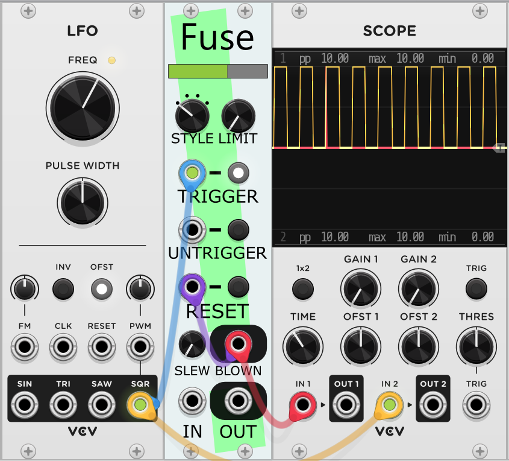

Here the LIMIT is set to 7, and Fuse basically acts like a clock divider,
sending out a trigger every seven input triggers and then resetting the count.

#### The Different Styles
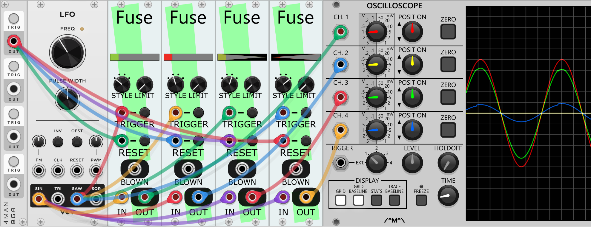

Set this up and let it run, and you'll see that each setting of STYLE
has a different effect on the relationship between IN and OUT, especially as the
count of TRIGGER events gets closer to LIMIT. See the STYLE Knob description
for details.

More examples can be found in [this patch](examples/AnnotatedSunlightOnSeaAnemones.vcv). You can [hear the results](https://www.youtube.com/watch?v=uagZ6GN_s1Y).

### Uses
* Paired with other modules, can simulate modules that "wear out" or "break"
with repeated use.
* Allow generative patches to self-conduct behavioral changes over time.
* Periodically reset other accumulated state in a patch (e.g., in Drifter).
* Create fade-ins or fade-outs of signals that take hours to complete.

### Controls
Note that hovering the cursor over the colored fuse progress bar displays the
current count of TRIGGER events seen and the percentage of the LIMIT
has been reache

#### STYLE Knob
Selects from one of four styles of behavior:
* **BLOW CLOSED** (IN -> 0.0)
** While count is less than LIMIT, OUT equals IN.
Once count >= LIMIT, OUT is set to 0.0V.
* **BLOW OPEN** (0.0 -> IN)
** While count is less than LIMIT, OUT equals 0.0V. Once count >= LIMIT,
OUT equals IN.
* **NARROW** (IN * (1 - count/LIMIT) -> 0.0)
** Initially, OUT equals IN. As the count increases, OUT becomes an increasingly
attenuated version of IN, until it eventually becomes 0.0V.
* **WIDEN** (IN * (count/LIMIT) -> IN)
** Initially, OUT is 0.0V. As the count increases, OUT becomes an increasingly
larger version of IN, until it eventually equals IN.

#### LIMIT Knob
Specify the number of TRIGGER events (from 1 to 1000) that need to be received
for the Fuse to blow.

Hint: To count more than 1000 TRIGGER events, connect the BLOWN
signal of a first Fuse (with LIMIT X) to the TRIGGER of a second (with LIMIT Y)
and to the RESET of the first; then the second Fuse will blow after X*Y
TRIGGER events.

#### TRIGGER Input and Button
A trigger to the Input or a Button press adds one to the count of accumulated
TRIGGER events. If that count now equals LIMIT, then BLOWN will emit a
short trigger.
#### UNTRIGGER Input and Button
If the fuse is not currently blown, then a trigger to the Input or a
Button press **subtracts** one from the count of
accumulated TRIGGER events.
#### RESET Input and Button
A trigger to the Input or a Button press resets the count of accumulated
TRIGGER events to zero.
#### SLEW Knob
In math terms, OUT = **X** * IN. **X** is a value from 0.0 - 1.0 that is determined by
the STYLE, LIMIT and current count of TRIGGER events.

Note that this knob controls the slew on **X**, not the slew on OUT.
At the default SLEW value (0.0), changes to **X** happen instantaneously; this
*might* cause clicks in OUT, especially when OUT is an audio signal (e.g., a
Sine wave) using the NARROW or WIDEN style. Values of 0.1 will
generally prevent this click.

The value of SLEW is the minimum number of seconds it takes for **X** to change
from 0.0 -> 1.0 or from 1.0 -> 0.0. This means it will also affect how quickly
RESET takes effect. For example, a SLEW value of 2.3 means that a RESET to a
blown BLOW CLOSED Fuse will take 2.3 seconds to move from OUT = 0.0 -> OUT = IN.
The change will be linear (i.e., a straight line).
#### BLOWN Output
Outputs a single trigger once count == LIMIT.
#### IN Input
The signal being altered by Fuse.
#### OUT Output
The altered version of IN. See STYLE Knob for how it will be altered.

### Menu Options
#### "Unplugged value of IN"
A convenience only used when IN has no cable running into it.
The option (-10V, -5V, -1V, 1V, 5V, 10V) that is selected (if any) is then
assumed to be the constant value entering IN. This constant value is then
affected by the STYLE, LIMIT, and count of TRIGGERS when computing OUT, as
per the usual case.

### Bypass Behavior
If this module is bypassed, then OUT will equal IN. If IN has no cable running
into it, then OUT will be 0.0V, *even if* the "Unplugged value of IN" menu
option is set to something else.

### Related Modules

* AlliewayAudio's [Bumper](https://library.vcvrack.com/AlliewayAudio_Series_I/Bumper).
* ML Modules' [Counter](https://library.vcvrack.com/ML_modules/Counter).

# TTY
A [teletype](https://en.wikipedia.org/wiki/Teletype_Model_33)-like module for
displaying text messages. Useful for
debugging or saving sets of values that are of interest. TTY can also track
streams of unique CV values from modules, noting them only when they change.

[Video of TTY in action](https://www.youtube.com/watch?v=hDymEax7uEU).
And another video, [showing the range of sizes](https://www.youtube.com/watch?v=VQs2c6qWk8E).

### Examples

TTY logs the values being produced by Random.
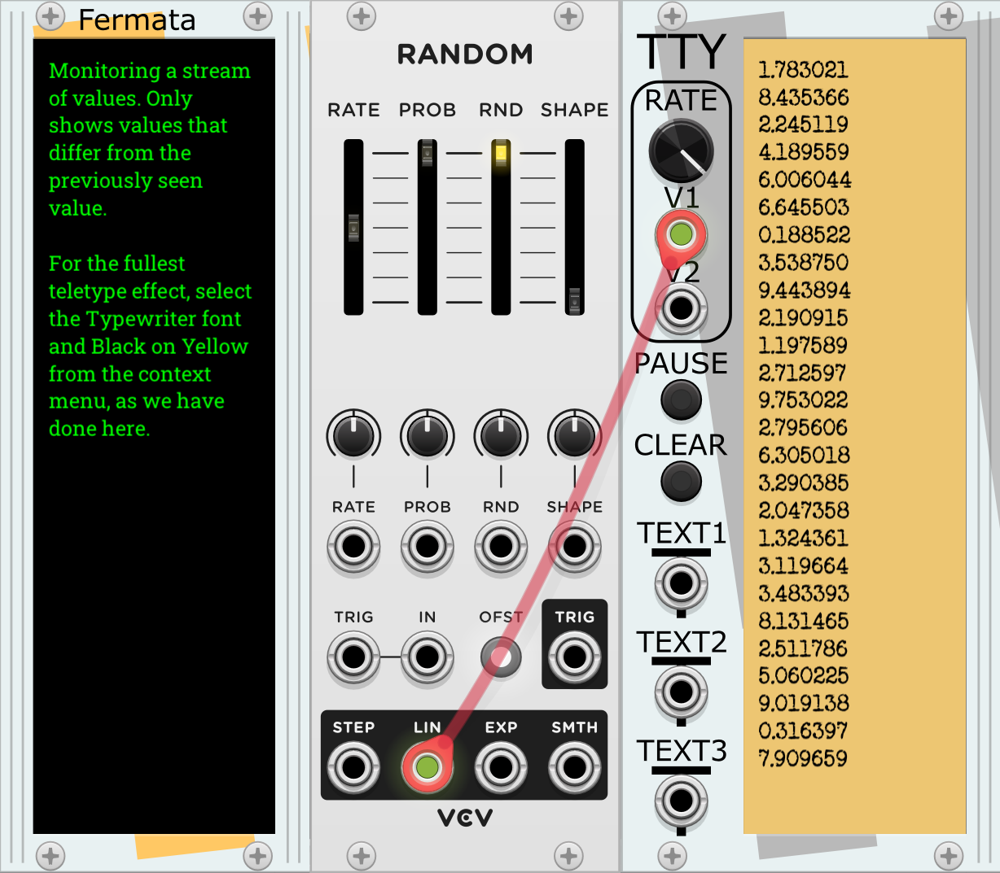

TTY logging the text being sent by BASICally.
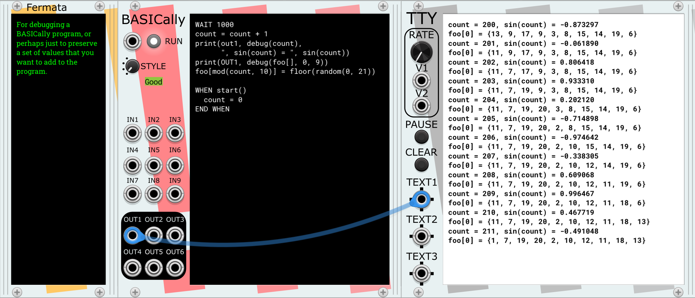

TTY logging the text being sent by Memory when it loads or saves files.
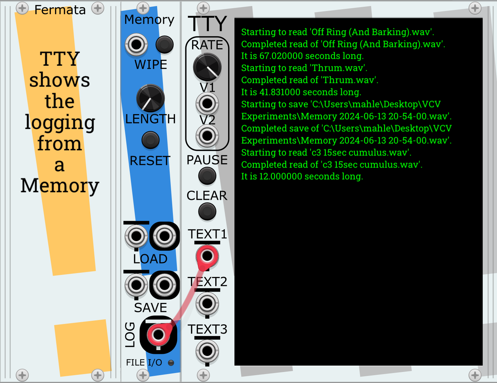

The menu allows for a small selection of fonts, colors, and sizes.
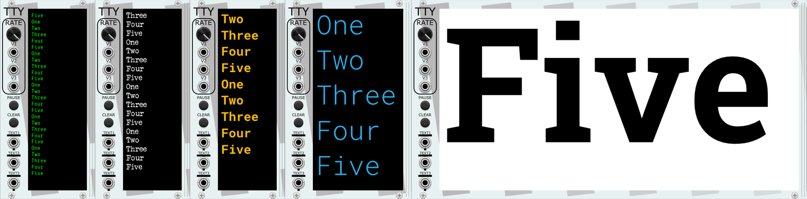

More examples in [this patch](examples/TTYExamples.vcv).

### Uses
* Logging CV values that a generative or non-deterministic process creates. In
some cases, this is more precise, more fine-grained, and easier to read than
a scope trace, especially when monitoring over a long period of time.
* Logging text messages from modules that produce them using the [Tipsy
protocol](https://github.com/baconpaul/tipsy-encoder). As of this writing
in June 2024, the only such modules that I know of are my [BASICally](#basically)
and [Memory](Memory.md#memory) modules.
* With the larger font sizes now available, you can use BASICally to print() a series
of timed messages, providing visual narration to a video performance.

### Features
* **Note that navigation works much better when the Pause button is lit**.
Up and Down arrow keys work mostly like you expect. Home and End go to the
top and bottom of the text, PgUp and PgDown go up and down a screen length.
* Text scrolls as you move up and down.
* Resize the module by dragging the right edge. Size can range
from 4-300 HP.
* Pick from a (small) variety of fonts. Be sure to try the "Veteran Typewriter" font
for a more authentic teletype feeling.
* Pick the number of lines available at a time via the "Visible Lines" menu selection, with ranges from the 28-line default to a single line of **very** large text (like the "Four" in the image above).
* Pick from a (small) variety of foreground/background colors. Be sure to try
"Black on Yellow (TTY Paper)" for that authentic teletype feeling.
* Can be cleared by clicking the CLEAR button or by sending a "!!CLEAR!!" message.

### Controls

#### RATE Knob
Specifies the number of milliseconds between reads on the V1/V2/V3 inputs. If
set to zero, then every sample will be examined. If set to 1000, then TTY will
only examine inputs to V1/V2/V3 once every second.
Note that a low number (turning the knob to the right) means a very high RATE.
This may be a poor nomenclature decision on my part.
RATE has no effect on TEXT inputs.
#### V1, V2, and V3 inputs
Signals sent to V1, V2, or V3 will be monitored. Each time they are examined (see
RATE knob), if the value is different than it was the time before, the new
value will be printed to the text window.
#### PAUSE button
This button latches. If set, new messages will no longer be written to the log.
When unset, new messages will start being written again to the log.
#### CLEAR button
When pressed, the logging window will be cleared of all messages.
The window will also be cleared if any of the TEXT inputs receives a message
that is exactly the special message "**!!CLEAR!!**" (no quotes).
#### TEXT1, TEXT2, and TEXT3 inputs
Text messages can be sent to these ports via the [Tipsy
protocol](https://github.com/baconpaul/tipsy-encoder). If they have the
Tipsy MIME type "text/plain", then they will be added to the log.

### Menu Options
#### Preface lines with source port
If set, then each message will be proceeded by the port that the message
came from, e.g., from "1.23456" to "V1> 1.23456".
#### Keep recent output when patch is saved
If set, then the text currently visible in the buffer will be saved into the
patch, and will be restored when the patch is loaded. If not set, then
the log will be empty when the patch starts.
#### Screen Colors
Pick from a small number of color choices for the editor window.
#### Visible Lines
Pick the font size by selecting the number of visible lines of text, from 28 to 1.
#### Font
Pick from a small number of fonts. The "Mono" fonts are monospaced fonts.

### Known Limitations
* By design, TTY only keeps the previous 900-1000 lines of output. By "lines",
this means physical lines on the screen. Since line length is dictated by the
screen width, this means that shrinking the module down to it's minimum width
can result in deleting most of the contents of the output window.
* Putting noise into the TEXTn inputs can crash VCV Rack.
* If lines of text are scrolling by very quickly, it's probably using more CPU
than you want. If the values are coming from V1, V2, or V3, consider raising the
RATE.
* There is internal load-shedding inside of TTY. If the UI is not keeping
up with the all of messages being added, it will throw away new ones until
the backlog is lessened. This typically only happens when V1/V2/V3 is connected to
a continuously changing signal (e.g., a VCO Sine wave) and the RATE is very high
(like less than ten).

### Bypass Behavior
If this module is bypassed, then it will stop logging new input, much like
when it is Paused.

### Related Modules
* Despite TTY being a common shorthand for "teletype", do NOT confuse
TTY with [Monome's Teletype](https://library.vcvrack.com/monome/teletype),
which is a deep, interesting platform for dynamic algorithmic event triggering.

# Venn
Venn is a signal generator for VCV Rack. With five output ports, each with up to sixteen signals each, it creates up to 80 CV signals simultaneously with an intuitive and visually appealing interface.

Venn's "circles + point" UI is inspired by part of Leafcutter John's [Forester 2022](https://leafcutterjohn.com/forester-2022/) desktop sonic playground.
Forester 2022 does a *LOT* more than Venn, and you should certainly take a look at it. This is just my take on an innovative piece of Forester that I wanted to see in VCV Rack.

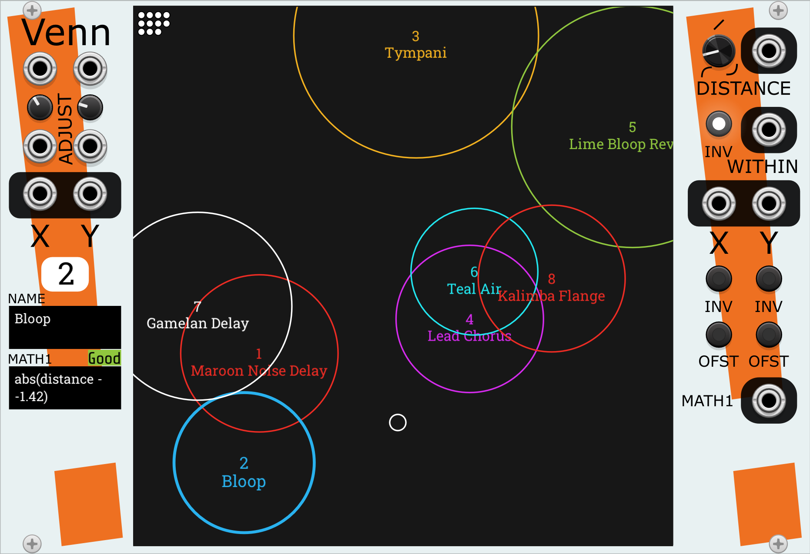

### Videos
* Using Venn to [control the panning and mixing](https://www.youtube.com/watch?v=yvjIii_FKCs) of four audio signals.
* A detailed look at [editing the Circles](https://www.youtube.com/watch?v=Csc6DKv9wHI) and using Venn to create [sonic neighborhoods](https://www.youtube.com/watch?v=Csc6DKv9wHI&t=139s).
* [Generating MIDI notes](https://www.youtube.com/watch?v=gOE4iCjMsH8) and moving Point at audio rate. I don't show it here, but try moving Point with your own sounds...
* [Omri Cohen](https://www.youtube.com/@OmriCohen-Music) demonstrates using Venn in [one of his videos](https://youtu.be/QeuiSSYwI1I?si=jHnXk3oZFpmK63D-).

### Uses
* With a single gesture, change multiple aspects of a single sound, or change the mix
of several sounds or effects, or both at the same time.
* Use it as a loose-as-you-like sequencer to send notes or events to other modules or connected MIDI
instruments. The movement of the Point is highly controllable and can easily be made complex and yet non-random.
* If you attach audio rate X+Y signals, you'll get droning sounds from the outputs.
* Set up environments where signals that drive the position of the Point can vary the sound of a patch in numerous ways. You can think of Venn as a process that takes two random numbers and turns them into a dozen slightly less random, more controlled numbers.
* Generating MIDI from the WITHIN gate.

## Controls

### The Circle Surface
The large black area in the center of Venn is where the Circles and the Point reside.

#### Circles
Each Circle has a number (displayed in the center), and that number is the same as the channel in the polyphonic outputs (on the right side of Venn) that it outputs to. Since the maximum polyphony of VCV Rack is sixteen channels, you can have no more than 16 Circles in one Venn.

The Circles are created, resized, moved, and deleted with keystrokes. These are all centered
around the WASD keys familiar to anyone who has played games on a computer.
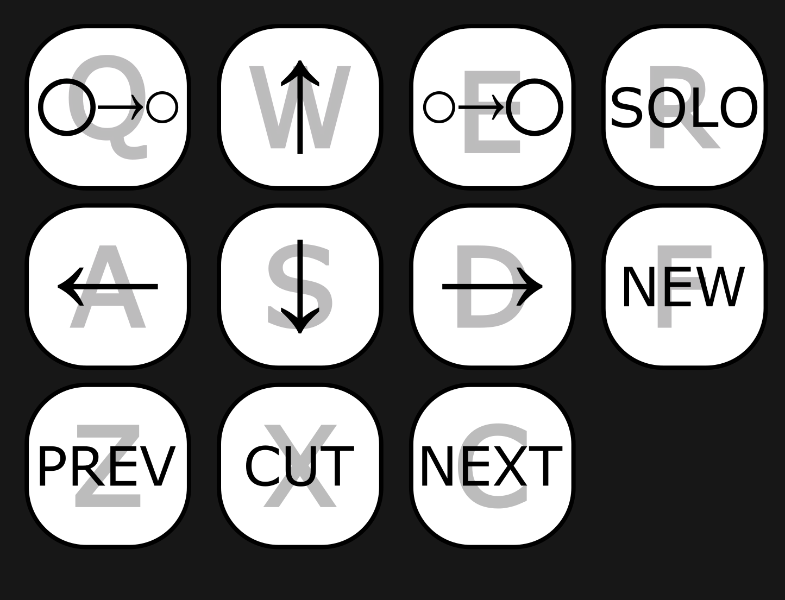
These edits affect
whichever Circle is currently **selected**; the currently selected Circle is shown in slightly thicker lines, and its corresponding number is shown in a small window to the left of the Surface.

To clarify those icons:
* **F** - create a new Circle of slightly randomized size, centered on where the mouse cursor is currently hovering over the surface. That new Circle will now be the selected Circle.
* **W/A/S/D** - move the selected Circle around the space.
* **Q** - shrink the selected Circle
* **E** - enlarge the selected Circle
* **C/Z** or **TAB/SHIFT-TAB** - cycles through the Circles, selecting each in turn. **C** and **TAB** move to the next higher numbered Circle, **Z** and **SHIFT-TAB** move to lower numbers, and both gestures wrap around from the last circle to the first.
* **X** - deletes the selected Circle.
* **R** - this **solos** the selected Circle. Like soloing in a mixer, this turns off all of the other Circles, and only that Circle's output is non-zero in the outputs. You can still cycle through the Circles with **Z/C**, soloing each in turn. The display will show the muted Circles only faintly. Typing **R** again will turn off soloing, and all Circles will be registered in the outputs again.

#### On-screen keyboard and context
When a new Venn module is created, a smaller version of the graphic above is shown in the upper left corner of the Surface; this provides hints to new users, reminders for returning users, and also informs the user that the keyboard commands are now active. Note that if you click elsewhere in your patch, the graphic will disappear, and this means those keyboard commands will no longer affect the Circles.

Once you've learned the keyboard commands, you may wish to have it out of the way so more of the Surface is visible. Unset the option in the module's menu (**Show Keyboard Commands**) to replace the graphic with a much smaller indicator. The smaller indicator still serves the purpose of letting you know when the keyboard commands will (or will not) work.

##### Circle Names
Each Circle can have a user-created name, which is shown underneath the Circle's number. This can, for example, make it easier to see at a glance which Circle controls what. When a Circle is selected, the current name for it is shown to the left of the Circle Surface in an editable text window. Editing text there immediately updates the text seen on the display.

A couple notes:
* While editing names, use **TAB** and **SHIFT-TAB** to rotate through the Circles.
* If the name of a Circle is empty, but there is a non-empty MATH1 formula, then the formula will be displayed on the Surface instead of the name.
* If the name of a Circle is getting wider than you like, you can separate the name into multiple lines by typing a newline/Enter in the name. That is, "Seductive Bass Line" looks like:

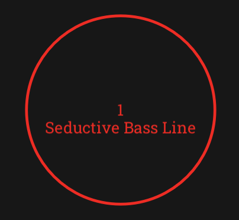

but "Seductive[ENTER]Bass[ENTER]Line" looks like:

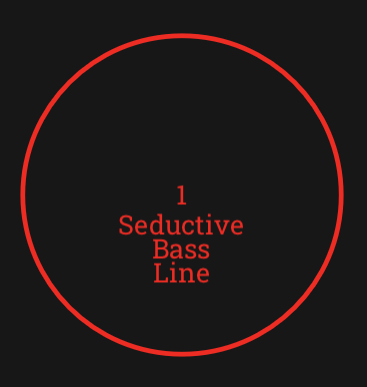

##### Circle Math
By themselves, the DISTANCE, WITHIN, X, and Y ports have only a few different value ranges (i.e., -5 -> 5, 0 -> 10, 5 -> -5, and 10 -> 0). There are many times when it would be preferable to have more subtle values for each circle.

The MATH1 text field allows an arbitrary formula to be entered for each Circle, the output of which is polyphonically output from the MATH1 output port. Here are some examples to illustrate what these formulas can do:

* A constant value:
* * "0.125"
* * "c#2" - that is, the V/OCT value for a C sharp in octave 2
* Simple computed values:
* * "bb2 + 0.02" - a slightly sharp Bflat in octave 2.
* * "x / 2" - the value of the X value for this Circle, but divided by two.
* * "(x * y / 10) - 1" - use both the X and Y values for this Circle.
* * "pointx + pointy" - pointx and pointy are the X and Y values of the Point (i.e., the little white circle you move).
* Use built-in functions:
* * "sign(x) * .1" - have the values -0.1 or 0.1, depending on which side of the Circle the Point is on.
* * "min(distance, 5.4)" - be the smaller of the DISTANCE value or 5.4.
* * "limit(distance, 5.4, 8.3)" - be the value of DISTANCE, but never less than 5.4 or more than 8.3.
* * "scale(x, leftx, rightx, -2.3, -1.2)" - instead of X's normal range, scale it so that
 the left edge X is -2.3 and the right edge is -1.2.
* Use simple logic to determine values:
* * "within ? 1.4 : 3.11" - if WITHIN is not zero, return 1.4; if WITHIN is zero, return 3.11.
* * "x < 1 ? 0.2 : sin(x)" - if X is less than 1, return 0.2, otherwise return sin(x).

#### The Good/Fix Light
The lit word just above the right side of the MATH1 text field indicates whether or not Venn has figured out how to turn your formula into instructions. If it looks like:

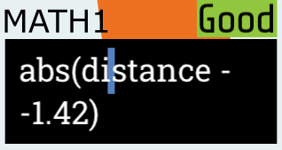

then Venn can compute your formula. However if it looks like:

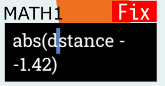

Then it cannot compute the formula as it stands.

If you roll the mouse pointer over the "Fix", then Venn will attempt to
describe the error it found.

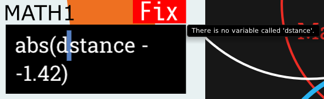

A couple notes:
* While editing MATH1 formulas, use **TAB** and **SHIFT-TAB** to rotate through the Circles.
* By default, the value of MATH1 is zero for a particular Circle when Point is not in that Circle. This is to reduce the CPU load. If, however, the value of MATH1 is important for a Circle even when Point is not in it, then open Venn's menu and unset the "Only Compute MATH1 for a circle when inside it" option.

#### The Point
The Point is a small white circle in the Surface that controls the signals sent by each of the Circles. The position of Point
is a pair of X and Y voltages, where X = -5, Y = -5 is at the lower left corner and X = 5, Y = 5 is
at the upper right corner. There are menu options on Venn to change either or both of the X and Y axis from the [-5, 5] range to [0, 10].

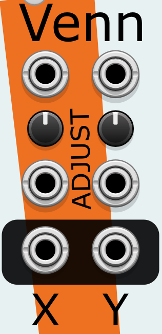

Its position can be set (and moved) in a number of ways:
* Clicking or dragging on the surface will move the Point to that position.
* On the left side of Venn, there are a number of controls to move Point: 
* * Inputs at the top for setting X and Y. If these are not set, then the last position set by clicking on the surface will be used.
* * Below that, inputs with attenuverters are added to the values from the inputs (or last clicked position).
* * And below that are outputs of the current position of Point.
* Note that X and Y are independent of each other, meaning that you can, for example, use the inputs above to control the X position of Point, but control the Y solely by clicks on the surface.

### Other Controls
#### DISTANCE Output
A polyphonic output with as many channels as the highest numbered Circle.

Each channel is 0.0V when Point is outside of the corresponding Circle. The value ranges from
0V to 10V as Point approaches the center. How quickly that value increases is affected by the DISTANCE Shape Knob.

#### DISTANCE Shape Knob
This parameter allows you to change how the DISTANCE value grows from 0V - 10V as Point approaches the center.

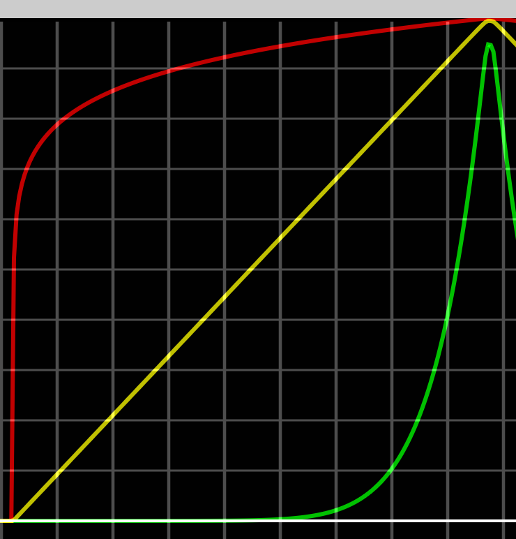
* At full left (-1), the curve looks like the red line; rapidly increasing at first, then growing far more slowly.
* At center (0, the default), the curve looks like the yellow line; increasing linearly with distance.
* At full right (1), the curve looks like the green line; growing imperceptibly, then growing far more quickly very near to the center.

#### WITHIN Output
A polyphonic output with as many channels as the highest numbered Circle.

Each channel outputs 0V when Point is outside of it, and 10V gates when inside. You think of these as a gate signal for when the Point is inside a Circle.

#### X and Y Outputs
These are polyphonic outputs with as many channels as the highest numbered Circle. 

The values of a channel reflect the relative distance from the center of a Circle. 
* Each channel is 0V when the Point is outside the Circle. Values within the Circle range from -5V to 5V (but see the INV and OFST switches).
* When Point is inside the Circle, then Point's horizontal or vertical distance from the center is divided by the radius of the Circle and multiplied by 5.
* For example, if Point is at X = 3, and that's inside a Circle whose center is at X = 4 with a radius of 2.5, then X for that Circle's channel is (3 - 4) / 2.5 * 5 = -2.

#### INV Switches
When set, INV inverts the corresponding signal:
* For WITHIN, setting INV means that the value is 10.0 when Point is *outside* the Circle, and 0.0
when inside the Circle.
* For X, setting INV means that values increase as Point moves from right to left.
* For Y, setting INV means that values increase as Point moves from top to bottom.

#### OFST Switches
When set, adds 5V to what would otherwise be output, so X or Y would output 0V - 10V instead of -5V - 5V.

#### MATH1 Output
A polyphonic output with as many channels as the highest numbered Circle.

Each channel computes the value of the MATH1 formula for that Circle, making this a source of arbitrarily customized values for each Circle. See the [description](#circle-math) and the [reference](#math1-formula-components) for details, or Randomize (see the module menu) a Venn to see examples.

### MATH1 Formula Components
NOTE: For reference while patching, a more succinct version of this info is visible in Venn's menu as "MATH Cheat Sheet".

* [Scientific pitch notation](https://en.m.wikipedia.org/wiki/Scientific_pitch_notation) is supported (e.g., c4, Db2, d#8), turning them into
V/OCT values. So you can use **c4**, send it to a VCO in the default position, and the VCO will output a tone at middle C.
* Variables:
* * Same for all Circles:
* * * **pointx**, **pointy** - the X and Y position of the Point.
* * * **leftx**, **rightx**, **topy**, **bottomy** - the maximum and minimum values for X or Y within a circle.
 Especially useful for the 2nd and 3rd arguments to the **scale()** function. 
* * Per Circle:
* * * **distance**, **within**, **x**, **y** - the values for this particular Circle.

The following are operators and functions you can use in mathematical
expressions:
* **"+", "-", "*", "/"** -- add, subtract, multiply, divide. Note that dividing
any number by zero, while undefined in *mathematics*, is defined by *Venn*
to be 0.0.
* "condition **?** true_value **:** false_value" - often known as the ternary operator, allows choices to be made based on comparisons of values.
For example, "distance >= 2 ? 1.4 : 3.14" means if DISTANCE is two or more, return 1.4; otherwise, return 3.14.
* **"<", "<=", ">" , ">=", "==", "!="** -- comparison operators. Useful in the condition part of "condition ? true_value : false_value".
* **"and", "or", "not"** -- Boolean logic operators. Handy for more complicated conditions in the ternary operator. For purposes of these, a zero
value is treated as **FALSE**, and *any non-zero value* is treated as **TRUE**.
* Technical note: correct testing of equality or inequality in floating point numbers is [notoriously non-obvious to beginners](https://embeddeduse.com/2019/08/26/qt-compare-two-floats/) (and even experts). Venn uses an ever-so-slightly looser definition of equality, as described at the end of the essay linked above. For most uses this will work exactly as before and be less prone to surprises like this example. But if you find yourself comparing two numbers and you want differences of 0.00001V to matter, I'll suggest that instead of writing "a == b", you use "a <= b AND a >= b", which does not invoke the looser definition. 

### Math Functions

| Function  | Meaning        | Examples |
| --------- | -------------- | -------- |
|**abs(a)**| absolute value | abs(2.1) == 2.1, abs(-2.1) == 2.1 |
|**ceiling(a)**| integer value at or above a | ceiling(2.1) == 3, ceiling(-2.1) == -2 |
|**floor(a)**|integer value at or below a|floor(2.1) == 2, floor(-2.1) == -3|
|**limit(a, b, c)**|returns 'a' but forces it to be between b and c|limit(distance, 5, 8)|
|**log2(a)**|Base 2 logarithm of a; returns zero for a <= 0|log2(8) == 3|
|**loge(a)**|Natural logarithm of a; returns zero for a <= 0|loge(8) == 2.07944|
|**log10(a)**|Base 10 logarithm of a; returns zero for a <= 0|log10(100) == 2|
|**max(a, b)**|the larger of a or b|max(2.1, 2.3) == 2.3, max(2.1, -2.3) == 2.1
|**min(a, b)**|the smaller of a or b|min(2.1, 2.3) == 2.1, min(2.1, -2.3) == -2.3
|**mod(a, b)**|the remainder after dividing a by b. Will be negative only if a is negative|mod(10, 2.1) == 1.6
|**pow(a, b)**|a to the power of b|pow(3, 2) == 9, pow(9, 0.5) == 3 |
|**scale(a, b, c, d, e)**|scales a from b-c range to d-e range|scale(y, bottomy, topy, -5, -8)|
|**sign(a)**|-1, 0, or 1, depending on the sign of a|sign(2.1) == 1, sign(-2.1) == -1, sign(0) = 0|
|**sin(a)**|arithmetic sine of a, which is in radians| sin(30 * 0.0174533) == 0.5, sin(3.14159 / 2) == 1|

### Menu Options
#### Randomize
The Randomize menu option found on every module will, in Venn, also replace any existing Circles with a random set of new ones. The Circles will also have randomly generated names and MATH1 formulas.
#### Show Keyboard Commands
As noted above, when set (the default), this will show the larger version of the editing keyboard commands. Unsetting it will replace it with a small icon.
#### Only Compute MATH1 for a circle when inside it
Defaults to true. By default, the value of MATH1 is zero for a particular Circle when Point is not in the Circle. This is to reduce the CPU load. If, however, the value of MATH1 is important for a Circle even when Point is not in it, then unset this menu option.
#### Point position X ranges from 0-10 instead of -5 - 5
When set, the X input will be expected from 0-10, and the X output will fall into that range as well.
#### Point position Y ranges from 0-10 instead of -5 - 5
When set, the Y input will be expected from 0-10, and the Y output will fall into that range as well.
#### MATH Cheat Sheet
Just shows a brief reminder of all the functions and variable names Venn will recognize.

### Bypass Behavior
If this module is bypassed, then all output values will be 0.0V. However, you can continue to
edit the Surface, adding and changing Circles as you wish.

# Acknowledgements

Thanks to all of the helpful people on the
[VCV Rack Community board](https://community.vcvrack.com/) for their
willingness to help and advise me as I've been learning this new domain.

Many thanks to [Marc Weidenbaum](https://disquiet.com/) for his
encouragement and enthusiasm for my module-making efforts.

Thanks to both [BaconPaul](https://baconpaul.org/) and
[pachde](https://library.vcvrack.com/?query=&brand=pachde&tag=&license=) of the VCV Rack 
community for greatly extending my silly idea to send text over a VCV cable and
seeing far more value in it then I did. And for then doing the actual work of
implementing it.

And my deepest gratitude to Diane LeVan, for letting me ignore her and/or
the world for periods of time just to craft these things. I apologize for
waking up with new ideas at 5AM, and for having a retirement hobby that
is nearly impossible to even *start* describing to any of our friends.
