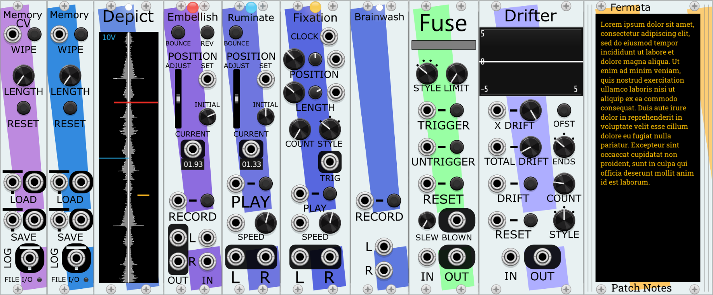
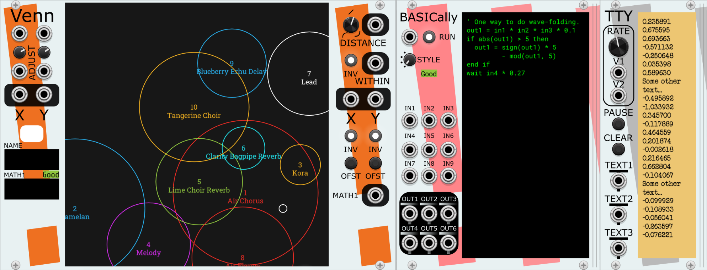
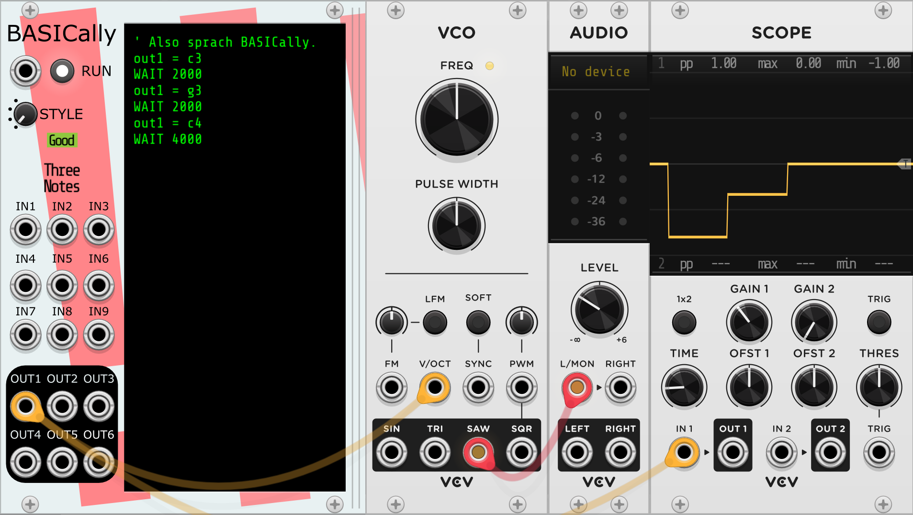
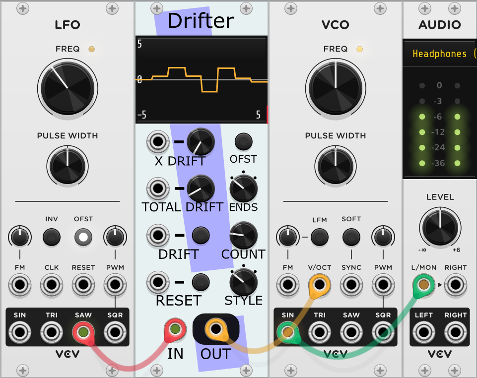
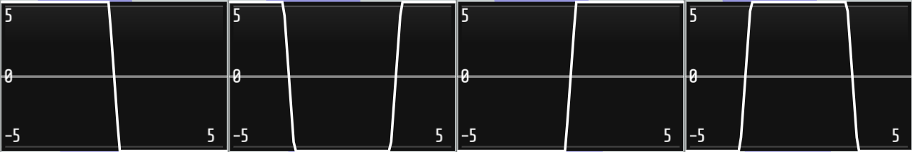
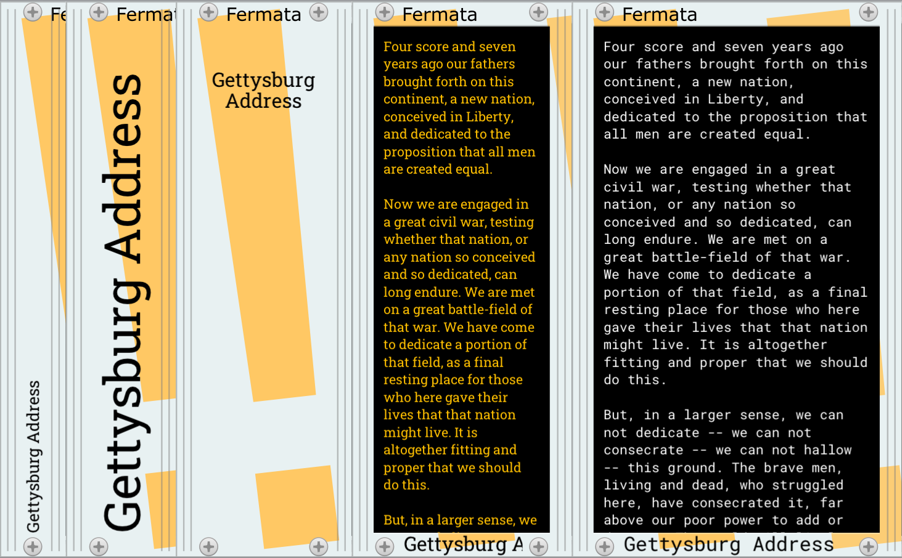
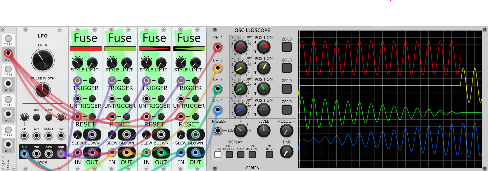
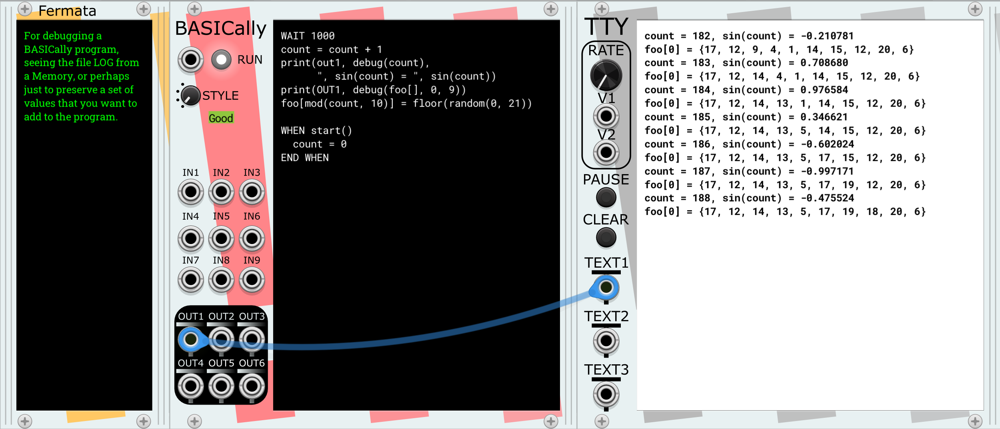
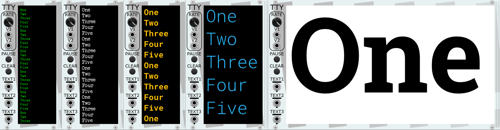
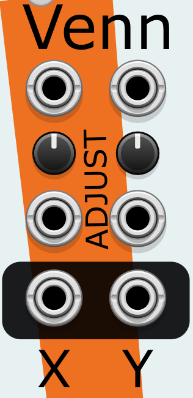

# Stochastic Telegraph modules for VCV Rack
Modules for use with VCV Rack 2.0, with an emphasis on generative and
self-regulating structure. Exploring the region between random and static.




* [Memory System](Memory.md): A set of six inter-related recording/playback modules with [their own documentation](Memory.md).
* [BASICally](#basically): A simple, likely familiar procedural programming language within the context of VCV Rack.
* [Drifter](#drifter): Creates sequences of values that can slowly (or quickly) vary, like a series of points doing random walks connected into a series.
* [Fermata](#fermata): A text editor and labeling module. Write much longer text notes. Resizable, scrolls, font choices, and more. Or just add some visual emphasis,
Stochastic Telegraph-style.
* [Fuse](#fuse): Block, allow, or attenuate a signal passing through, based on the number of triggers observed in a different signal.
* [TTY](#tty): A scrolling text window that displays distinct values it gets, and also displays [Tipsy](https://github.com/baconpaul/tipsy-encoder) text messages sent by other modules (like BASICally).
* [Venn](#venn): A 2D graphical signal generator consisting of up to sixteen visible Circles and a visible Point chosen by mouse or CV. Where the Point is in relation to a Circle determines four CV values per Circle. 


# BASICally

A simple, likely familiar procedural programming language within the
context of VCV Rack. Can act like:
* a very flexible sequencer
* VCO or LFO
* a wavefolder
* a control voltage utility
* sample and hold
* a tape delay or tape loop
* all of the above and more, simultaneously

Useful for:
* quickly trying out an idea
* simple transformations that would otherwise involve many small utility modules
* non-standard approaches to otherwise straightforward ideas

### Examples

#### Sequencer playing the first three notes of Also sprach Zarathustra


#### LFO altered by inputs


#### An almost triangle wave with randomly selected slopes and peak


#### Sample and hold

Note that STYLE is set to "Start on trigger, don't loop".

The examples above are all in [this patch](examples/BASICallyExamples1.vcv).
A patch with some simple/strange/silly ideas for other things BASICally can do
are in [this patch](examples/BASICallyExperiments.vcv).

#### Presets
There are over a dozen presets demonstrating how BASICally can be used,
including unusual sequencers, oscillators, tape and delay effects,
a sample and hold, a signal router, and four different quantizers. Since the
workings of these are controlled solely by the BASICally code, it's easy to
change how they behave.

<!-- TODO: video of different Presets and their output -->

## Unique Features
While there are
[other modules](https://github.com/mahlenmorris/VCVRack#related-modules)
with a similar emphasis on "writing code within VCV", BASICally has some
interesting differences:
* It intentionally bears a visual resemblance to the
[BASIC language](https://en.wikipedia.org/wiki/BASIC) (albeit a **quite
limited** version of BASIC). BASIC is a language that many people
know, once knew, or can pick up by looking at examples.
* The right side of the module is a resize bar; pull it to the right or left,
and the code window changes size. Handy for reading those long comments without
line breaks and for shrinking the module down to a small size when you don't
wish to edit the code. Also, the text window scrolls vertically as you move
through it.
* Input ports (IN1-IN9) and output ports (OUT1-OUT6) are polyphonic,
with a maximum of 16 channels each. 
* Four different run "STYLES" (see Controls below), giving it the ability to
 act on a RUN trigger, or to run the most recent working version continuously
 as you type, or only run while a button or trigger is pressed.
* Edits in the text window become part of the VCV Rack Undo/Redo system.
* You can pick from a (small) number of screen color schemes in the menu.
* [Scientific pitch notation](https://en.m.wikipedia.org/wiki/Scientific_pitch_notation) is supported (e.g., c4, Db2, d#8). They are turned into V/OCT values.
* Using the [Tipsy text protocol](https://github.com/baconpaul/tipsy-encoder),
BASICally can [send messages](#text-functions) to modules that accept Tipsy text messages, such as
[TTY](#tty). This can be useful for debugging and other situations where mere graphs
are not as informative as text, and one may expect future modules that accept
Tipsy text messages.
* Easily allows for [multitasking](#multitasking-also-and-when-blocks) within
the same BASICally module.

## The Language
### Setting and Using Variables (Assignment and Math)
Always in the form:

**variable name** = **mathematical expression**

Set values of the OUT1, OUT2, OUT3, OUT4, OUT5, and OUT6 ports for other modules to
read via connected cables. Assignment is also used for setting variables for
use elsewhere by your program.

Examples:

    ' Creates a variable called 'foo' and sets it to 3.0. All values
    ' in BASICally are floating point numbers.
    foo = 3
    ' Uses the value of the 'foo' variable.
    bar = 5 * IN1 + foo
    ' Sets the value of the OUT1 port.
    OUT1 = bar * -0.01
    ' Sets out2 equal to -1.9. Operator precedence is the same as most other languages.
    OUT2 = 0.1 + 2 * -1
    ' Set out2 to emit the V/OCT value for middle C.
    OUT2 = C4
    ' Get and set polyphonic channels of the INx and OUTx ports.
    OUT2 = 0.1  ' Sets the first channel of OUT2 to 0.1.
    OUT2[1] = 0.1  ' Also sets the first channel of OUT2 to 0.1.
    OUT2[16] = IN1[1]  ' Sets the last OUT2 channel equal to the value of IN1's first channel.

* All variables start with the value 0.0 when first read.
* Variables stay available in the environment of a module until the patch
is restarted. This is true even if the code that created the variable has been removed from the program.
* OUT1-6 (and all of their channels) are, by default, limited (akak, clamped) to the range -10v <--> 10v. You can make
individual OUT ports unclamped in [the module menu](#clampunclamp-outn-values). Input values and internal values are not clamped.
* [Scientific pitch notation](https://en.m.wikipedia.org/wiki/Scientific_pitch_notation) is supported (e.g., c4, Db2, d#8), turning them into
V/OCT values. So you can use **OUT1 = c4**, send OUT1 to a VCO in the default position, and the VCO will output a tone at middle C.

The following are operators and functions you can use in mathematical
expressions:
* **"+", "-", "*", "/"** -- add, subtract, multiply, divide. Note that dividing
any number by zero, while undefined in *mathematics*, is defined by *BASICally*
to be 0.0.
* **"<", "<=", ">" , ">=", "==", "!="** -- comparison operators. Most commonly used
in IF-THEN[-ELSE] statements.
* "condition **?** true_value **:** false_value" -- often known as the ternery operator, allows choices to be made based on comparisons of values.
For example, "distance >= 2 ? 1.4 : 3.14" means if DISTANCE is two or more, return 1.4; otherwise, return 3.14.
* **"and", "or", "not"** -- Boolean logic operators. For purposes of these, a zero
value is treated as **FALSE**, and *any non-zero value* is treated as **TRUE**.
* Technical note: correct testing of equality or inequality in floating point numbers is [notoriously non-obvious to beginners](https://embeddeduse.com/2019/08/26/qt-compare-two-floats/) (and even experts). For example, in previous versions of BASICally, "3.1" does NOT equal "31 * .1"! As of version 2.0.14, BASICally uses an ever-so-slightly looser definition of equality, as described at the end of the essay linked above. For most uses this will work exactly as before and be less prone to surprises like this example. But if you find yourself comparing two numbers and you want differences of 0.00001V to matter, I'll suggest that instead of writing "a == b", you use "a <= b AND a >= b", which does not invoke the looser definition. 

### Math Functions

| Function  | Meaning        | Examples |
| --------- | -------------- | -------- |
|**abs(x)**| absolute value | abs(2.1) == 2.1, abs(-2.1) == 2.1 |
|**ceiling(x)**|integer value at or above x | ceiling(2.1) == 3, ceiling(-2.1) == -2 |
|**channels(p)**|number of channels in polyphonic INx port p | FOR chan = 1 TO channels(IN1)|
|**connected(x)**|1 if named port x has a cable attached, 0 if not | connected(IN1) |
|**floor(x)**|integer value at or below x|floor(2.1) == 2, floor(-2.1) == -3|
|**log2(x)**|Base 2 logarithm of x; returns zero for x <= 0|log2(8) == 3|
|**loge(x)**|Natural logarithm of x; returns zero for x <= 0|loge(8) == 2.07944|
|**log10(x)**|Base 10 logarithm of x; returns zero for x <= 0|log10(100) == 2|
|**max(x, y)**|the larger of x or y|max(2.1, 2.3) == 2.3, max(2.1, -2.3) == 2.1
|**min(x, y)**|the smaller of x or y|min(2.1, 2.3) == 2.1, min(2.1, -2.3) == -2.3
|**mod(x, y)**|the remainder after dividing x by y. Will be negative only if x is negative|mod(10, 2.1) == 1.6
|**normal(mean, std_dev)**| bell curve distribution of random number | normal(0, 1) |
|**pow(x, y)**|x to the power of y|pow(3, 2) == 9, pow(9, 0.5) == 3 |
|**random(min, max)**|uniformly random number: min <= random(x, y) < max | random(-1, 1)|
|**sample_rate()**|number of times BASICally is called per second (e.g., 44100)|sample_rate() == 48000|
|**sign(x)**|-1, 0, or 1, depending on the sign of x|sign(2.1) == 1, sign(-2.1) == -1, sign(0) = 0|
|**sin(x)**|arithmetic sine of x, which is in radians| sin(30 * 0.0174533) == 0.5, sin(3.14159 / 2) == 1|
|**start()**|True *only* for the moment when a program has just been recompiled. Useful for blocks that initialize variables at startup| WHEN start() ...|
|**time()**|The number of seconds (see note below) since this BASICally module started running|IF time() > 60 THEN ' It's been a minute.|
|**time_millis()**|The approximate (see note below) number of milliseconds since this BASICally module started running|IF time_millis() > 60000 THEN ' It's been a minute.|
|**trigger(INn)**|True *only* for the moment when the INn port has received a trigger. Useful for WHEN blocks that wish to change the behavior of the program whenever this trigger is seen.| WHEN trigger(in9) ...|

**Note on time() and time_millis()**: The resolution of these clocks appears to be
system-dependent. On my Windows system, for one, the minimum non-zero interval
between calls to time_millis() is about 16 milliseconds. This makes them
unsuitable for making, say, consistent 40Hz signals.

### Text functions

BASICally can create text messages and send them in the Tipsy encoding to
modules that can use them or display them (for example, [TTY](#tty) or [Memory](https://github.com/mahlenmorris/VCVRack/blob/main/Memory.md#memory)).

As of version 2.0.16, BASICally has variables and arrays that can store text. These are distinguished
from other variables by the name ending in a "\$". For example:

    hey$ = "hello, "
    you$[0] = {"world", "planet", "Earth", "universe"}
    pick = random(0, 4)   ' A number from 0 -> 3.99999..., 
    print(OUT6, hey$, you$[pick], "!")


| Function | Meaning       | Examples |
| -------- | ------------- | -------- |
| **debug(foo)** | returns text of the form 'foo = (current value of var_name)' | debug(foo) -> "foo = 3.14159" |
| **debug(bar[], start, end)** | returns text of the form 'bar[start] = { (values in bar[]) }' | debug(bar[], 0, 3) -> "bar[0] = {2, 3.11, 0, -4}" |
| **debug(you$[], start, end)** | returns text of the form 'you[start] = { (string values in you$[]) }' | debug(you$[], 0, 3) -> "you$[0] = {"world", "planet", "Earth", "universe"}" |
| **print(OUTn, text, text, ...)** | Joins the computed text and sends it out the port. | print(OUT6, "note = ", sin(IN1)) -> Sends "note = 0.5" via OUT6 port. |

### WAIT Statements
Always in the form:

WAIT **mathematical expression**

Specifies a number of milliseconds for the program to make no changes. The
OUTn ports maintain their voltages at the values they were at when the WAIT started.

Examples:

    ' Waits a full second.'
    wait 1000
    ' Wait half of one thousandth of a second.
    WAIT 0.5
    ' wait [in2] tenths of a second.
    wait in2 * 100
    ' The shortest possible WAIT. Exactly one sample.
    WAIT 0
    ' Negative values are treated as if the were zero.
    WAIT -3

WAIT's are a powerful way to reduce the amount of CPU that BASICally is consuming in your patch.
If you find that your BASICally module is using a lot of CPU, even a short WAIT (e.g., WAIT 1, or WAIT 0.2)
can help make the module use less CPU. When BASICally is processing non-audio signals, the ear is quite unlikely to perceive
the 1ms delay.

### Comments
A single quote (') followed by a space indicates that the rest of the line will
be treated as a comment only to be read by the user. Comments have no effect on
the execution of other statements.

Examples:

    out2 = c3 ' A C3 note.
    out2 = -1 ' Also a C3 note.
    WAIT 200 ' Pause for 1/5 of a second.
    ' The next line can be turned on just by removing the initial tick (').
    ' out1 = 2.3 * in1  ' Look, I'm live-coding!

### Arrays
Simple one-dimensional, 0-indexed arrays are available. The index will have
floor() act on it internally. Using an index less than zero will be ignored.

    a[3.3] = 2.2  ' Same as a[3] = 2.2
    a[-1] = 6     ' Ignored, will have no effect.

You can set a series of values in a array quickly by specifying just the
initial index, and enclosing the series of values with curly braces '{}'
For example, this will assign value to b[1], b[2], and b[3]. Note that these
values do not need to be constants, as some other languages require.

    b[1] = { -5, sin(in3), 2.2 }

Reading from an array works the same; The index will have floor() act on
it internally. Using an index less than zero will return a value of 0.0.
Accessing any index within the array that hasn't been set will also return
a value of 0.0.

    out1 = b[1]

Unlike BASIC and many other languages, there is no need to set the size of
the array before using it (i.e, there is no DIM() statement.)

There are also arrays of strings, see [Text Functions](#text-functions) for details.

### Polyphonic Inputs and Outputs
Polyphonic or multi-channel signals are referenced as if they were arrays in BASICally. VCV Rack cables can carry at most 16 channels.
IN1[1] is the first channel, as is IN1 (without the array notation), and IN1[16] is the last usable channel.

The functions channels() and set_channels() also help you use polyphonic signals.
* channels(INx) - returns the number of channels in that input signal. That value is set by the module that is sending that signal.
Often used when processing multiple channels like so, which halves the input signals:
```
FOR chan = 1 to channels(IN1)
  OUT2[chan] = IN1[chan] / 2
NEXT   ' Or "NEXTHIGHCPU", see the section on FOR-NEXT loops.
```
* set_channels(OUTx) - Tells the specified output port how many channels to have. Without using
set_channels(), the output port will continue to output the highest channel number that has been set
since the module started. For example:
```
OUT1[2] = 0            ' Starting from scratch, OUT1 now has 2 channels.
OUT1[8] = 1            ' Now OUT1 now has 8 channels.
OUT1[4] = -2           ' OUT1 still has 8 channels.
set_channels(OUT1, 5)  ' OUT1 now only has 5 channels.
```

### IF Statements (Conditional Behavior)
There are four kinds of IF statements:

IF **conditional expression** THEN

**...Statements for True...**

END IF

or

IF **conditional expression** THEN

**...statements for True...**

ELSE

**...Statements for False...**

END IF

or

IF **conditional expression 1** THEN

**...Statements for expression 1 is True...**

ELSEIF **conditional expression 2** THEN

**...Statements for expression 2 is True...**

ELSEIF **conditional expression 3** THEN

**...Statements for expression 3 is True...**  *(You can have multiple ELSEIF clauses.)*

END IF

or

IF **conditional expression 1** THEN

**...Statements for expression 1 is True...**

ELSEIF **conditional expression 2** THEN

**...Statements for expression 2 is True...**

ELSEIF **conditional expression 3** THEN

**...Statements for expression 3 is True...**  *(You can have multiple ELSEIF clauses.)*

ELSE

**...Statements for expression 3 is False...**

END IF


The conditional expression evaluates to **False** if it equals **zero**; it evaluates to
**True** otherwise.

Examples:
```
if in1 > 3.7 then
  out1 = in2 * 0.01
  out2 = sin(in2)
end if

if in1 > 3.7 or foo == -1 then
  out1 = in2 * 0.01
  out2 = sin(in2)
else
  out1 = 0
  out2 = 0.5
end if

if a == 5 then
  out1 = in2 + 1
elseif a == 4 then
  out1 = in2
elseif a == 3 then
  out1 = in2 - 1
else
  out1 = in3
end if
```
### WHILE Loops
Used to repeat statements while some condition is true:

```
WHILE **expression**
  **...Statements...**
END WHILE
```

Example:
```
OUT1 = 0.1
WHILE OUT1 < 10
  OUT1 = OUT1 * 2
  WAIT 10
END WHILE
' out1 will be: 0.2, 0.4, 0.8, 1.6, 3.2, 6.4, 12.8 and then leave the loop
```
Note that the last value (12.8) will be 10.0 unless OUT1 is [unclamped](#clampunclamp-outn-values).

### CONTINUE WHILE and EXIT WHILE
While in a WHILE loop, there may be circumstances when you want to change
what statements to run. There are two special ways to do this.

**CONTINUE WHILE** moves execution back to the beginning of the loop.

**EXIT WHILE**, in contrast, moves to the statement after the END WHILE, leaving the
loop entirely.

Examples:
```
WHILE note == c4 
  IF foo > 2 AND foo < 2.5 THEN
    ' Skips rest of loop when foo in this range.
    CONTINUE WHILE
  END IF  
  foo = foo + random(-1, 1)
  WAIT 1
END WHILE

WHILE note == c4 
  IF foo > 2 AND foo < 2.5 THEN
    ' Leave loop when foo in this range.
    EXIT WHILE
  END IF  
  foo = foo + random(-1, 1)
  WAIT 1
END WHILE
```

### FOR Loops
Useful for repeating statements for some limited number of times.
There are two kinds of FOR loops:

FOR **variable** = **expression** TO **expression** **...Statements...** NEXT

(**variable** goes up by one every loop)

or

FOR **variable** = **expression** TO **expression** STEP **expression** **...Statements...** NEXT

(**variable** goes up by the STEP **expression** every loop, or down if it's negative)

Examples:
```
for i = -5 to 5
  out1 = i
  wait 100
next
' out1 will be: -5, -4, -3, -2, -1, 0, 1, 2, 3, 4, 5 and then leave the loop

for i = 0 to 5
  for j = 0.4 to 0 step -0.1
    out1 = i + j
    wait 10
  next
  wait 100
next
' out1 will be: 0.4, 0.3, 0.2, 0.1, 0, 1.4, 1.3, 1.2, ...
```
Note that the TO and STEP expressions are only computed when entering the loop.
```
dest = 10
leap = 2
FOR j = 0 TO dest STEP leap
  dest = .1  ' Has no effect on loop.
  leap = .1  ' Also no effect.
  out1 = j
  wait 10
next
' out1 will be: 0, 2, 4, 6, 8, 10 and then leave the loop.
```

NB: Remember that all variables, **including the loop variables in FOR-NEXT
loops**, are in the same variable space. If you are using [blocks](#blocks)
which might be running at the same time, make sure you use **different loop
variables in different blocks**. Not doing so leads to VERY confusing behavior
when running.

### Faster FOR loops with NEXTHIGHCPU

This next point about FOR loops is subtle.
As of version 2.0.21, you have the choice of ending a FOR loop with either of
**NEXT** or **NEXTHIGHCPU**. I'll attempt to explain the difference.

VCV Rack is running BASICally code (and all of the other modules) once for every sample; that is, if you are running at 48KHz, it's running each module 48,000 per second. Each module tries to run as quickly as possible, but if a module takes too long to run many times in a row, you will hear nasty pops and dropouts in the audio.

One design principle I've had is that it should be a bit difficult for a BASICally user to stall out the VCV Rack system this way. As a result of this principle, every time a FOR-NEXT loop repeats, there is [actually a hidden "WAIT 0"](#hidden-wait-0-statements) that occurs. A "WAIT 0" really means, "BASICally will finish processing this sample, and then when the next sample is processed, I"ll continue where I left off."

Consider this simple loop:
```
FOR chan = 1 to channels(IN1)
  OUT1[chan] = IN1[chan] / 2
NEXT
```
Unrolling this loop, it becomes:
```
OUT1[1] = IN1[1] / 2
WAIT 0
OUT1[2] = IN1[2] / 2
WAIT 0
OUT1[3] = IN1[3] / 2
WAIT 0
OUT1[4] = IN1[4] / 2
WAIT 0
...
```

Now, if a 16-channel IN1 is changing quite slowly (like most CV signals), you might not notice that the 16th channel gets updated 15 samples (i.e., 0.3 milliseconds) after the first one. But you might, depending on what the signals are altering.

And if these are audio signals, this means that each audio signal is only getting sampled every 16 samples; this is **very** noticeable.

So, if your code is in that situation, or the loop is small enough and not called for every sample, then by replacing NEXT with NEXTHIGHCPU ,the FOR loop to run without the "WAIT 0"s, i.e., 
```
OUT1[1] = IN1[1] / 2
OUT1[2] = IN1[2] / 2
OUT1[3] = IN1[3] / 2
OUT1[4] = IN1[4] / 2
...
```

As the name suggests, this *can* drive up the CPU usage of BASICally. So if you try it, I'll suggest you check how well it's running by activating VCV's "View/Performance Meters" and see if the numbers and the audio are acceptable to you are not.

Here's some rough guidelines (definitely not rules) that help guide my thinking about when to use which NEXT:

| Situation | Suggestion |
| --------- | ---------- |
| Initialization on startup | NEXT |
|Running a calculation over a long array (more than 20 items) | NEXT |
|Processing multiple channels of audio every sample | NEXTHIGHCPU |
|Processing polyphonic CV, per sample accuracy is not required | NEXT |
|Processing polyphonic CV, per sample accuracy would be better | NEXTHIGHCPU|

### CONTINUE FOR and EXIT FOR
While in a FOR loop, there may be circumstances when you want to change
what statements to run. There are two special ways to do this.

**CONTINUE FOR** moves execution back to the beginning of the loop, changing
the variable value as it normally would.

**EXIT FOR**, in contrast, moves to the statement after the NEXT, quitting the
loop entirely.

Examples:
```
for i = 0 to 5
  if i == 2 then CONTINUE FOR end if  ' Skips rest of loop when i == 2.
  out1 = i
  wait 100
next
' out1 will be 0, 1, 3, 4, 5, and then leave this loop.

for i = 0 to 5
  if i == 2 then EXIT FOR end if   ' Leaves loop when i == 2.
  out1 = i
  wait 100
next
' out1 will be 0, 1, and then leave this loop.
```
### CONTINUE ALL and EXIT ALL
Similarly, you can use **CONTINUE ALL** to move execution to the top of the
program (or ALSO block).

For the two STYLES that support halting the program, which are:

* Start on trigger, loop
* Start on trigger, don't loop

encountering an **EXIT ALL** will actually halt the program/block. A trigger
to the RUN input or pushing the RUN button will start it again.

### CLEAR ALL
"CLEAR ALL" resets all variables to 0, and resets all arrays to empty.

### RESET
Whenever a "RESET" is executed, it immediately stops processing this sample, and on the
next sample each block (see Multitasking, below) will start from scratch. It does NOT
change any variable values. This is very similar to the state when you've just typed a
character into the editing window and the code compiles correctly, with one
exception; recompiling the code makes start() become true, but RESET does NOT make start() become true.

Note that RESET's effect is **immediate**. For example:

```
...
IF trigger(in7) OR foo > 20 THEN
  RESET
  out2 = 0
END IF
...
```

the "out2 = 0" will NEVER be executed.

## Multitasking: ALSO and WHEN blocks

**Note: This section has kind of advanced topics, or at least they have the
potential to make BASICally more confusing, especially if you are new to
programming in general. You don't need to know this part to make BASICally do
useful things for you, so feel free to skip this section the first
time you learn about BASICally. But come back and read this later; multitasking
may be useful to you soon!**

The code style described above (one big loop of code that gets repeated) doesn't allow
for certain kinds of programs to be easily written, and can be less efficient
than required. For example, when running in just one loop:
* Any initialization code will get executed every time. One can minimize this
to an extent by setting and checking an "init" variable being non-zero, but
this concept should be better integrated into the language.
* Running two loops with WAITs in them would be diabolically difficult to write.
* Checking for a trigger at an IN port is difficult, and impossible during a
WAIT.

To allow BASICally to do these things, version 2.0.7 introduced "multitasking"
and "blocks".

### Blocks
There are two kinds of Blocks of code.

#### ALSO Blocks
ALSO blocks each run continuously, exactly the way the (un-blocked) code examples
elsewhere in this manual do. For example:

```
FOR OUT1 = -5 TO 5 STEP 0.1
  WAIT 100
NEXT
```

Causes OUT1 to emit a stepped saw wave with a period of 10 seconds.

However, if you wanted the same program to also run this downward saw on OUT2:

```
FOR OUT2 = 5 TO -1 STEP -0.2
  WAIT 75
NEXT
```

that would be very difficult. But with ALSO blocks, it's easy.

```
FOR OUT1 = -5 TO 5 STEP 0.1
  WAIT 100
NEXT

ALSO
FOR OUT2 = 5 TO -1 STEP -0.2
  WAIT 75
NEXT
END ALSO
```

Now both loops will run at the same time!

The ALSO ... END ALSO is the new part here. Each ALSO block runs simultaneously
with all of the other blocks. The ALSO blocks are run in the order that they
appear in the program. So in this example:

```
' Block1
IF IN1 == 0 THEN
  foo = random(0, 1)
END IF

' Block2
ALSO
out1 = foo * 10
END ALSO
```

Then the **foo** variable that Block2 uses will be changed when Block1
changes it. They share the same "variable space".

As we see in these examples, if there is code at the top of
the program that isn't otherwise in a block, BASICally treats it like an ALSO
block. Note that these all work the same:
```
(some code)

ALSO
(more code)
END ALSO
```

```
ALSO
(some code)
END ALSO

ALSO
(more code)
END ALSO
```

But the following won't compile:

```
ALSO
(some code)
END ALSO

(more code)
```

#### WHEN blocks
WHEN blocks only start running when some condition is met.

WHEN Blocks are of the form:
```
WHEN (condition)
(some code)
END WHEN
```
For example:
```
WHEN foo > 3
FOR OUT1 = -5 TO 5 STEP 0.1
  WAIT 100
NEXT
END WHEN
```

BASICally will wait for the condition (in this case,
"foo > 3") to be true, and then will start running the FOR-NEXT loop.
Once the FOR-NEXT loop has completed, the block will stop running until
the condition is true again. All of this is independent of the ALSO blocks;
they will continue running simultaneously.

WHEN Blocks are useful when used with the start() or trigger()
methods, *especially* for running the "initialization" code mentioned above:

```
' A trigger to IN9 resets the speed the notes are played.
FOR n = 0 TO 3
  out1 = note[n]
  WAIT pause_length
NEXT

WHEN start() OR trigger(in9)
IF start() THEN
  note[0] = { c3, g3, c4, c4 }  ' The notes in my score.
END IF
pause_length = random(100, 2000)  '  How fast we play the notes.
END WHEN
```

### Details of Multitasking

Some notes about how this all works under the hood.

Every sample, BASICally does the following:
* Walk through the list of WHEN Blocks, in the order they appear in the code.
* * If a WHEN block is not already running, then the (condition) is evaluated, and
if it is true, then the Block is started.
* * If a WHEN block was already running (or was just started in the step above),
then it is run for one sample's worth of time.
* Walk through the ALSO Blocks, in the order they appear in the code.
* * Each ALSO Block is run for one sample's worth of time.

NB: Remember that all variables, **including the loop variables in FOR-NEXT
loops**, are in the same variable space. If you are using blocks
which might be running at the same time, make sure you use **different loop
variables in different blocks**. Not doing so leads to VERY confusing behavior
when running.

For example:

```
WHEN trigger(IN1)
  FOR i = 1 to 10  ' Uses "i"
    foo[i] = random(0, 10)
  NEXT
END WHEN

WHEN bar > 3
  FOR i = -5 to 5 STEP 0.1  ' ALSO uses "i"!
    OUT1 = sin(i)
  NEXT
END WHEN
```
is going to have **wildly unpredictable results** whenever both WHEN blocks are
running at the same time. Better for the second block to use "j", or "i2", or
something meaningful in context that is not used elsewhere in the program.

### Other Things to Note
BASICally is intended for the very casual user, with the hope that examples
alone will suffice to suggest how programs can be written. Because of the UI
limitations, detailed error reporting is difficult to provide. But if you
hover your mouse over the little red area to the left that says "Fix", it
will attempt to point out the first place that BASICally couldn't understand
the code.  

Programs are typically short. For that reason, this language doesn't need
the features that are useful for writing long programs but increase the
amount of boilerplate code. Here are a few surprising differences
from more robust languages:
* BASICally is **case-insensitive**. "OUT1", "oUt1", and "out1" all refer to
the same variable. "WAIT" and "wait" are identical in meaning. DB3, Db3, and
db3 are the same note. I would certainly suggest you capitalize consistently
within in your programs to make them easier to read, but BASICally won't
insist on it.
* **Newlines do not matter**, *except* that comments always end at the newline.
The following are identical in meaning:
```
out1 = sin(in2) * 0.3 + mod(in1, 4)
```
```
 out1 =
 sin(in2)
   * 0.3
      + mod(
  in1, 4)
```

If lines are wrapping around in a way that makes it hard to read,
remember that you can **resize the code window** by dragging the right-side
edge of the module.
* **Indentation does not matter**. That said, even short programs can become more readable to you by using the indentation demonstrated in the examples.

## Slightly Surprising Details

### WAIT Statements Changing Lengths

In the case of

    wait in2 * 100

the length of time might get shorter or longer if in2 changes while
the WAIT has started. For example, if in2 is 10.0 when the WAIT starts, then
it will *start* to wait for 1000 millis. However, if, say, 100 milliseconds later
the value of in2 changes to 0.5, then the WAIT is now for 50 milliseconds.
What should happen?

What BASICally does is frequently recompute the wait time and then see if the
WAIT has already exceeded the new value; if it does, the WAIT ends and the next
statement runs. Doing this makes BASICally more responsive to changes from the
user.

If this is not what you want, just assign the value to a variable:

    pause_ms = in2 * 100
    wait pause_ms

Then (in the scenario above) the length of the WAIT will be 1000 millis,
and no change to in2 during the WAIT can change that.

*Note that this differs from the way FOR-NEXT loops work, where the TO and STEP
values are computed **only** upon entering the loop.*

### Hidden WAIT 0 Statements

Under the hood, WAIT statements are how BASICally knows to stop running its
code and pass control back to the other modules in VCV Rack. If it never WAITed,
VCV Rack would hang and eventually the program will crash. Therefore, there are a number of hardwired WAIT 0 lines inserted. For example, consider this program:
```
OUT3 = 0
FOR level = 0 To 5 STEP 0.01
  OUT3 = level
NEXT
OUT1 = sin(in2 * in2)
WHILE level > 1
  level = level / 2
  OUT3 = level
END WHILE
```    
Under the hood, it is turned into:
```
OUT3 = 0
FOR level = 0 To 5 STEP 0.01
  OUT3 = level
  WAIT 0   ' There is a hidden WAIT 0 inserted just before every NEXT in a FOR-NEXT loop.
NEXT
OUT1 = sin(in2 * in2)
WHILE level > 1
  level = level / 2
  OUT3 = level
  WAIT 0   ' There is a hidden WAIT 0 inserted just before every END WHILE in a WHILE loop.
END WHILE
WAIT 0  ' There is a hidden WAIT 0 inserted at the bottom of the program.
```

### Controls
#### The Good/Fix Light
The lit word in the upper left corner indicates whether or not BASICally has figured out how to turn your code into instructions. If it looks like:


then BASICally can run your code. However if it looks like:


Then it cannot run the code as it stands. You can see that the line where it
gets confused is highlighted in red.

If you roll the mouse pointer over the "Fix", then BASICally will attempt to
describe the first error it found. As you can see here, it can only vaguely
tell you where it got confused and why. Note that if the editing window is
scrolled away from the line where the error occurs, you won't be able to see
the highlight line until you scroll up (or down) to it.

If the red and green colors are hard to tell apart, there is a menu option to change it
to blue and orange.

#### STYLE Knob + RUN Button and Input
There are four options to determine when the code will run. Three of them rely on the RUN Button and trigger/gate, which are described below.

* **Always run** -- Will always try to run the latest code in the window that
compiled. This is the best state for making changes on the fly and seeing them
applied immediately. Also nice for when you are first determining what your
code for this module should be. Note that when the code changes, BASICally restart the code from the start of the code.

* **Start on trigger, loop** -- If not already running, then it waits for the RUN
button to be pressed or a trigger to be seen by the RUN input. When the signal
to run happens, it will run and "loop", meaning it will when it gets to the last line, it will do a "WAIT 0", and then start again from the top.

* **Start on trigger, don't loop** -- If not already running, then it waits for
the RUN button to be pressed or a trigger to be seen by the RUN input.
When the signal to run happens, it will run and then stop when the last line is reached. This is useful for making Sample & Hold behavior; the RUN input
becomes the trigger for the Hold.

* **Run when gate is open** -- While the RUN button is pressed or the RUN input
is high, then BASICALLY will run. If the button is released or the input
falls low, then the program will stop. As long as the program isn't changed, when the next button press/input high occurs, execution will pick up from where it left off. For example, suppose a five second WAIT starts, and then after 3.5
seconds the button is released. When the button is later pressed, the WAIT will continue for another 1.5 seconds before moving on to the next statement.

### Menu Options

#### Title
You can specify a short title that will appear above the INn ports. This may make
it easier to identify what each BASICally module is doing, especially when
you've minimized the size.

#### Screen Colors
A small number of choices about text colors.

#### Error Line Highlighting
By default, if BASICally can't understand your code in its entirety, then it
will attempt to highlight the line where it stopped understanding your code.
It's not terribly accurate, but gives you a sense of where to change your code.
If the red highlight is distracting, you can turn it off here.

#### Colorblind-friendly status light
By default, BASICally uses green and red for the Good/Fix light. In hopes of
making the distinction clearer to more people, this option turns those colors to
blue and orange, and makes the error line highlighting orange as well.

#### Clamp/unclamp OUTn values
Normally OUTn values are not allowed to go below -10V or go above 10V; the bulk
of VCV Rack modules do not have meaningful uses for values outside of that
range. However, values within BASICally can be any floating point number, and
it can be useful (especially for debugging a script) to see the true value of
a variable in an OUTn. You can clamp/unclamp each of the OUTn ports individually
in this menu.

Two modules that can usefully display the unclamped values are
[ML Modules' Volt Meter](https://library.vcvrack.com/ML_modules/VoltMeter) and
[NYSTHI's MultiVoltimetro](https://library.vcvrack.com/NYSTHI/MultiVoltimetro).

#### Syntax/Math Hints
Just in case you're in the middle of coding and you don't want to look up
this documentation, there's some hints about the syntax of BASICally. You can
click on a particular statement and it will be inserted into your code.

### Known Limitations
* If the text is taking over 1000 physical lines (like if the window is
really narrow, and there is a LOT of text), then you can only show the first
1000 lines. I'll gently suggest you make the module wider, and then more of
the text will be reachable.

### Bypass Behavior
When the module is bypassed, all OUTn ports are set to zero volts.

### Related Modules
* Frank Buss's
[Formula](https://library.vcvrack.com/FrankBuss/Formula).
* docB's
[Formula One](https://library.vcvrack.com/dbRackFormulaOne), which, compared
to BASICally, seems to be slightly more CPU efficient for doing raw math.
* [Monome Teletype](https://library.vcvrack.com/monome/teletype),
If I understand it correctly, it mostly responds to triggers with scripts in
a very terse language, likely an artifact of
[the hardware it is based on](https://market.monome.org/products/teletype).
Looks pretty deep and interesting.
* docB's [dbRackCsound](https://github.com/docb/dbRackCsound)
([download](https://github.com/docb/dbRackCsound/releases/tag/v2.0.1)),
which uses the very powerful [CSound](https://csound.com/) engine.
 Not in the Library as I write this (January 2023).
* [VCV Prototype](https://vcvrack.com/Prototype#manual), which I _think_ is only available for
VCV Rack version 1. But you can write code in Lua or Javascript (in an external editor).


# Drifter
Creates sequences of values that can slowly (or quickly) vary, like a series of
points doing random walks connected into a series.

### Examples


* Set this up, and you'll just hear a single tone.
* Now try tapping the DRIFT button a few times, and you'll hear the frequency change.
 * The IN signal is the value coming out of the Saw wave, and is shown in the display as a short line moving from left to right along the bottom.  
 * The OUT signal is the height (Y position) of the line in the display that jumps whenever you press DRIFT at the X position of IN.
* Set the TOTAL DRIFT value to something larger, like 5.0.
* Now press DRIFT; the line moves a lot more now!
* Play with the STYLE knob, which changes the shape of the line in the display and hear how that changes the OUT values.
* There are many more knobs and controls, and they are described below. They long to be twiddled!

More examples can be found in [this patch](examples/AnnotatedSunlightOnSeaAnemones.vcv). You can [hear the results](https://www.youtube.com/watch?v=uagZ6GN_s1Y).

### Uses
Creating or modifying a series of values you wish was gradually (or drastically) changing - melodies, volume levels,
waveforms, CV levels. Note that the use of a Saw wave as the input in the
sample rack is just to better illustrate the idea of it being a
transformation function; you can put whatever you like into IN. Sine wave,
oscillator output, random,... Drifter alters signals, basically.

[Here's a video from Pazi K.](https://www.youtube.com/watch?v=L5No8J7SPK4) showing two Drifters being used to simultaneously
create the timbre of two sounds **and** create matching visuals in Etchasketchoscope.

[Another patch](https://patchstorage.com/partch-2/), this one demonstratating using Drifter to hold melodies that we play
several times and then allow to vary at specific times.

(Someday I'll make a video or two that demonstrates these other notions better.)

### Controls
#### X DRIFT Input and Button
The maximum distance, in V, that each point can move
along the X-axis (i.e., left-to-right) in one DRIFT event. Setting it to
zero locks the points horizontally in place. Higher values allow
larger changes each DRIFT. Hint: start small.
#### OFST Button
Sets the range of the expected inputs and outputs from 0V - 10V or
-5V - +5V.
#### TOTAL DRIFT Input and Button
The maximum distance, in V, that each point can
move in the 2-dimensional space in one DRIFT event. Setting it to zero
locks the points in place. Higher values allow larger changes each
time. Hint: start small.
#### ENDS Button
Selects one of three options:
* Left and right end points stay locked
at their current value OR end points drift up and down when DRIFT events occur.
* Left and right end points drift independently.
* The right-side end point stays at the same value as the left one.

#### DRIFT Input and Button
A trigger to the Input or a Button press will
cause all of the points defining the output curve to move once, within the
limits set by X DRIFT, TOTAL DRIFT, and ENDS.
#### COUNT Knob
The number of segments in the steps/line/curve, from 1 (just
connecting the end points) to 32. **Takes effect at the next RESET.**
#### RESET Input and Button
A trigger to the Input or a Button press resets the line to its
starting position (see Menu Options below for choosing a starting position).
This also applies any change to COUNT.
#### STYLE Knob
Selects one of three different line types, Steps/Lines/Curves.
Changes are applied instantly.
#### IN Input
Selects the horizontal position of the point on the line to be
selected. Shown on the display as a short line at the bottom of the display.
#### OUT Output
The vertical position of the line at the position determined by IN.

### Menu Options
#### "Save curve in rack"
* If checked - when the rack is saved, the current position of the line
will be saved with the rack, and that position will be loaded along with the rack.
* If **not** checked - when the rack is loaded, the line will always start at all zeros.
#### RESET Shape
The default behavior for Drifter is to reset the line to evenly-spaced zero
values. However, this makes using Drifter for some uses tricky, so there are
many other shapes you can now RESET to. Each shape has variants called simply
A, B, C, and D.

##### Sine
Variants A, B, C, and D

##### Triangle

##### Rising Saw

##### Falling Saw

##### Square
Note that the transients in these "squares" aren't perfectly vertical,
because there is always initially some horizontal distance between the
points that define the shape.


### Bypass Behavior
If this module is bypassed, then OUT will equal IN.


# Fermata
Write longer notes! And wider or narrower text notes.

Here is Fermata:
* as a label, in three of the six available sizes
* expanded a bit, turning it into a text editor
* further expanded, and with different font, font size, and screen color choices.




### Uses
* Instructions for playing the patch.
* Notes/reminders on how this part of the patch works. Take a look at [this patch](examples/AnnotatedSunlightOnSeaAnemones.vcv) for one example of what this might look like.
* TODO's or ideas.
* As a label, the title names a chunk of the patch, allowing the person seeing
it to pull it open and, say, read more detail on how it works. An example of this can be found in [this patch](examples/AnnotatedSunlightOnSeaAnemones.vcv).
* A very wide banner of horizontal text. You can add easily readable text in a video or still image of your patch.
* A short story or poem you're writing while listening to your patch.

### Features
* Up and down arrow keys work mostly like you expect. Home and End go to the
top and bottom of the text, PgUp and PgDown go up and down a screen length.
* Text scrolls as you move up and down.
* Resize the module by dragging the left or right edges. Size can range
from 3-300 HP.
* Pick from a (small) variety of fonts.
* Pick the number of lines available at a time via the "Visible Lines" menu selection, with ranges from the 28-line default to a single line of **very** large text (like the "Four" in the image above).
* Pick from a (small) variety of foreground/background colors.
* Set the title in the module menu.

Also useful for making a vertical text label:
* Set the title in the menu.
* Resize the module (by dragging the left or right edges) and when it's narrow enough (3-8 HP), the title becomes the label text.

### Menu Options
#### Set Title
Type in the title you'd like to use here.
#### Screen Colors
Pick from a small number of color choices for the editor window.
#### Visible Lines
Pick the font size by selecting the number of visible lines of text, from 28 to 1.
#### Font
Pick from a small number of fonts. The "Mono" fonts are monospaced fonts.

### Known Limitations
* If the text is taking over 1000 physical lines (like if the window is
really narrow, and there is a LOT of text), then you can only show the first
1000 lines. I'll gently suggest you make the module wider, and then more of
the text will be reachable.

### Bypass Behavior
If this module is bypassed, then it will be darker. But otherwise, no different.

### Related Modules
#### Writing Text
* VCV's [Notes](https://library.vcvrack.com/Core/Notes).
#### Labels
* cf's [LABEL](https://library.vcvrack.com/cf/LABEL).
* NYSTHI's [Label](https://library.vcvrack.com/NYSTHI/Label) and
[LabelSlim](https://library.vcvrack.com/NYSTHI/LabelSlim).
* stoermelder's [GLUE](https://library.vcvrack.com/Stoermelder-P1/Glue).
* Submarine's [TD-510](https://library.vcvrack.com/SubmarineFree/TD-510),
[TD-410](https://library.vcvrack.com/SubmarineFree/TD-410), and
[TD-316](https://library.vcvrack.com/SubmarineFree/TD-316).


# Fuse
Block, allow, or attenuate a signal passing through, based on the number of triggers
observed in a different signal.
### Examples
#### Counting/Clock Divider


Here the LIMIT is set to 7, and Fuse basically acts like a clock divider,
sending out a trigger every seven input triggers and then resetting the count.

#### The Different Styles


Set this up and let it run, and you'll see that each setting of STYLE
has a different effect on the relationship between IN and OUT, especially as the
count of TRIGGER events gets closer to LIMIT. See the STYLE Knob description
for details.

More examples can be found in [this patch](examples/AnnotatedSunlightOnSeaAnemones.vcv). You can [hear the results](https://www.youtube.com/watch?v=uagZ6GN_s1Y).

### Uses
* Paired with other modules, can simulate modules that "wear out" or "break"
with repeated use.
* Allow generative patches to self-conduct behavioral changes over time.
* Periodically reset other accumulated state in a patch (e.g., in Drifter).
* Create fade-ins or fade-outs of signals that take hours to complete.

### Controls
Note that hovering the cursor over the colored fuse progress bar displays the
current count of TRIGGER events seen and the percentage of the LIMIT
has been reached

#### STYLE Knob
Selects from one of four styles of behavior:
* **BLOW CLOSED** (IN -> 0.0)
** While count is less than LIMIT, OUT equals IN.
Once count >= LIMIT, OUT is set to 0.0V.
* **BLOW OPEN** (0.0 -> IN)
** While count is less than LIMIT, OUT equals 0.0V. Once count >= LIMIT,
OUT equals IN.
* **NARROW** (IN * (1 - count/LIMIT) -> 0.0)
** Initially, OUT equals IN. As the count increases, OUT becomes an increasingly
attenuated version of IN, until it eventually becomes 0.0V.
* **WIDEN** (IN * (count/LIMIT) -> IN)
** Initially, OUT is 0.0V. As the count increases, OUT becomes an increasingly
larger version of IN, until it eventually equals IN.

#### LIMIT Knob
Specify the number of TRIGGER events (from 1 to 1000) that need to be received
for the Fuse to blow.

Hint: To count more than 1000 TRIGGER events, connect the BLOWN
signal of a first Fuse (with LIMIT X) to the TRIGGER of a second (with LIMIT Y)
and to the RESET of the first; then the second Fuse will blow after X*Y
TRIGGER events.

#### TRIGGER Input and Button
A trigger to the Input or a Button press adds one to the count of accumulated
TRIGGER events. If that count now equals LIMIT, then BLOWN will emit a
short trigger.
#### UNTRIGGER Input and Button
If the fuse is not currently blown, then a trigger to the Input or a
Button press **subtracts** one from the count of
accumulated TRIGGER events.
#### RESET Input and Button
A trigger to the Input or a Button press resets the count of accumulated
TRIGGER events to zero.
#### SLEW Knob
In math terms, OUT = **X** * IN. **X** is a value from 0.0 - 1.0 that is determined by
the STYLE, LIMIT and current count of TRIGGER events.

Note that this knob controls the slew on **X**, not the slew on OUT.
At the default SLEW value (0.0), changes to **X** happen instantaneously; this
*might* cause clicks in OUT, especially when OUT is an audio signal (e.g., a
Sine wave) using the NARROW or WIDEN style. Values of 0.1 will
generally prevent this click.

The value of SLEW is the minimum number of seconds it takes for **X** to change
from 0.0 -> 1.0 or from 1.0 -> 0.0. This means it will also affect how quickly
RESET takes effect. For example, a SLEW value of 2.3 means that a RESET to a
blown BLOW CLOSED Fuse will take 2.3 seconds to move from OUT = 0.0 -> OUT = IN.
The change will be linear (i.e., a straight line).
#### BLOWN Output
Outputs a single trigger once count == LIMIT.
#### IN Input
The signal being altered by Fuse.
#### OUT Output
The altered version of IN. See STYLE Knob for how it will be altered.

### Menu Options
#### "Unplugged value of IN"
A convenience only used when IN has no cable running into it.
The option (-10V, -5V, -1V, 1V, 5V, 10V) that is selected (if any) is then
assumed to be the constant value entering IN. This constant value is then
affected by the STYLE, LIMIT, and count of TRIGGERS when computing OUT, as
per the usual case.

### Bypass Behavior
If this module is bypassed, then OUT will equal IN. If IN has no cable running
into it, then OUT will be 0.0V, *even if* the "Unplugged value of IN" menu
option is set to something else.

### Related Modules

* AlliewayAudio's [Bumper](https://library.vcvrack.com/AlliewayAudio_Series_I/Bumper).
* ML Modules' [Counter](https://library.vcvrack.com/ML_modules/Counter).


# TTY
A [teletype](https://en.wikipedia.org/wiki/Teletype_Model_33)-like module for
displaying text messages. Useful for
debugging or saving sets of values that are of interest. TTY can also track
streams of unique CV values from modules, noting them only when they change.

[Video of TTY in action.](https://www.youtube.com/watch?v=hDymEax7uEU) 

### Examples

TTY logs the values being produced by Random.


TTY logging the text being sent by BASICally.


TTY logging the text being sent by Memory when it loads or saves files.


The menu allows for a small selection of fonts, colors, and sizes.


More examples in [this patch](examples/TTYExamples.vcv).

### Uses
* Logging CV values that a generative or non-deterministic process creates. In
some cases, this is more precise, more fine-grained, and easier to read than
a scope trace, especially when monitoring over a long period of time.
* Logging text messages from modules that produce them using the [Tipsy
protocol](https://github.com/baconpaul/tipsy-encoder). As of this writing
in June 2024, the only such modules that I know of are my [BASICally](#basically)
and [Memory](Memory.md#memory) modules.
* With the larger font sizes now available, you can use BASICally to print() a series
of timed messages, providing visual narration to a video performance.

### Features
* **Note that navigation works much better when the Pause button is lit**.
Up and Down arrow keys work mostly like you expect. Home and End go to the
top and bottom of the text, PgUp and PgDown go up and down a screen length.
* Text scrolls as you move up and down.
* Resize the module by dragging the right edge. Size can range
from 4-300 HP.
* Pick from a (small) variety of fonts. Be sure to try the "Veteran Typewriter" font
for a more authentic teletype feeling.
* Pick the number of lines available at a time via the "Visible Lines" menu selection, with ranges from the 28-line default to a single line of **very** large text (like the "Four" in the image above).
* Pick from a (small) variety of foreground/background colors. Be sure to try
"Black on Yellow (TTY Paper)" for that authentic teletype feeling.
* Can be cleared by clicking the CLEAR button or by sending a "!!CLEAR!!" message.

### Controls

#### RATE Knob
Specifies the number of milliseconds between reads on the V1/V2 inputs. If
set to zero, then every sample will be examined. If set to 1000, then TTY will
only examine inputs to V1/V2 once every second.
Note that a low number (turning the knob to the right) means a very high RATE.
This may be a poor nomenclature decision on my part.
RATE has no effect on TEXT inputs.
#### V1 and V2 inputs
Signals sent to V1 or V2 will be monitored. Each time they are examined (see
RATE knob), if the value is different than it was the time before, the new
value will be printed to the text window.
#### PAUSE button
This button latches. If set, new messages will no longer be written to the log.
When unset, new messages will start being written again to the log.
#### CLEAR button
When pressed, the logging window will be cleared of all messages.
The window will also be cleared if any of the TEXT inputs receives a message
that is exactly the special message "**!!CLEAR!!**" (no quotes).
#### TEXT1, TEXT2, and TEXT3 inputs
Text messages can be sent to these ports via the [Tipsy
protocol](https://github.com/baconpaul/tipsy-encoder). If they have the
Tipsy MIME type "text/plain", then they will be added to the log.

### Menu Options
#### Preface lines with source port
If set, then each message will be proceeded by the port that the message
came from, e.g., from "1.23456" to "V1> 1.23456".
#### Keep recent output when patch is saved
If set, then the text currently visible in the buffer will be saved into the
patch, and will be restored when the patch is loaded. If not set, then
the log will be empty when the patch starts.
#### Screen Colors
Pick from a small number of color choices for the editor window.
#### Visible Lines
Pick the font size by selecting the number of visible lines of text, from 28 to 1.
#### Font
Pick from a small number of fonts. The "Mono" fonts are monospaced fonts.

### Known Limitations
* By design, TTY only keeps the previous 900-1000 lines of output. By "lines",
this means physical lines on the screen. Since line length is dictated by the
screen width, this means that shrinking the module down to it's minimum width
can result in deleting most of the contents of the output window.
* Putting noise into the TEXTn inputs can crash VCV Rack.
* If lines of text are scrolling by very quickly, it's probably using more CPU
than you want. If the values are coming from V1 or V2, consider raising the
RATE.
* There is internal load-shedding inside of TTY. If the UI is not keeping
up with the all of messages being added, it will throw away new ones until
the backlog is lessened. This typically only happens when V1/V2 is connected to
a continuously changing signal (e.g., a VCO Sine wave) and the RATE is very high
(like less than ten).

### Bypass Behavior
If this module is bypassed, then it will stop logging new input, much like
when it is Paused.

### Related Modules
* Despite TTY being a common shorthand for "teletype", do NOT confuse
TTY with [Monome's Teletype](https://library.vcvrack.com/monome/teletype),
which is a deep, interesting platform for dynamic algorithmic event triggering.


# Venn
Venn is a signal generator for VCV Rack. With five output ports, each with up to sixteen signals each, it creates up to 80 CV signals simultaneously with an intuitive and visually appealing interface.

Venn's "circles+point" UI is inspired by part of Leafcutter John's [Forester 2022](https://leafcutterjohn.com/forester-2022/) desktop sonic playground.
Forester 2022 does a *LOT* more than Venn, and you should certainly take a look at it. This is just my take on an innovative piece of Forester that I wanted to see in VCV Rack.


### Videos
* Using Venn to [control the panning and mixing](youtube.com/watch?v=yvjIii_FKCs) of four audio signals.
* A detailed look at [editing the Circles](https://www.youtube.com/watch?v=Csc6DKv9wHI&t=6s) and using Venn to create [sonic neighborhoods](https://www.youtube.com/watch?v=Csc6DKv9wHI&t=139s).
* [Generating MIDI notes](https://www.youtube.com/watch?v=gOE4iCjMsH8) and moving Point at audio rate. I don't show it here, but try moving Point with your own sounds...
* [Omri Cohen](https://www.youtube.com/@OmriCohen-Music) demonstrates using Venn in [one of his videos](https://youtu.be/QeuiSSYwI1I?si=jHnXk3oZFpmK63D-).

### Uses
* With a single gesture, change multiple aspects of a single sound, or change the mix
of several sounds or effects, or both at the same time.
* Use it as a loose-as-you-like sequencer to send notes or events to other modules or connected MIDI
instruments. The movement of the Point is highly controllable and can easily be made complex and yet non-random.
* If you attach audio rate X+Y signals, you'll get droning sounds from the outputs.
* Set up environments where signals that drive the position of the Point can vary the sound of a patch in numerous ways. You can think of Venn as a process that takes two random numbers and turns them into a dozen slightly less random, more controlled numbers.
* Generating MIDI from the WITHIN gate.

## Controls

### The Circle Surface
The large black area in the center of Venn is where the Circles and the Point reside.

#### Circles
Each Circle has a number (displayed in the center), and that number is the same as the channel in the polyphonic outputs (on the right side of Venn) that it outputs to. Since the maximum polyphony of VCV Rack is sixteen channels, you can have no more than 16 Circles in one Venn.

The Circles are created, resized, moved, and deleted with keystrokes. These are all centered
around the WASD keys familiar to anyone who has played games on a computer.

These edits affect
whichever Circle is currently **selected**; the currently selected Circle is shown in slightly thicker lines, and it's corresponding number is shown in a small window to the left of the Surface.

To clarify those icons:
* **F** - create a new Circle of slightly randomized size, centered on where the mouse cursor is currently hovering over the surface. That new Circle will now be the selected Circle.
* **W/A/S/D** - move the selected Circle around the space.
* **Q** - shrink the selected Circle
* **E** - enlarge the selected Circle
* **C/Z** or **TAB/SHIFT-TAB** - cycles through the Circles, selecting each in turn. **C** and **TAB** move to the next higher numbered Circle, **Z** and **SHIFT-TAB** move to lower numbers, and both gestures wrap around from the last circle to the first.
* **X** - deletes the selected Circle.
* **R** - this **solos** the selected Circle. Like soloing in a mixer, this turns off all of the other Circles, and only that Circle's output is non-zero in the outputs. You can still cycle through the Circles with **Z/C**, soloing each in turn. The display will show the muted Circles only faintly. Typing **R** again will turn off soloing, and all Circles will be registered in the outputs again.

#### On-screen keyboard and context
When a new Venn module is created, a smaller version of the graphic above is shown in the upper left corner of the Surface; this provides hints to new users, reminders for returning users, and also informs the user that the keyboard commands are now active. Note that if you click elsewhere in your patch, the graphic will disappear, and this means those keyboard commands will no longer affect the Circles.

Once you've learned the keyboard commands, you may wish to have it out of the way so more of the Surface is visible. Unset the option in the module's menu (**Show Keyboard Commands**) to replace the graphic with a much smaller indicator. The smaller indicator still serves the purpose of letting you know when the keyboard commands will (or will not) work.

##### Circle Names
Each Circle can have a user-created name, which is shown underneath the Circle's number. This can, for example, make it easier to see at a glance which Circle controls what. When a Circle is selected, the current name for it is shown to the left of the Circle Surface in an editable text window. Editing text there immediately updates the text seen on the display.

A couple notes:
* While editing names, use **TAB** and **SHIFT-TAB** to rotate through the Circles.
* If the name of a Circle is empty, but there is a non-empty MATH1 formula, then the formula will be displayed on the Surface instead of the name.
* If the name of a Circle is getting wider than you like, you can separate the name into multiple lines by typing a newline/Enter in the name. That is, "Seductive Bass Line" looks like:


but "Seductive[ENTER]Bass[ENTER]Line" looks like:


##### Circle Math
By themselves, the DISTANCE, WITHIN, X, and Y ports have only a few different value ranges (i.e., -5 -> 5, 0 -> 10, 5 -> -5, and 10 -> 0). There are many times when it would be preferable to have more subtle values for each circle.

The MATH1 text field allows an arbitrary formula to be entered for each Circle, the output of which is polyphonically output from the MATH1 output port. Here are some examples to illustrate what these formulas can do:

* A constant value:
* * "0.125"
* * "c#2" - that is, the V/OCT value for a C sharp in octave 2
* Simple computed values:
* * "bb2 + 0.02" - a slightly sharp Bflat in octave 2.
* * "x / 2" - the value of the X value for this Circle, but divided by two.
* * "(x * y / 10) - 1" - use both the X and Y values for this Circle.
* * "pointx + pointy" - pointx and pointy are the X and Y values of the Point (i.e., the little white circle you move).
* Use built-in functions:
* * "sign(x) * .1" - have the values -0.1 or 0.1, depending on which side of the Circle the Point is on.
* * "min(distance, 5.4)" - be the smaller of the DISTANCE value or 5.4.
* * "limit(distance, 5.4, 8.3)" - be the value of DISTANCE, but never less than 5.4 or more than 8.3.
* * "scale(x, leftx, rightx, -2.3, -1.2)" - instead of X's normal range, scale it so that
 the left edge X is -2.3 and the right edge is -1.2.
* Use simple logic to determine values:
* * "within ? 1.4 : 3.11" - if WITHIN is not zero, return 1.4; if WITHIN is zero, return 3.11.
* * "x < 1 ? 0.2 : sin(x)" - if X is less than 1, return 0.2, otherwise return sin(x).

#### The Good/Fix Light
The lit word just above the right side of the MATH1 text field indicates whether or not Venn has figured out how to turn your formula into instructions. If it looks like:


then Venn can compute your formula. However if it looks like:


Then it cannot compute the formula as it stands.

If you roll the mouse pointer over the "Fix", then Venn will attempt to
describe the error it found.


A couple notes:
* While editing MATH1 formulas, use **TAB** and **SHIFT-TAB** to rotate through the Circles.
* By default, the value of MATH1 is zero for a particular Circle when Point is not in that Circle. This is to reduce the CPU load. If, however, the value of MATH1 is important for a Circle even when Point is not in it, then open Venn's menu and unset the "Only Compute MATH1 for a circle when inside it" option.

#### The Point
The Point is a small white circle in the Surface that controls the signals sent by each of the Circles. The position of Point
is a pair of X and Y voltages, where X = -5, Y = -5 is at the lower left corner and X = 5, Y = 5 is
at the upper right corner.



Its position can be set (and moved) in a number of ways:
* Clicking or dragging on the surface will move the Point to that position.
* On the left side of Venn, there are a number of controls to move Point: 
* * Inputs at the top for setting X and Y. If these are not set, then the last position set by clicking on the surface will be used.
* * Below that, inputs with attenuverters are added to the values from the inputs (or last clicked position).
* * And below that are outputs of the current position of Point.
* Note that X and Y are independent of each other, meaning that you can, for example, use the inputs above to control the X position of Point, but control the Y solely by clicks on the surface.

### Other Controls
#### DISTANCE Output
A polyphonic output with as many channels as the highest numbered Circle.

Each channel is 0.0V when Point is outside of the corresponding Circle. The value ranges from
0V to 10V as Point approaches the center. How quickly that value increases is affected by the DISTANCE Shape Knob.

#### DISTANCE Shape Knob
This parameter allows you to change how the DISTANCE value grows from 0V - 10V as Point approches the center.


* At full left (-1), the curve looks like the red line; rapidly increasing at first, then growing far more slowly.
* At center (0, the default), the curve looks like the yellow line; increasing linearly with distance.
* At full right (1), the curve looks like the green line; growing inperceptively, then growing far more quickly very near to the center.

#### WITHIN Output
A polyphonic output with as many channels as the highest numbered Circle.

Each channel outputs 0V when Point is outside of it, and 10V gates when inside. You think of these as a gate signal for when the Point is inside a Circle.

#### X and Y Outputs
These are polyphonic outputs with as many channels as the highest numbered Circle. 

The values of a channel reflect the relative distance from the center of a Circle. 
* Each channel is 0V when the Point is outside the Circle. Values within the Circle range from -5V to 5V (but see the INV and OFST switches).
* When Point is inside the Circle, then Point's horizontal or vertical distance from the center is divided by the radius of the Circle and muliplied by 5.
* For example, if Point is at X = 3, and that's inside a Circle whose center is at X = 4 with a radius of 2.5, then X for that Circle's channel is (3 - 4) / 2.5 * 5 = -2.

#### INV Switches
When set, INV inverts the corresponding signal:
* For WITHIN, setting INV means that the value is 10.0 when Point is *outside* the Circle, and 0.0
when inside the Circle.
* For X, setting INV means that values increase as Point moves from right to left.
* For Y, setting INV means that values increase as Point moves from top to bottom.

#### OFST Switches
When set, adds 5V to what would otherwise be output, so X or Y would output 0V - 10V instead of -5V - 5V.

#### MATH1 Output
A polyphonic output with as many channels as the highest numbered Circle.

Each channel computes the value of the MATH1 formula for that Circle, making this a source of arbitrarily customized values for each Circle. See the [description](#circle-math) and the [reference](#math1-formula-components) for details, or Randomize (see the module menu) a Venn to see examples.

### MATH1 Formula Components
NOTE: For reference while patching, a more succinct version of this info is visible in Venn's menu as "MATH Cheat Sheet".

* [Scientific pitch notation](https://en.m.wikipedia.org/wiki/Scientific_pitch_notation) is supported (e.g., c4, Db2, d#8), turning them into
V/OCT values. So you can use **c4**, send it to a VCO in the default position, and the VCO will output a tone at middle C.
* Variables:
* * Same for all Circles:
* * * **pointx**, **pointy** - the X and Y position of the Point.
* * * **leftx**, **rightx**, **topy**, **bottomy** - the maximum and minimum values for X or Y within a circle.
 Especially useful for the 2nd and 3rd arguments to the **scale()** function. 
* * Per Circle:
* * * **distance**, **within**, **x**, **y** - the values for this particular Circle.

The following are operators and functions you can use in mathematical
expressions:
* **"+", "-", "*", "/"** -- add, subtract, multiply, divide. Note that dividing
any number by zero, while undefined in *mathematics*, is defined by *Venn*
to be 0.0.
* "condition **?** true_value **:** false_value" - often known as the ternery operator, allows choices to be made based on comparisons of values.
For example, "distance >= 2 ? 1.4 : 3.14" means if DISTANCE is two or more, return 1.4; otherwise, return 3.14.
* **"<", "<=", ">" , ">=", "==", "!="** -- comparison operators. Useful in the condition part of "condition ? true_value : false_value".
* **"and", "or", "not"** -- Boolean logic operators. Handy for more complicated conditions in the ternery operator. For purposes of these, a zero
value is treated as **FALSE**, and *any non-zero value* is treated as **TRUE**.
* Technical note: correct testing of equality or inequality in floating point numbers is [notoriously non-obvious to beginners](https://embeddeduse.com/2019/08/26/qt-compare-two-floats/) (and even experts). Venn uses an ever-so-slightly looser definition of equality, as described at the end of the essay linked above. For most uses this will work exactly as before and be less prone to surprises like this example. But if you find yourself comparing two numbers and you want differences of 0.00001V to matter, I'll suggest that instead of writing "a == b", you use "a <= b AND a >= b", which does not invoke the looser definition. 

### Math Functions

| Function  | Meaning        | Examples |
| --------- | -------------- | -------- |
|**abs(a)**| absolute value | abs(2.1) == 2.1, abs(-2.1) == 2.1 |
|**ceiling(a)**| integer value at or above a | ceiling(2.1) == 3, ceiling(-2.1) == -2 |
|**floor(a)**|integer value at or below a|floor(2.1) == 2, floor(-2.1) == -3|
|**limit(a, b, c)**|returns 'a' but forces it to be between b and c|limit(distance, 5, 8)|
|**log2(a)**|Base 2 logarithm of a; returns zero for a <= 0|log2(8) == 3|
|**loge(a)**|Natural logarithm of a; returns zero for a <= 0|loge(8) == 2.07944|
|**log10(a)**|Base 10 logarithm of a; returns zero for a <= 0|log10(100) == 2|
|**max(a, b)**|the larger of a or b|max(2.1, 2.3) == 2.3, max(2.1, -2.3) == 2.1
|**min(a, b)**|the smaller of a or b|min(2.1, 2.3) == 2.1, min(2.1, -2.3) == -2.3
|**mod(a, b)**|the remainder after dividing a by b. Will be negative only if a is negative|mod(10, 2.1) == 1.6
|**pow(a, b)**|a to the power of b|pow(3, 2) == 9, pow(9, 0.5) == 3 |
|**scale(a, b, c, d, e)**|scales a from b-c range to d-e range|scale(y, bottomy, topy, -5, -8)|
|**sign(a)**|-1, 0, or 1, depending on the sign of a|sign(2.1) == 1, sign(-2.1) == -1, sign(0) = 0|
|**sin(a)**|arithmetic sine of a, which is in radians| sin(30 * 0.0174533) == 0.5, sin(3.14159 / 2) == 1|

### Menu Options
#### Randomize
The Randomize menu option found on every module will, in Venn, also replace any existing Circles with a random set of new ones. The Circles will also have randomly generated names and MATH1 formulas.
#### Show Keyboard Commands
As noted above, when set (the default), this will show the larger version of the editing keyboard commands. Unsetting it will replace it with a small icon.
#### Only Compute MATH1 for a circle when inside it
Defaults to true. By default, the value of MATH1 is zero for a particular Circle when Point is not in the Circle. This is to reduce the CPU load. If, however, the value of MATH1 is important for a Circle even when Point is not in it, then unset this menu option.
#### MATH Cheat Sheet
Just shows a brief reminder of all the functions and variable names Venn will recognize.

### Bypass Behavior
If this module is bypassed, then all output values will be 0.0V. However, you can continue to
edit the Surface, adding and changing Circles as you wish.


# Acknowledgements

Thanks to all of the helpful people on the
[VCV Rack Community board](https://community.vcvrack.com/) for their
willingness to help and advise me as I've been learning this new domain.

Many thanks to [Marc Weidenbaum](https://disquiet.com/) for his
encouragement and enthusiasm for my module-making efforts.

Thanks to both [BaconPaul](https://baconpaul.org/) and
[pachde](https://library.vcvrack.com/?query=&brand=pachde&tag=&license=) of the VCV Rack 
community for greatly extending my silly idea to send text over a VCV cable and
seeing far more value in it then I did. And for then doing the actual work of
implementing it.

And my deepest gratitude to Diane LeVan, for letting me ignore her and/or
the world for periods of time just to craft these things. I apologize for
waking up with new ideas at 5AM, and for having a retirement hobby that
is nearly impossible to even *start* describing to any of our friends.
