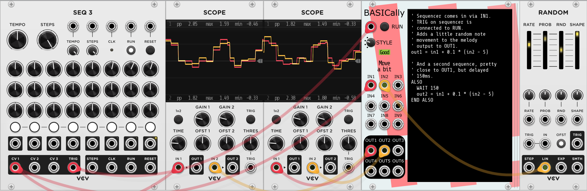

# Stochastic Telegraph modules for VCV Rack
Modules for use with VCV Rack 2.0, with an emphasis on generative and
self-regulating structure. Exploring the region between random and static.


* [BASICally](#basically): A simple, likely familiar procedural programming language within the context of VCV Rack.
* [Drifter](#drifter): Creates sequences of values that can slowly (or quickly) vary, like a series of points doing random walks connected into a series.
* [Fuse](#fuse): Block, allow, or attenuate a signal passing through, based on the number of triggers observed in a different signal.


# BASICally

A simple, likely familiar procedural programming language within the
context of VCV Rack. Can act like:
* a very flexible sequencer
* VCO or LFO
* a wavefolder
* a control voltage utility
* sample and hold
* all of the above and more, simultaneously

Useful for:
* quickly trying out an idea
* simple transformations that would otherwise involve many small utility modules
* non-standard approaches to otherwise straightforward ideas

### Examples

#### Sequencer playing the first three notes of Also sprach Zarathustra


#### LFO altered by inputs


#### An almost triangle wave with randomly selected slopes and peak


#### Sample and hold

Note that STYLE is set to "Start on trigger, don't loop".

The examples above are all in [this patch](examples/BASICallyExamples1.vcv).
A patch with some simple/strange/silly ideas for other things BASICally can do
are in [this patch](examples/BASICallyExperiments.vcv).

<!-- TODO: video of different examples and their output -->

## Unique Features
While there are
[other modules](https://github.com/mahlenmorris/VCVRack#related-modules)
with a similar emphasis on "writing code within VCV", BASICally has some
interesting differences:
* It intentionally bears a visual resemblance to the
[BASIC language](https://en.wikipedia.org/wiki/BASIC) (albeit a **quite
limited** version of BASIC). BASIC is a language that many people
know, once knew, or can pick up by looking at examples.
* The right side of the module is a resize bar; pull it to the right or left,
and the code window changes size. Handy for reading those long comments without
line breaks and for shrinking the module down to a small size when you don't
wish to edit the code. Also, the text window scrolls vertically as you move
through it.
* Four different run "STYLES" (see Controls below), giving it the ability to
 act on a RUN trigger, or to run the most recent working version continuously
 as you type, or only run while a button or trigger is pressed.
* Edits in the text window become part of the VCV Rack Undo/Redo system.
* You can pick from a (small) number of screen color schemes in the menu.
* [Scientific pitch notation](https://en.m.wikipedia.org/wiki/Scientific_pitch_notation) is supported (e.g., c4, Db2, d#8). They are turned into V/OCT values.

## The Language
### Setting and Using Variables (Assignment and Math)
Always in the form:

**variable name** = **mathematical expression**

Set values of the OUT1, OUT2, OUT3 and OUT4 ports for connected modules to
read via connected cables. Assignment is also used for setting variables for
use elsewhere by your program.

Examples:

    ' Creates a variable called 'foo' and sets it to 3.0. All values
    ' in BASICally are floating point numbers.
    foo = 3
    ' Uses the value of the 'foo' variable.
    bar = 5 * in1 + foo
    ' Sets the value of the OUT1 port.
    out1 = bar * -0.01
    ' Sets out2 equal to -1.9. Operator precedence is the same as most other languages.
    out2 = 0.1 + 2 * -1
    ' Set out2 to emit the V/OCT value for middle C.
    out2 = C4

* All variables start with the value 0.0 when first read.
* Variables stay available in the environment of a module until the patch
is restarted. This is true even if the code that created the variable has been removed from the program.
* OUT1-4 are clamped to the range -10v <--> 10v. Input values and internal
values are not clamped.
* [Scientific pitch notation](https://en.m.wikipedia.org/wiki/Scientific_pitch_notation) is supported (e.g., c4, Db2, d#8), turning them into
V/OCT values. So you can use **out1 = c4**, send OUT1 to a VCO in the default position, and the VCO will output a tone at middle C.

The following are operators and functions you can use in mathematical
expressions:
* **"+", "-", "*", "/"** -- add, subtract, multiply, divide. Note that dividing
any number by zero, while undefined in *mathematics*, is defined by *BASICally*
to be 0.0.
* **"<", "<=", ">" , ">=", "==", "!="** -- comparison operators. Most commonly used
in IF-THEN[-ELSE] statements.
* **"and", "or", "not"** -- Boolean logic operators. For purposes of these, a zero
value is treated as **FALSE**, and *any non-zero value* is treated as **TRUE**.

| Function  | Meaning        | Examples |
| --------- | -------------- | -------- |
|**abs(x)**| absolute value | abs(2.1) == 2.1, abs(-2.1) == 2.1 |
|**ceiling(x)**| integer value at or above x | ceiling(2.1) == 3, ceiling(-2.1) == -2 |
|**connected(x)**|1 if named port x has a cable attached, 0 if not | connected(IN1) |
|**floor(x)**|integer value at or below x|floor(2.1) == 2, floor(-2.1) == -3|
|**max(x, y)**|the larger of x or y|max(2.1, 2.3) == 2.3, max(2.1, -2.3) == 2.1
|**min(x, y)**|the smaller of x or y|min(2.1, 2.3) == 2.1, min(2.1, -2.3) == -2.3
|**mod(x, y)**|the remainder after dividing x by y. Will be negative only if x is negative|mod(10, 2.1) == 1.6
|**normal(mean, std_dev)**| bell curve distribution of random number | normal(0, 1) |
|**pow(x, y)**|x to the power of y|pow(3, 2) == 9, pow(9, 0.5) == 3 |
|**random(min, max)**|uniformly random number: min <= random(x, y) < max | random(-1, 1)|
|**sample_rate()**|number of times BASICally is called per second (e.g., 44100)|sample_rate() == 48000|
|**sign(x)**|-1, 0, or 1, depending on the sign of x|sign(2.1) == 1, sign(-2.1) == -1, sign(0) = 0|
|**sin(x)**|arithmetic sine of x, which is in radians| sin(30 * 0.0174533) == 0.5, sin(3.14159 / 2) == 1

### WAIT Statements
Always in the form:

WAIT **mathematical expression**

Specifies a number of milliseconds for the program to make no changes. The
OUTn ports maintain their voltages at the values they were at when the WAIT started.

Examples:

    ' Waits a full second.'
    wait 1000
    ' Wait half of one thousandth of a second.
    WAIT 0.5
    ' wait [in2] tenths of a second.
    wait in2 * 100
    ' The shortest possible WAIT. Exactly one sample.
    WAIT 0
    ' Negative values are treated as if the were zero.
    WAIT -3

If you find that your BASICally module is using a lot of CPU, even a short WAIT
will help make the module use less CPU.

### Comments
A single quote (') followed by a space indicates that the rest of the line will
be treated as a comment only to be read by the user. Comments have no effect on
the execution of other statements.

Examples:

    out2 = 3.250 ' A C4 note.
    out2 = c4 ' Also a C4 note.
    WAIT 200 ' Pause for 1/5 of a second.
    ' The next line can be turned on just by removing the initial tick (').
    ' out1 = 2.3 * in1  ' Look, I'm live-coding!

### Arrays
Simple one-dimensional, 0-indexed arrays are available. The index will have
floor() act on it internally. Using an index less than zero will be ignored.

    a[3.3] = 2.2  ' Same as a[3] = 2.2
    a[-1] = 6     ' Ignored, will have no effect.

You can set a series of values in a array quickly by specifying just the
initial index, and enclosing the series of values with curly braces '{}'
For example, this will assign value to b[1], b[2], and b[3]. Note that these
values do not need to be constants, as some other languages require.

    b[1] = { -5, sin(in3), 2.2 }

Reading from an array works the same; The index will have floor() act on
it internally. Using an index less than zero will return a value of 0.0.
Accessing any index within the array that hasn't been set will also return
a value of 0.0.

    out1 = b[1]

Unlike BASIC and many other languages, there is no need to set the size of
the array before using it (i.e, there is no DIM() statement.)

### IF Statements (Conditional Behavior)
There are two kinds of IF statements:

IF **conditional expression** THEN
**...Statements for True...**
END IF

or

IF **conditional expression** THEN
**...statements for True...**
ELSE
**...Statements for False...**
END IF

The conditional expression evaluates to False if it equals zero; it evaluates to
True otherwise.

Examples:
```
if in1 > 3.7 then
  out1 = in2 * 0.01
  out2 = sin(in2)
end if

if in1 > 3.7 or foo == -1 then
  out1 = in2 * 0.01
  out2 = sin(in2)
else
  out1 = 0
  out2 = 0.5
end if
```
### FOR Loops
Useful for repeating statements for some limited number of times.
There are two kinds of FOR loops:

FOR **variable** = **expression** TO **expression** **...Statements...** NEXT

(**variable** goes up by one every loop)

or

FOR **variable** = **expression** TO **expression** STEP **expression** **...Statements...** NEXT

(**variable** goes up by the STEP **expression** every loop, or down if it's negative)

Examples:
```
for i = -5 to 5
  out1 = i
  wait 100
next
' out1 will be: -5, -4, -3, -2, -1, 0, 1, 2, 3, 4, 5 and then leave the loop

for i = 0 to 5
  for j = 0.4 to 0 step -0.1
    out1 = i + j
    wait 10
  next
  wait 100
next
' out1 will be: 0.4, 0.3, 0.2, 0.1, 0, 1.4, 1.3, 1.2, ...
```
Note that the TO and STEP expressions are only computed when entering the loop.
```
dest = 10
leap = 2
FOR j = 0 TO dest STEP leap
  dest = .1  ' Has no effect on loop.
  leap = .1  ' Also no effect.
  out1 = j
  wait 10
next
' out1 will be: 0, 2, 4, 6, 8, 10 and then leave the loop.
```

### CONTINUE FOR and EXIT FOR
While in a FOR loop, there may be circumstances when you want to change
what statements to run. There are two special ways to do this.

**CONTINUE FOR** moves execution back to the beginning of the loop, changing
the variable value as it normally would.

**EXIT FOR**, in contrast, moves to the statement after the NEXT, quitting the
loop entirely.

Examples:
```
for i = 0 to 5
  if i == 2 then CONTINUE FOR end if  ' Skips rest of loop when i == 2.
  out1 = i
  wait 100
next
' out1 will be 0, 1, 3, 4, 5, and then leave this loop.

for i = 0 to 5
  if i == 2 then EXIT FOR end if   ' Leaves loop when i == 2.
  out1 = i
  wait 100
next
' out1 will be 0, 1, and then leave this loop.
```
### CONTINUE ALL and EXIT ALL
Similarly, you can use **CONTINUE ALL** to move execution to the top of the
program.

For the two STYLES that support halting the program, which are:

* Start on trigger, loop
* Start on trigger, don't loop

encountering an  **EXIT ALL** will actually halt the program. A trigger/button
press to RUN will start it again.

### Other Things to Note
BASICally is intended for the very casual user, with the hope that examples
alone will suffice to suggest how programs can be written. Because of the UI
limitations, detailed error reporting is difficult to provide. But if you
hover your mouse over the little red area to the left that says "Fix!", it
will attempt to point out the first place that BASICally couldn't understand
the code.  

Programs are typically *very* short. For that reason, this language doesn't need
the features that are useful for writing long programs but increase the
amount of boilerplate code. Here are a few surprising differences
from more robust languages:
* BASICally is **case-insensitive**. "OUT1", "oUt1", and "out1" all refer to
the same variable. "WAIT" and "wait" are identical in meaning. DB3, Db3, and
db3 are the same note. I would certainly suggest you capitalize consistently
within in your programs to make them easier to read, but BASICally won't
insist on it.
* **Newlines do not matter**, *except* that comments always end at the newline.
The following are identical in meaning:
```
out1 = sin(in2) * 0.3 + mod(in1, 4)
```
```
 out1 =
 sin(in2)
   * 0.3
      + mod(
  in1, 4)
```

If lines are wrapping around in a way that makes it hard to read,
remember that you can **resize the code window** by dragging the right-side
edge of the module.
* **Indentation does not matter**. That said, even short programs can become more readable to you by using the indentation demonstrated in the examples.

## Slightly Surprising Details

### WAIT Statements Changing Lengths

In the case of

    wait in2 * 100

the length of time might get shorter or longer if in2 changes while
the WAIT has started. For example, if in2 is 10.0 when the WAIT starts, then
it will *start* to wait for 1000 millis. However, if, say, 100 milliseconds later
the value of in2 changes to 0.5, then the WAIT is now for 50 milliseconds.
What should happen?

What BASICally does is frequently recompute the wait time and then see if the
WAIT has already exceeded the new value; if it does, the WAIT ends and the next
statement runs. Doing this makes BASICally more responsive to changes from the
user.

If this is not what you want, just assign the value to a variable:

    pause_ms = in2 * 100
    wait pause_ms

Then (in the scenario above) the length of the WAIT will be 1000 millis,
and no change to in2 during the WAIT can change that.

*Note that this differs from the way FOR-NEXT loops work, where the TO and STEP
values are computed **only** upon entering the loop.*

### Hidden WAIT 0 Statements

Under the hood, WAIT statements are how BASICally knows to stop running its
code and pass control back to the other modules in VCV Rack. If it never WAITed,
VCV Rack would hang and eventually the program will crash. Therefore, there are a number of hardwired WAIT 0 lines inserted. For example, consider this program:
```
OUT3 = 0
WAIT 100
FOR level = 0 To 5 STEP 0.01
  OUT3 = level
NEXT
OUT1 = sin(in2 * in2)
```    
Under the hood, it is turned into:
```
OUT3 = 0
WAIT 100
FOR level = 0 To 5 STEP 0.01
  OUT3 = level
  WAIT 0   ' There is a hidden WAIT 0 inserted just before every NEXT in a FOR-NEXT loop.
NEXT
OUT1 = sin(in2 * in2)
WAIT 0  ' There is a hidden WAIT 0 inserted at the bottom of the program.
```

### Controls
#### The Good/Fix Light
The lit word in the upper left corner indicates whether or not BASICally has figured out how to turn your code into instructions. If it looks like:


then BASICally can run your code. However if it looks like:


Then it cannot run the code as it stands. You can see that the line where it
gets confused is highlighted in red.

If you roll the mouse pointer over the "Fix", then BASICally will attempt to
describe the first error it found. As you can see here, it can only vaguely
tell you where it got confused and why. Note that if the editing window is
scrolled away from the line where the error occurs, you won't be able to see
the highlight line until you scroll up (or down) to it.

#### STYLE Knob + RUN Button and Input
There are four options to determine when the code will run. Three of them rely on the RUN Button and trigger/gate, which are described below.

* **Always run** -- Will always try to run the latest code in the window that
compiled. This is the best state for making changes on the fly and seeing them
applied immediately. Also nice for when you are first determining what your
code for this module should be. Note that when the code changes, BASICally restart the code from the start of the code.

* **Start on trigger, loop** -- If not already running, then it waits for the RUN
button to be pressed or a trigger to be seen by the RUN input. When the signal
to run happens, it will run and "loop", meaning it will when it gets to the last line, it will do a "WAIT 0", and then start again from the top.

* **Start on trigger, don't loop** -- If not already running, then it waits for
the RUN button to be pressed or a trigger to be seen by the RUN input.
When the signal to run happens, it will run and then stop when the last line is reached. This is useful for making Sample & Hold behavior; the RUN input
becomes the trigger for the Hold.

* **Run when gate is open** -- While the RUN button is pressed or the RUN input
is high, then BASICALLY will run. If the button is released or the input
falls low, then the program will stop. As long as the program isn't changed, when the next button press/input high occurs, exection will pick up from where it left off. For example, suppose a five second WAIT starts, and then after 3.5
seconds the button is released. When the button is later pressed, the WAIT will continue for another 1.5 seconds before moving on to the next statement.

### Menu Options

#### Title
You can specify a short title that will appear above the INn ports. This may make
it easier to identify what each BASICally module is doing, especially when
you've minimized the size.

#### Screen Colors
A small number of choices about text colors.

#### Error Line Highlighting
By default, if BASICally can't understand your code in its entirety, then it
will attempt to highlight the line where it stopped understanding your code.
It's not terribly accurate, but gives you a sense of where to change your code.
If the red highlight is distracting, you can turn it off here.

#### Colorblind-friendly status light
By default, BASICally uses green and red for the Good/Fix light. In hopes of
making the distinction clearer to more people, this option turns those colors to
blue and orange, and makes the error line highlighting orange as well.

#### Syntax/Math Hints
Just in case you're in the middle of coding and you don't want to look up
this documentation, there's some hints about the syntax of BASICally, as
well as the complete list of math functions. You can
click on a particular statement and it will be inserted into your code.

### Bypass Behavior
When the module is bypassed, all OUTn ports are set to zero volts.

### Related Modules
* Frank Buss's
[Formula](https://library.vcvrack.com/FrankBuss/Formula).
* docB's
[Formula One](https://library.vcvrack.com/dbRackFormulaOne), which, compared
to Formula and BASICally, seems to be **very** CPU efficient.


# Drifter
Creates sequences of values that can slowly (or quickly) vary, like a series of
points doing random walks connected into a series.

### Examples


* Set this up, and you'll just hear a single tone.
* Now try tapping the DRIFT button a few times, and you'll hear the frequency change.
 * The IN signal is the value coming out of the Saw wave, and is shown in the display as a short line moving from left to right along the bottom.  
 * The OUT signal is the height (Y position) of the line in the display that jumps whenever you press DRIFT at the X position of IN.
* Set the TOTAL DRIFT value to something larger, like 5.0.
* Now press DRIFT; the line moves a lot more now!
* Play with the STYLE knob, which changes the shape of the line in the display and hear how that changes the OUT values.
* There are many more knobs and controls, and they are described below. They long to be twiddled!

More examples can be found in [this patch](examples/AnnotatedSunlightOnSeaAnemones.vcv). You can [hear the results](https://www.youtube.com/watch?v=uagZ6GN_s1Y).

### Uses
Creating or modifying a series of values you wish was gradually (or drastically) changing - melodies, volume levels,
waveforms, CV levels. Note that the use of a Saw wave as the input in the
sample rack is just to better illustrate the idea of it being a
transformation function; you can put whatever you like into IN. Sine wave,
oscillator output, random,... Drifter alters signals, basically.

[Here's a video from Pazi K.](https://www.youtube.com/watch?v=L5No8J7SPK4) showing two Drifters being used to simultaneously
create the timbre of two sounds **and** create matching visuals in Etchasketchoscope.

(Someday I'll make a video or two that demonstrates these other notions better.)

### Controls
#### X DRIFT Input and Button
The maximum distance, in V, that each point can move
along the X-axis (i.e., left-to-right) in one DRIFT event. Setting it to
zero locks the points horizontally in place. Higher values allow
larger changes each DRIFT. Hint: start small.
#### OFST Button
Sets the range of the expected inputs and outputs from 0V - 10V or
-5V - +5V.
#### TOTAL DRIFT Input and Button
The maximum distance, in V, that each point can
move in the 2-dimensional space in one DRIFT event. Setting it to zero
locks the points in place. Higher values allow larger changes each
time. Hint: start small.
#### ENDS Button
Selects one of two options: Left and right end points stay locked
at value zero OR end points drift up and down when DRIFT events occur.
#### DRIFT Input and Button
A trigger to the Input or a Button press will
cause all of the points defining the output curve to move once, within the
limits set by X DRIFT, TOTAL DRIFT, and ENDS.
#### COUNT Knob
The number of segments in the steps/line/curve, from 1 (just
connecting the end points) to 32. **Takes effect at the next RESET.**
#### RESET Input and Button
A trigger to the Input or a Button press resets the line to its
starting position, which is all zeroes. This also applies any change to COUNT.
#### STYLE Knob
Selects one of three different line types, Steps/Lines/Curves.
Changes are applied instantly.
#### IN Input
Selects the horizontal position of the point on the line to be
selected. Shown on the display as a short line at the bottom of the display.
#### OUT Output
The vertical position of the line at the position determined by IN.

### Menu Options
#### "Save curve in rack"
* If checked - when the rack is saved, the current position of the line
will be saved with the rack, and that position will be loaded along with the rack.
* If **not** checked - when the rack is loaded, the line will always start at all zeros.

### Bypass Behavior
If this module is bypassed, then OUT will equal IN.


# Fuse
Block, allow, or attenuate a signal passing through, based on the number of triggers
observed in a different signal.
### Examples
#### Counting/Clock Divider


Here the LIMIT is set to 7, and Fuse basically acts like a clock divider,
sending out a trigger every seven input triggers and then resetting the count.

#### The Different Styles


Set this up and let it run, and you'll see that each setting of STYLE
has a different effect on the relationship between IN and OUT, especially as the
count of TRIGGER events gets closer to LIMIT. See the STYLE Knob description
for details.

More examples can be found in [this patch](examples/AnnotatedSunlightOnSeaAnemones.vcv). You can [hear the results](https://www.youtube.com/watch?v=uagZ6GN_s1Y).

### Uses
* Paired with other modules, can simulate modules that "wear out" or "break"
with repeated use.
* Allow generative patches to self-conduct behavioral changes over time.
* Periodically reset other accumulated state in a patch (e.g., in Drifter).
* Create fade-ins or fade-outs of signals that take hours to complete.

### Controls
Note that hovering the cursor over the colored fuse progress bar displays the
current count of TRIGGER events seen and the percentage of the LIMIT
has been reached

#### STYLE Knob
Selects from one of four styles of behavior:
* **BLOW CLOSED** (IN -> 0.0)
** While count is less than LIMIT, OUT equals IN.
Once count >= LIMIT, OUT is set to 0.0V.
* **BLOW OPEN** (0.0 -> IN)
** While count is less than LIMIT, OUT equals 0.0V. Once count >= LIMIT,
OUT equals IN.
* **NARROW** (IN * (1 - count/LIMIT) -> 0.0)
** Initially, OUT equals IN. As the count increases, OUT becomes an increasingly
attenuated version of IN, until it eventually becomes 0.0V.
* **WIDEN** (IN * (count/LIMIT) -> IN)
** Initially, OUT is 0.0V. As the count increases, OUT becomes an increasingly
larger version of IN, until it eventually equals IN.

#### LIMIT Knob
Specify the number of TRIGGER events (from 1 to 1000) that need to be received
for the Fuse to blow.

Hint: To count more than 1000 TRIGGER events, connect the BLOWN
signal of a first Fuse (with LIMIT X) to the TRIGGER of a second (with LIMIT Y)
and to the RESET of the first; then the second Fuse will blow after X*Y
TRIGGER events.

#### TRIGGER Input and Button
A trigger to the Input or a Button press adds one to the count of accumulated
TRIGGER events. If that count now equals LIMIT, then BLOWN will emit a
short trigger.
#### RESET Input and Button
A trigger to the Input or a Button press resets the count of accumulated
TRIGGER events to zero.
#### SLEW Knob
In math terms, OUT = **X** * IN. **X** is a value from 0.0 - 1.0 that is determined by
the STYLE, LIMIT and current count of TRIGGER events.

Note that this knob controls the slew on **X**, not the slew on OUT.
At the default SLEW value (0.0), changes to **X** happen instantaneously; this
*might* cause clicks in OUT, especially when OUT is an audio signal (e.g., a
Sine wave) using the NARROW or WIDEN style. Values of 0.1 will
generally prevent this click.

The value of SLEW is the minimum number of seconds it takes for **X** to change
from 0.0 -> 1.0 or from 1.0 -> 0.0. This means it will also affect how quickly
RESET takes effect. For example, a SLEW value of 2.3 means that a RESET to a
blown BLOW CLOSED Fuse will take 2.3 seconds to move from OUT = 0.0 -> OUT = IN.
The change will be linear (i.e., a straight line).
#### BLOWN Output
Outputs a single trigger once count == LIMIT.
#### IN Input
The signal being altered by Fuse.
#### OUT Output
The altered version of IN. See STYLE Knob for how it will be altered.

### Menu Options
#### "Unplugged value of IN"
A convenience only used when IN has no cable running into it.
The option (-10V, -5V, -1V, 1V, 5V, 10V) that is selected (if any) is then
assumed to be the constant value entering IN. This constant value is then
affected by the STYLE, LIMIT, and count of TRIGGERS when computing OUT, as
per the usual case.

### Bypass Behavior
If this module is bypassed, then OUT will equal IN. If IN has no cable running
into it, then OUT will be 0.0V, *even if* the "Unplugged value of IN" menu
option is set to something else.


# Acknowledgements

Thanks to all of the helpful people on the
[VCV Rack Community board](https://community.vcvrack.com/) for their
willingness to help and advise me as I've been learning this new domain.

Many thanks to [Marc Weidenbaum](https://disquiet.com/) for his encouragement and enthusiasm for my module-making efforts.

And my deepest gratitude is to Diane LeVan, for letting me ignore her and/or
the world for periods of time just to craft these things. I apologize for
waking up with new ideas at 5AM, and for having a retirement hobby that is nearly impossible to even start describing to anyone.
